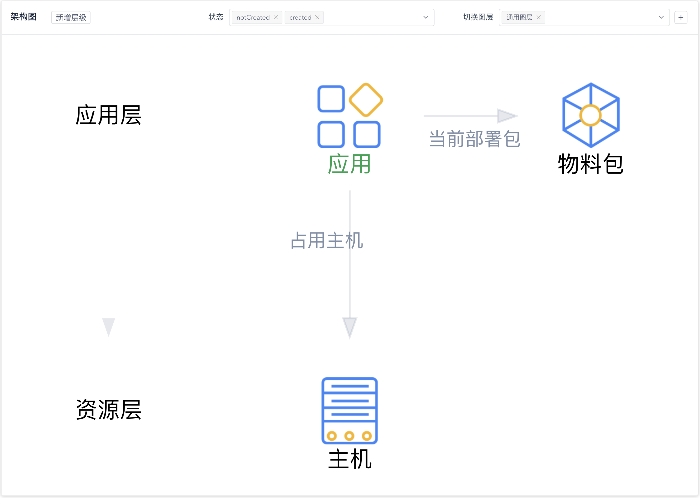
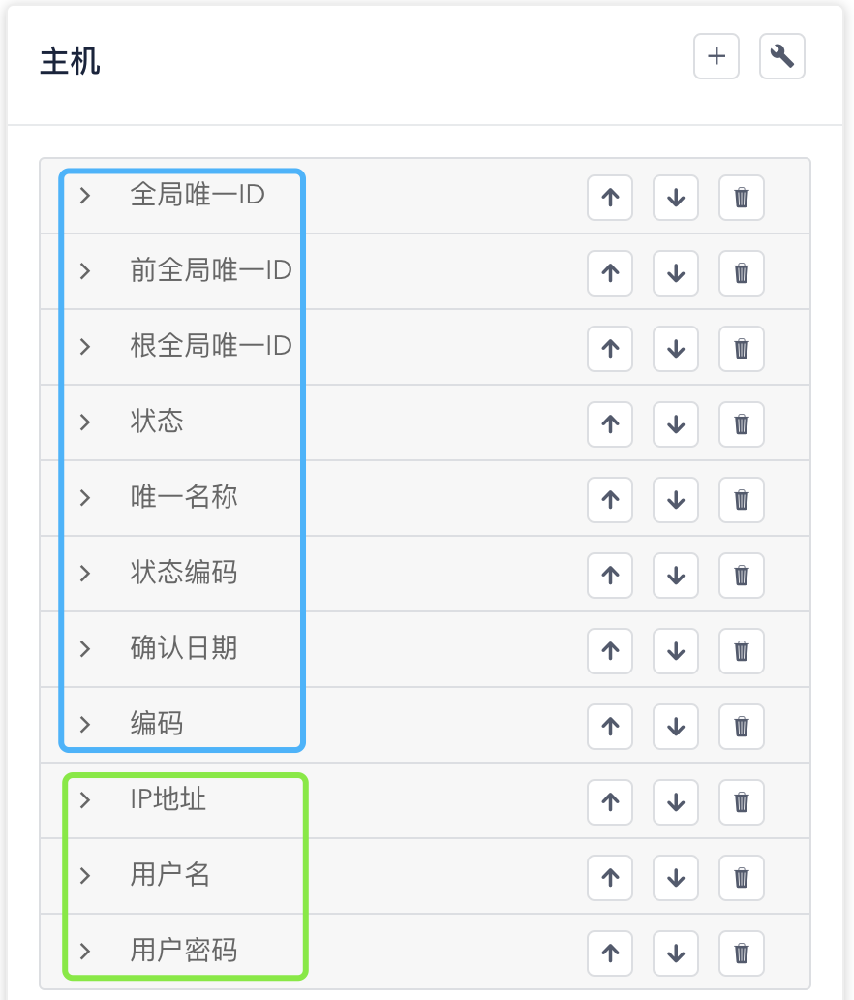
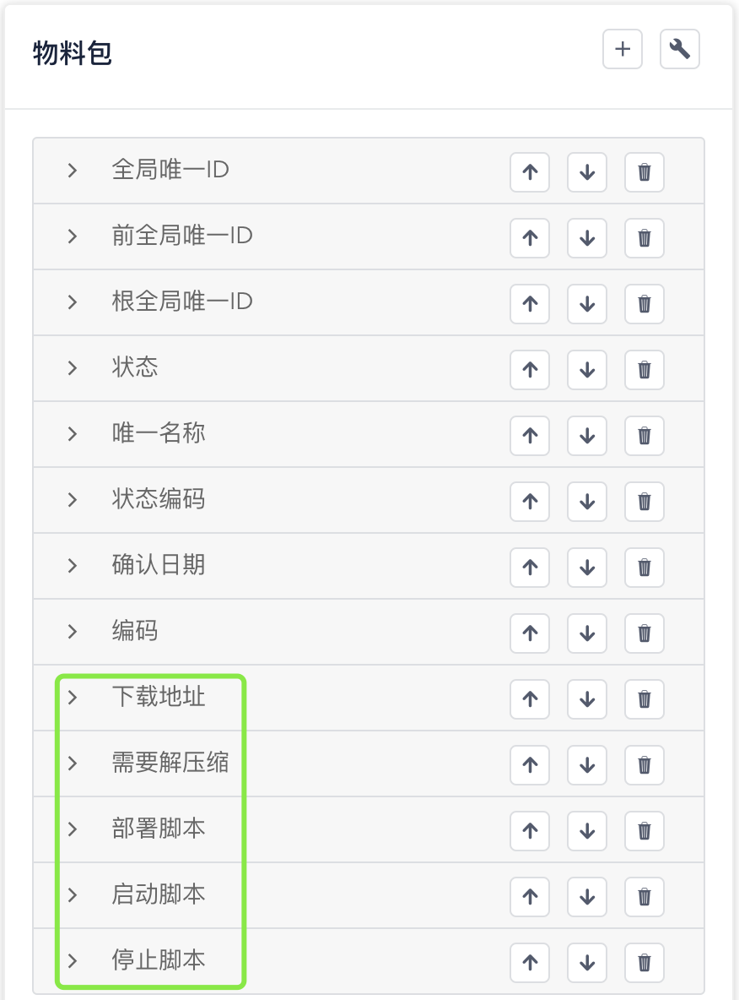
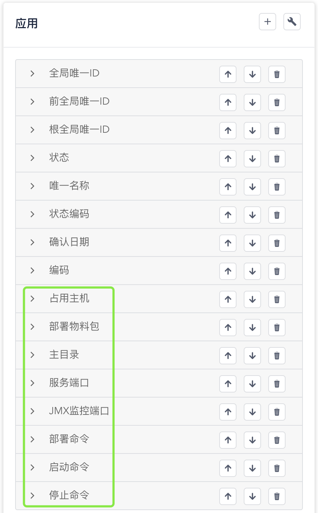

# 探索数据模型与数据记录

在这一步，让我们来了解能够在WeCube中进行管理的数据类型以及现有的数据记录。

## 数据模型概览

请通过 “**系统**菜单” - “**CMDB模型管理**菜单项” 进入CMDB模型管理页面。在页面上，您可以看到我们已经为您准备好的将要使用到的部分数据模型，如下图所示：

{: target=\_image}

其中包括：

- CI数据类型 **主机**

	**主机** 代表您所拥有的可以运行工作负载的计算资源，比如您刚刚安装WeCube时使用的虚拟机或者物理机。您可以点击架构图中的主机图标，页面右侧将为您展示主机数据类型中包含的数据属性，如下图所示：

	[{: style="display: block; width: 60%; margin: 0 auto;"}](images/bootcamp/bootcamp-data-type-host.png){: target=\_image}

	图中蓝色方框中的属性是通用属性，WeCube管理的任何数据类型中都包含这些属性；绿色方框中的数据属性则是我们为主机专门设计的属性，用来管理和维护与您主机相关的重要信息，目前包括 **IP地址**、**用户名** 和 **用户密码**。在后面的步骤中，我们将依靠这些数据属性连接到您的主机上并进行应用部署。

- CI数据类型 **物料包**

	**物料包** 代表我们为了进行应用部署而准备的物料包，如下图所示：

	[{: style="display: block; width: 60%; margin: 0 auto;"}](images/bootcamp/bootcamp-data-type-artifact.png){: target=\_image}

	在图中绿色方框中展示了我们为了进行应用部署需要使用到的物料包数据属性，目前包括 **下载地址**、**是否需要解压缩**、**部署脚本路径**、**启动脚本路径** 和 **停止脚本路径**。

- CI数据类型 **应用** （名称为绿色，即设计草稿、未创建状态）

	**应用** 代表我们希望在主机上部署的业务应用实例，如下图所示：

	[{: style="display: block; width: 60%; margin: 0 auto;"}](images/bootcamp/bootcamp-data-type-application.png){: target=\_image}

	您可能注意到架构图中的应用使用绿色进行了突出显示，这代表着 **应用**数据类型 还处于 [`notCreated`状态](manual-cmdb-model.md#_2)，也就是说，这个数据类型在WeCube系统中还没有真正创建出来，相当于设计草稿，还不能用来管理数据。所以，我们将在后续步骤中重新回来详细查看这个数据类型并完成它的创建。

## 数据记录概览

请通过 “**设计**菜单” - “**CI数据管理**菜单项” 进入数据管理页面。在页面上，您可以看到我们已经为您准备好的 **主机** 和 **物料包** 数据记录。

## 补充主机信息

## 进一步了解

关于WeCube中对数据模型的管理，您可以进一步参阅以下文档：

- [CMDB模型管理用户手册](manual-cmdb-model.md)
