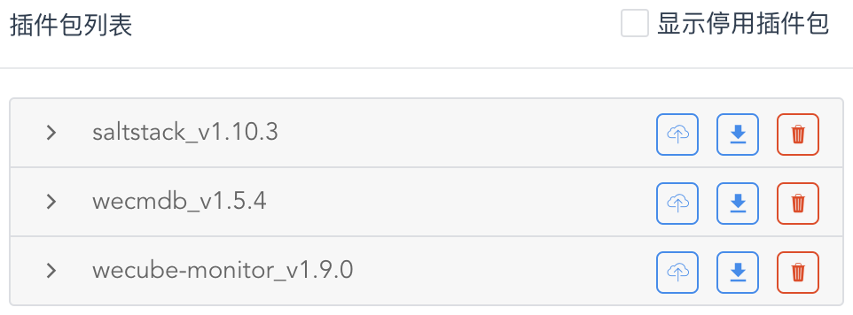

# 配置自动化部署插件服务

在这一步，我们将配置自动化部署插件saltstack，在主机上安装自动化部署代理，并尝试通过插件服务在主机上执行运维指令。

## 已安装插件概览

请通过 “**协同**菜单” - “**插件注册**菜单项” 进入插件管理页面。如下图所示：

{: target="\_image" style="display: block; width: 60%; margin: 0 auto;"}

在这里，您可以看到在上手指引配置方案中为您默认安装好的3个插件，其中

- **saltstack** 插件提供了自动化部署等运维操作的插件服务
    
    我们将对 **saltstack** 插件提供的服务进行配置，完成对主机的操作以及应用部署。

- **wecmdb** 插件提供了数据模型及数据记录管理的功能

    我们不需要对 **wecmdb** 插件进行任何配置。

- **wecube-monitor** 插件封装了开源监控系统Prometheus

    我们将对 **wecube-monitor** 提供的插件服务进行配置，实现对应用实例的监控。

## 了解自动化部署插件

请在插件包列表中点击 “**saltstack**” 展开插件包操作命令的显示，接着点击 “**服务注册**”。

{: target="\_image" style="display: block; width: 60%; margin: 0 auto;"}

在页面右侧，将显示 **saltstack**插件 提供的所有插件服务以及现有的服务配置，如下图所示：

{: target="\_image"}

请点击展开 “**agent**插件服务”，您会看到我们预先准备好的一套插件服务配置 `agent_for_host`，点击此服务配置，在页面右侧将为您显示此服务配置中各插件服务方法调用参数的具体绑定方式。

您可以看到，`agent_for_host` 服务配置中的 “**目标对象类型**” 被设置为 `wecmdb:host`，即CMDB模型中的`host`（主机）数据类型。也就是说，此服务配置描述了如何在`host`（主机）数据对象上调用 **agent**插件服务 中的服务方法（包括 `install` 和 `uninstall`）。在具体的服务方法调用参数的配置上，您也可以看到我们如何将 `host`（主机）数据类型上的数据属性绑定到服务方法的调用参数上。

您可以特别留意 **agent**插件服务 下 `agent_for_host` 配置中对 `install` 服务方法的调用参数配置，我们将使用这个服务方法主机上安装saltstack agent操作代理，来实现对主机的运维操作以及后续的应用部署。另外，在完成操作代理的安装后，我们将使用 **host-script**插件服务 下 `adhoc_scripting` 配置中的 `run` 服务方法来在主机上执行实际的命令行指令。

## 安装自动化部署代理

现在，我们要使用批量执行功能在主机上安装saltstack agent，请通过 “**执行**菜单” - “**批量执行**菜单项” 进入批量执行页面。

{: target="\_image"}

点击 “**设置条件**” 后，请按照下图所示设置好批量执行目标数据对象的查询参数：

{: target="\_image"}

- **查询路径**：由于我们希望在`host`（主机）数据对象上执行操作，因此请设置为 `wecmdb:host`
- **业务主键**：请将`host`（主机）数据类型中的 `code`数据属性 设置为业务主键，作为执行结果列表中的不同操作对象的主要标识符。

接着，点击 “**执行查询**”后，将为您显示出目前WeCube中存在的唯一一条主机数据记录：

{: target="\_image"}

请选中主机记录并点击 “**选择插件**”，并在 “**插件**”列表 中选择我们之前配置好的插件服务方法 `saltstack`/`agent`(`agent_for_host`)/`install` 

{: target="\_image"}

您可以看到，由于我们在 服务配置`agent_for_host` 中已经将 `install`服务方法 的调用参数绑定到了 `host`（主机）数据类型 的数据属性上，所以现在调用时无需提供任何额外的参数，请直接点击 “**执行**” 即可。

{: target="\_image"}

执行完成后，saltstack agent就被成功的安装在主机上了，我们将使用它在主机上执行运维指令。之后，您使用同样的方式选择插件服务方法 `saltstack`/`agent`(`agent_for_host`)/`uninstall` 将其卸载，但现在请暂时保留它以供后续使用。

## 在主机上执行运维指令

现在，我们继续使用批量执行功能在主机上执行命令行指令来完成运维操作，请点击页面上的 “**选择插件**” 来更换想要调用的插件服务方法。

{: target="\_image"}

接着，在 “**插件**”列表 中选择插件服务方法 `saltstack`/`host-script`(`adhoc_scripting`)/`run`

{: target="\_image"}

您可能会注意到，这一次，我们需要为服务方法补充调用参数，请为 “**scriptContent**”参数 输入希望执行的命令行指令 `docker ps` 并点击 “**执行**”。完成后，您就可以看到主机上的执行结果了，如下图所示：

{: target="\_image"}

您可以使用同样的方式，在WeCube管理的主机上执行其它运维指令。当然，您也可以根据需要调用其它插件服务方法来实现您的任务目标。

## 进一步了解

您可以进一步参阅以下文档：

- [插件注册用户手册](manual-plugin.md)
- [批量执行用户手册](manual-batch-execution.md)
