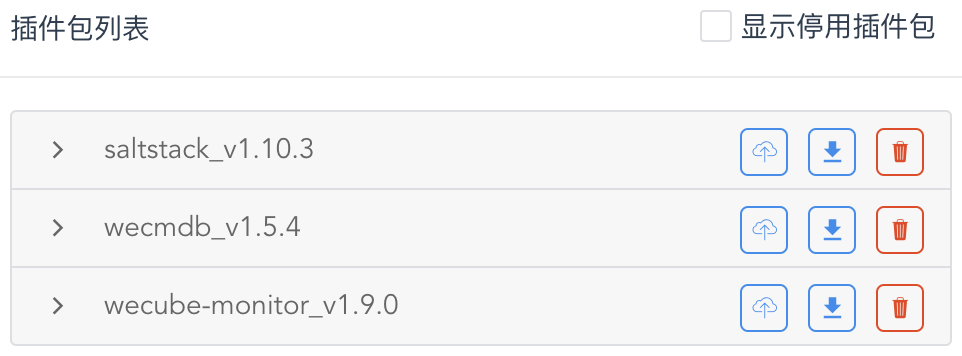

# 配置自动化部署插件

在这一步，我们将配置自动化部署插件saltstack，在主机上安装自动化部署代理，并尝试通过插件服务在主机上执行运维指令。

## 已安装插件概览

请通过 “**协同**菜单” - “**插件注册**菜单项” 进入插件管理页面。在这里，您可以看到在上手指引配置方案中为您默认安装好的3个插件，如下图所示：

[{: style="display: block; width: 60%; margin: 0 auto;"}](images/bootcamp/bootcamp-plugin-list.png){: target=\_image}

其中，

## 配置自动化部署插件服务

请通过 “**协同**菜单” - “**插件注册**菜单项” 进入插件管理页面。

## 安装自动化部署代理

请通过 “**执行**菜单” - “**批量执行**菜单项” 进入批量执行页面。

## 在主机上执行运维指令

请通过 “**执行**菜单” - “**批量执行**菜单项” 进入批量执行页面。

## 进一步了解

您可以进一步参阅以下文档：

- [插件注册用户手册](manual-plugin.md)
- [批量执行用户手册](manual-batch-execution.md)
