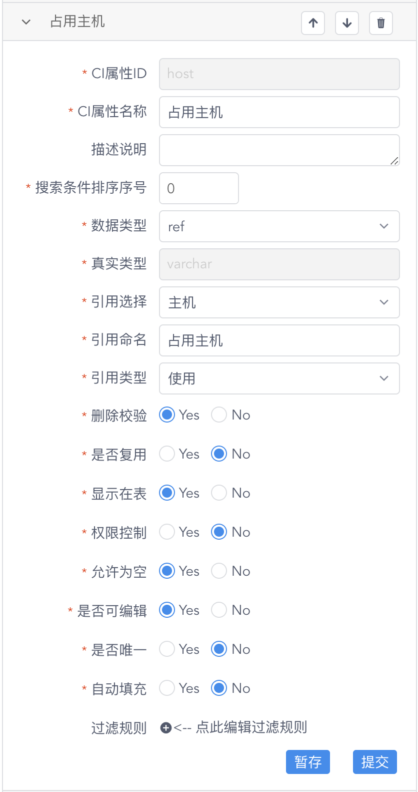
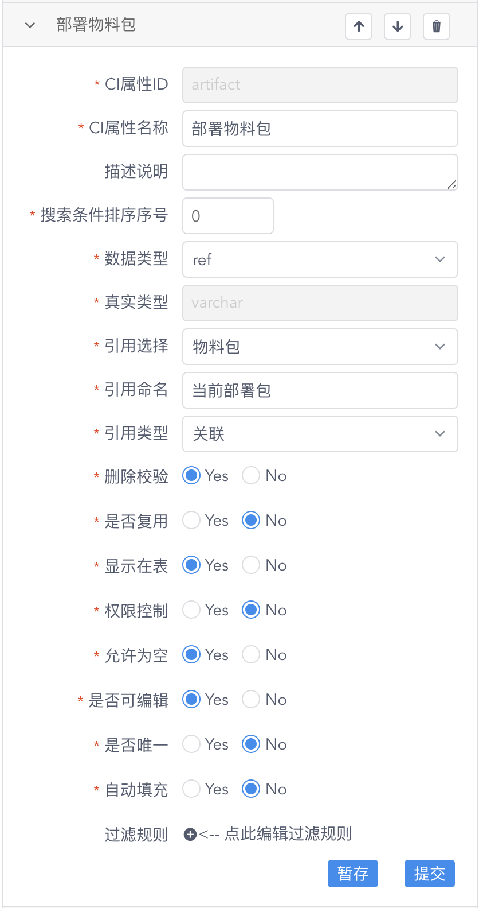
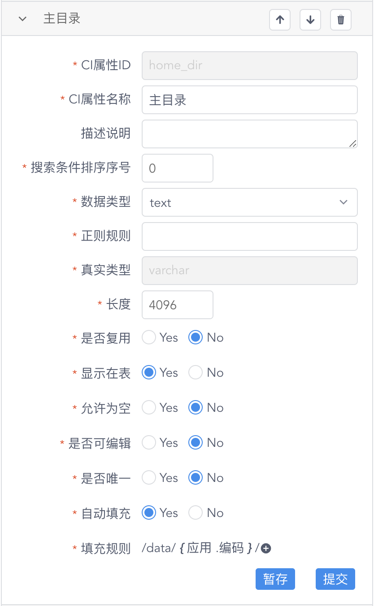
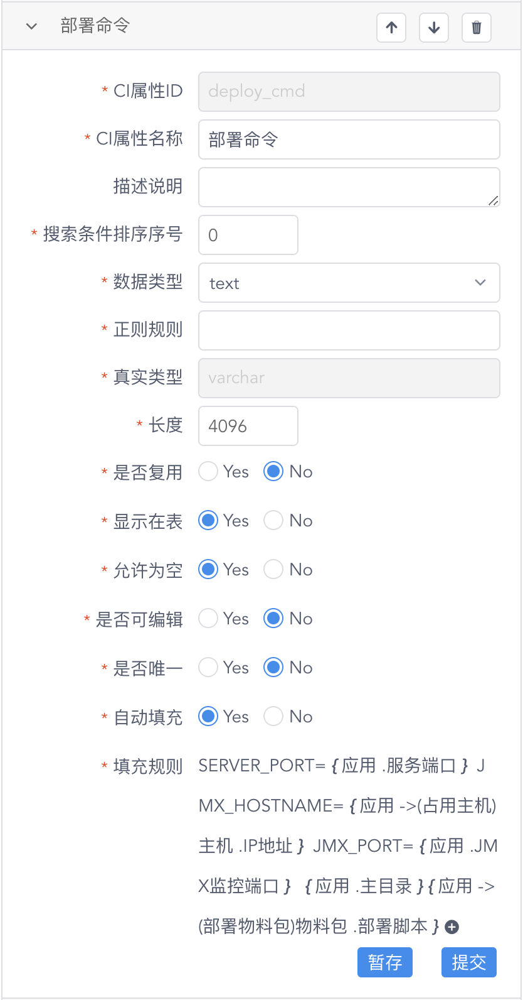
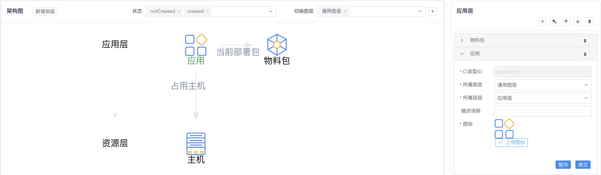
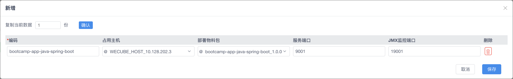

# 演进数据模型并配置应用

在这一步，为了实现应用部署，让我们对数据模型进行演进，完成 `application`（应用）数据类型 的创建并配置好要部署应用对应的数据记录。

## 创建 host（应用）数据类型

请通过 “**系统**菜单” - “**CMDB模型管理**菜单项” 返回到CMDB模型管理页面，点击数据模型架构图中以绿色显示的 “**应用**” 图标，您可以在页面右侧看到我们已经为 `host`（应用）数据类型 设计好的数据属性，如下图所示：

{: target="\_image" style="display: block; width: 60%; margin: 0 auto;"}

在进行数据类型的创建之前，让我们来仔细了解其中的数据属性和它们各自的作用。您可以在页面上通过点击数据属性名称来展开查看数据属性的设计细节。

- **占用主机**

    这个数据属性描述了部署应用实例时所使用的主机资源，也就是说，它实际是一个到 CI数据类型**主机** 的引用关系。所以，我们将这个数据属性的 “**数据类型**” 设置为 `ref`（引用类型），将 “**引用选择**” 设置为目标CI数据类型 `主机`，并且将 “**引用命名**” 和 “**引用类型**” 各自设置为符合其意义的值，如下图所示：

    {: target="\_image" style="display: block; width: 60%; margin: 0 auto;"}

- **部署物料包**

    这个数据属性描述了部署应用实例时所使用的应用物料包，同样的，它实际是一个到 CI数据类型**物料包** 的引用关系。所以，我们将这个数据属性的 “**数据类型**” 设置为 `ref`（引用类型），将 “**引用选择**” 设置为目标CI数据类型 `物料包`，并且将 “**引用命名**” 和 “**引用类型**” 各自设置为符合其意义的值，如下图所示：

    {: target="\_image" style="display: block; width: 60%; margin: 0 auto;"}

- **主目录**

    这个数据属性描述了应用实例运行时所需的物料（程序、配置、数据、日志等文件）在主机上的目录位置。在这里，您需要特别留意的是，我们为这个数据属性启用了 “**自动填充**” 功能，并且将其 “**填充规则**” 设置为 `/data/{应用.编码}`，如下图所示：

    {: target="\_image" style="display: block; width: 60%; margin: 0 auto;"}

    这意味着，我们希望由WeCube根据填充规则为这个数据属性自动生成并完成输入值的填充。具体来讲，进一步来查看填充规则 `/data/{应用.编码}`，这表示我们希望所有的应用物料都存放在目录 `/data` 下与应用实例中的 **编码**属性值 同名的子目录中。

    在这里，您可以根据自己的需要对填充规则进行更改，从而调整应用部署主目录的定位规则。

- **服务端口** 及 **JMX监控端口**

    这2个数据属性描述了应用实例运行时暴露的分别用于接受服务请求和基于JMX进行应用监控的端口。

- **部署命令**、**启动命令** 及 **停止命令**

    这3个数据属性描述了在部署、启动和停止应用实例时应当在主机上执行的命令行指令。同样，我们为这些数据属性都启用了 “**自动填充**” 功能并且配置了更加复杂的 “**填充规则**”，以 **部署命令** 为例，如下图所示：

    {: target="\_image" style="display: block; width: 60%; margin: 0 auto;"}

    为了简化应用部署过程中对配置变量的替换和应用，我们直接将其作为环境变量注入到命令行指令中。

    `SERVER_PORT={应用.服务端口} JMX_HOSTNAME={应用->(占用主机)主机.IP地址} JMX_PORT={应用.JMX监控端口} {应用.主目录}{应用->(部署物料包)物料包.部署脚本}`

    因此，在 “**填充规则**” 中，您会看到我们通过 **应用** 到 其它两个CI数据类型 **主机** 和 **物料包** 的引用关系来取得与其相关的数据属性值，比如 *应用实例所在主机的IP地址* 以及 *应用实例部署包中的部署脚本位置*。

当我们确认这些为应用实例设计的数据属性能够满足应用部署的要求后，请在数据模型架构图上点击位于左侧的 **CI数据类型应用** 所在的 “**应用层**”，随后在页面右侧显示的CI数据类型列表中，点击 “**应用**” 展开数据类型的详细设计，如下图所示：

{: target="\_image"}

接着，请点击下方的 “**提交**” 完成对 CI数据类型**应用** 的最终创建。操作成功后，您会看到数据模型架构图上的 **应用** 变为黑色，代表这个CI数据类型已经创建成功，可以正常使用了。

## 配置应用数据记录

在创建了 CI数据类型**应用** 之后，请通过 “**设计**菜单” - “**CI数据管理**菜单项” 进入数据管理页面。

此时，您会看到 “**应用**” 已经出现在数据模型中，请点击其图标打开 “**应用**”标签页，之后点击 “**新增**”，我们开始添加应用实例的数据记录，如下图所示：

{: target="\_image"}

为应用实例指定 **编码**，选择正确的 **占用主机** 和 **部署物料包**，指定 **服务端口** 和 **JMX监控端口** 后，点击 “**保存**” 来创建应用实例数据记录。

创建成功后，您可以检查应用实例数据记录中 “**主目录**” 和 3个运维操作命令 的属性值，来确保它们的属性值被正确地进行了填充。

## 进一步了解

关于WeCube中对数据模型的管理，您可以进一步参阅以下文档：

- [CMDB模型管理用户手册](manual-cmdb-model.md)
