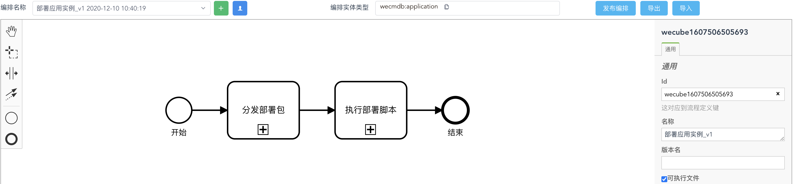
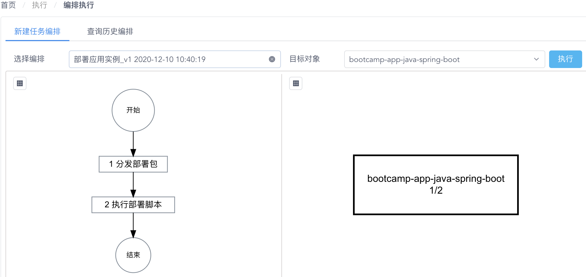
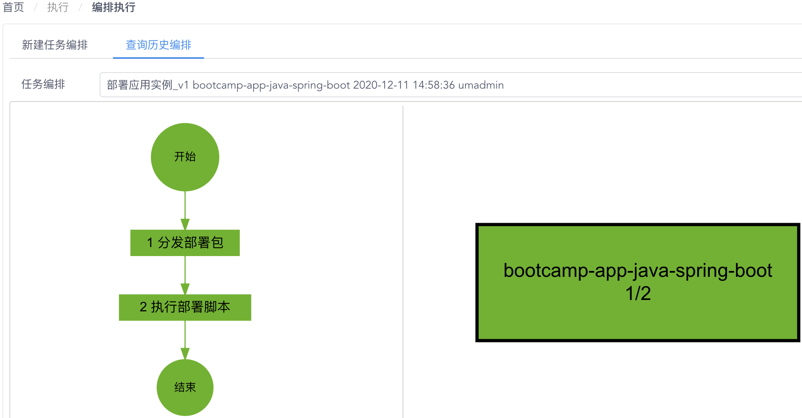

# 执行标准化应用部署流程

在这一步，我们将使用WeCube的任务编排功能执行标准化的应用部署流程。


## 在主机上为应用配置运行环境

在进行应用部署之前，我们需要确保应用部署的目标主机上具备运行应用实例所需的基本条件。在这个例子中，我们需要为主机安装Java运行时环境。

请通过 “**执行**菜单” - “**批量执行**菜单项” 进入批量执行页面，参考 [之前提到的方法](bootcamp-03-explore-plugin-for-deployment.md#_4)选择唯一的主机作为批量执行目标，并选择插件服务方法 `saltstack`/`host-script`(`adhoc_scripting`)/`run`，为 “**scriptContent**”参数 输入以下希望执行的命令行指令并点击 “**执行**”。

```bash
yum install -y java-1.8.0-openjdk
```

之后，您可以再次通过插件服务方法 `saltstack`/`host-script`(`adhoc_scripting`)/`run`，来执行命令行指令 `java -version` 来验证主机上已经具备了Java运行时环境。


## 使用任务编排固化标准化操作流程

您可能已经发现，理论上，我们可以使用批量执行在任意一个数据对象上执行任何一个已经正确配置好的插件服务方法，来完成运维任务。但是，在实际使用时，我们应当借助WeCube将运维任务的标准化操作流程进行固化和自动化。现在，我们就来看看如何通过任务编排实现这一目标。

请通过 “**协同**菜单” - “**任务编排**菜单项” 进入任务编排管理页面，在 “**编排名称**” 列表中选择我们为您准备好的任务编排 `部署应用实例_v1`。

[](images/bootcamp/bootcamp-task-orchestration-design.png){: target="\_image"}

您可以看到，我们使用业务流程引擎为应用实例的部署设计了一套标准化流程。根据 “**编排实体类型**” 的参数配置 `wecmdb:application`，这套任务编排流程将以 **应用实例**数据记录 作为执行目标，它分为 `分发部署包` 和 `执行部署脚本` 两个执行步骤。

当您点击这代表两个执行步骤的流程节点时，您可以在页面下方看到该流程节点执行时的各种配置参数。我们以 `分发部署包`任务节点为例，如下图所示：

[](images/bootcamp/bootcamp-task-node-config.png){: target="\_image"}

其中，

- “**插件类型**” 配置参数设置为 `自动节点`，代表该任务节点的执行无需人工干预，将自动执行并调用配置好的插件服务方法。

- “**定位规则**” 配置参数设置为 `wecmdb:applicaiton`，代表该任务节点将使用与 **编排实体类型** 配置相同的 **应用实例**数据记录 作为执行对象。

- “**插件**” 配置参数设置为 `saltstack/host-file(distribute_artifact)/copy`，代表该节点执行时将调用 `saltstack`插件 中 `host-file`服务 下的 `copy`方法 来完成应用部署包的拷贝分发，而调用时将根据名为 `distribute_artifact` 的服务配置决定调用参数。

    关于插件服务配置 `distribute_artifact` 的具体参数设置，您可以通过 “**协同**菜单” - “**插件注册**菜单项” 进入插件管理页面，参考 [之前提到的方法](bootcamp-03-explore-plugin-for-deployment.md#_3) 进行查看。


## 执行用于应用部署的任务编排

现在，让我们来执行任务编排来真正完成应用实例的部署，请通过 “**执行**菜单” - “**编排执行**菜单项” 进入任务编排执行页面，如下图所示：

[](images/bootcamp/bootcamp-task-orchestration-execution.png){: target="\_image"}

请在 “**选择编排**”列表 中选择刚刚确认过的任务编排　`部署应用实例_v1`，在 “**目标对象**”列表 中选择我们之前创建的应用实例 `bootcamp-app-java-spring-boot`，接着点击 “**执行**” 来开始进行应用实例的部署。

[](images/bootcamp/bootcamp-task-orchestration-execution-done.png){: target="\_image"}

当流程图中的所有任务节点都变为绿色时，应用部署过程即成功完成，您可以通过访问部署目标主机上之前为应用实例设置的服务端口来进行验证。

下一步，我们将通过WeCube的监控插件来最终实现对主机和应用实例的监控。


## 进一步了解

您可以进一步参阅以下文档：

- [任务编排设计用户手册](manual-orchestration-design.md)
- [任务编排执行用户手册](manual-orchestration-execution.md)
