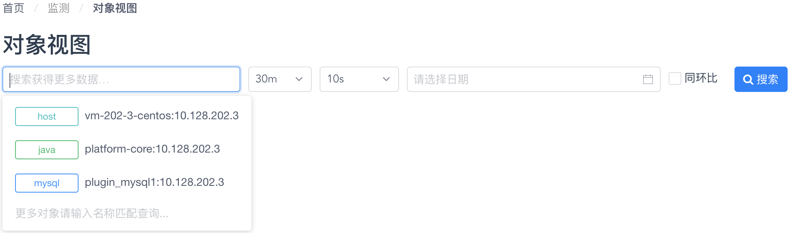
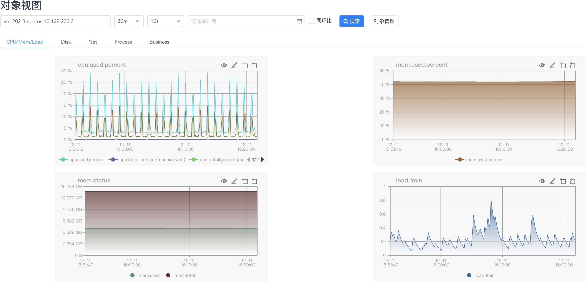
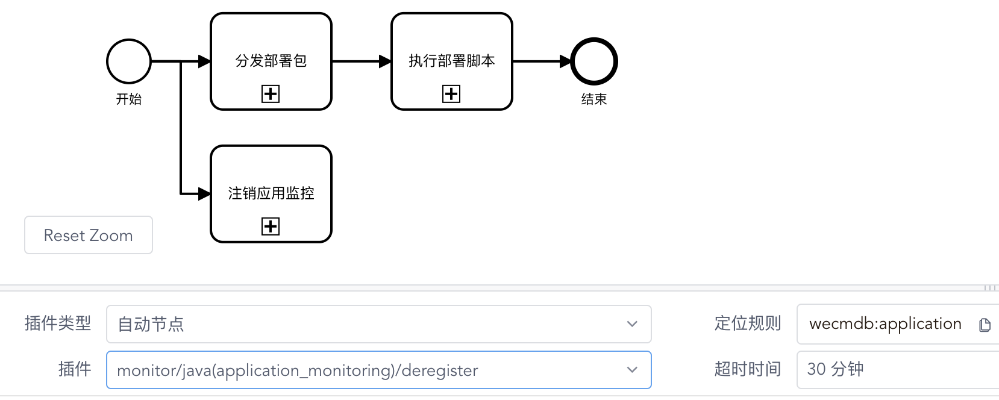
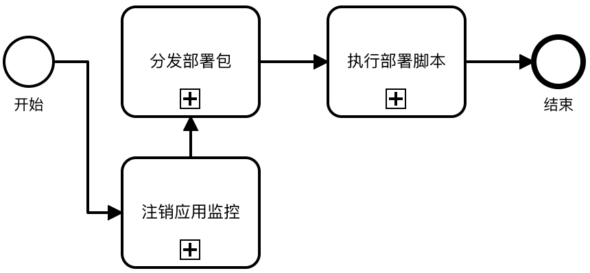
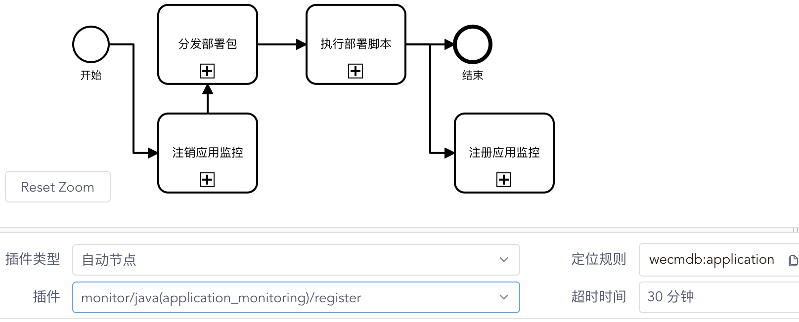
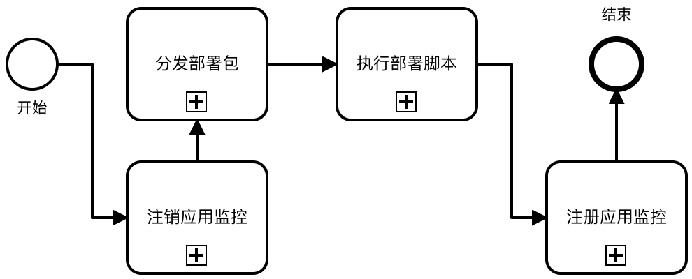
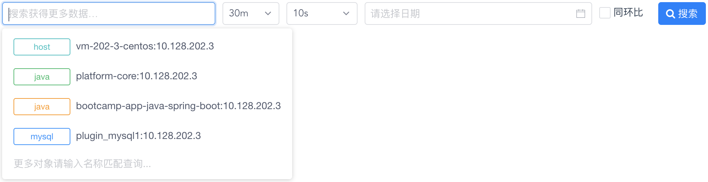
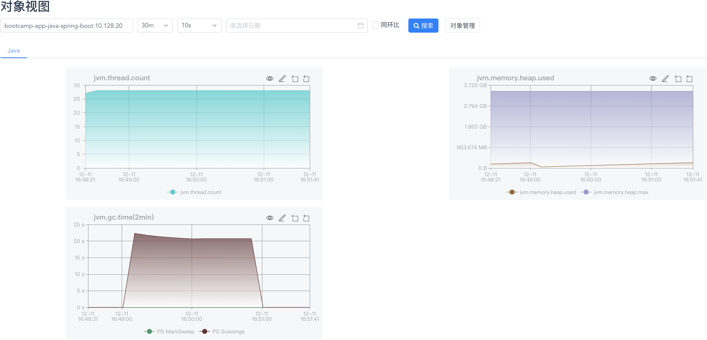

# 完善对主机和应用的监控

在这最后一步，让我们来完善由 WeCube 和部署好的示例应用组成的 IT 环境中的监控体系。

## 了解现有的监控体系

请通过 “**监测**菜单” - “**对象看板**菜单项” 进入监控对象看板页面。如下图所示：

{: target="\_image"}

在页面上的对象列表中，您可以看到我们已经在安装将 WeCube 运行依赖的主机、MySQL 数据库实例以及核心 Java 应用都作为监控对象加入到监控体系中。

您可以选择具体某一个监控对象，之后点击 “**搜索**”，来进一步查看监控指标情况。

{: target="\_image"}

## 把监控体系集成到应用部署过程中

现在，让我们来调整应用部署的标准化流程，把针对应用实例的监控对象操作添加到流程之中。请再次通过 “**协同**菜单” - “**任务编排**菜单项” 进入任务编排管理页面，在 “**编排名称**” 列表中选择任务编排 `部署应用实例_v1`。

请对流程做出以下调整：

1. 在流程执行开始后，添加 “**注销应用监控**” 的任务执行节点，并将任务节点的执行配置设定为自动执行插件方法 `monitor/java(application_monitoring)/deregister`，并点击页面右下方的 “**保存**”。

   {: target="\_image"}

1. 调整流程图中任务节点的顺序，使 “**注销应用监控**” 变为第一步，使 “**分发部署包**” 变味第二步，其它任务节点不变。

   {: target="\_image" style="display: block; width: 60%; margin: 0 auto;"}

1. 在流程执行结束前，添加 “**注册应用监控**” 的任务执行节点，并将任务节点的执行配置设定为自动执行插件方法 `monitor/java(application_monitoring)/register`，并点击页面右下方的 “**保存**”。

   {: target="\_image"}

1. 调整流程图中任务节点的顺序，使 “**注册应用监控**” 变为在 “**执行部署脚本**” 之后的最后一步，其它任务节点不变。

   {: target="\_image" style="display: block; width: 60%; margin: 0 auto;"}

1. 最后，请单击流程图中的空白处，在页面右侧的 “**名称**”输入框中，将流程编排名称改为 “**部署应用实例\_v2**”，之后点击页面右上方的 “**发布编排**”。

在调整后的新版本任务编排成功发布后，就可以使用它来再一次进行应用部署了。

## 再次执行应用部署

现在，让我们来使用新版本 v2 的任务编排再一次执行应用实例的部署，请通过 “**执行**菜单” - “**编排执行**菜单项” 进入任务编排执行页面。

您会看到，“**选择编排**”列表中 新增加了我们刚刚发布的 v2 版本的用于部署应用实例的任务编排，请选择这个新版本的任务编排，并在 “**目标对象**”列表中 选择之前配置好的唯一的应用实例，之后点击 “**执行**”。

您会注意到，此时的流程执行图中已经包含了我们调整过后的全部四个执行步骤。在任务编排执行完成后，请通过 “**监测**菜单” - “**对象看板**菜单项” 再次进入监控对象看板页面。

{: target="\_image"}

您可以看到，列表中已经包含了对应 示例应用`bootcamp-app-java-spring-boot` 的监控对象，请选择这个监控对象再点击 “**搜索**” 来查看针对这个 Java 应用的监控指标详情。

{: target="\_image"}

## 进一步了解

您可以进一步参阅以下文档：

- [监控插件用户手册](manual-open-monitor-object-view.md)
