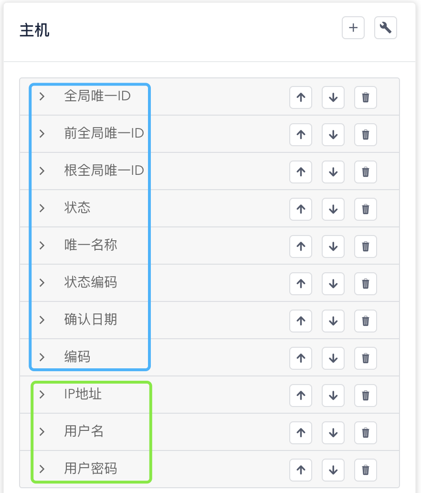

# 探索数据模型

在这一步，让我们来了解能够在WeCube中进行管理的数据类型，请通过 “**系统**菜单” - “**CMDB模型管理**菜单项” 进入CMDB模型管理页面。

## 数据模型概览

在页面上，您可以看到我们已经为您准备好的将要使用到的部分数据模型，如下图所示：

{: target=\_image}

其中包括：

- CI数据类型 **主机**

	**主机** 代表您所拥有的可以运行工作负载的计算资源，比如您刚刚安装WeCube时使用的虚拟机或者物理机。您可以点击架构图中的主机图标，页面右侧将为您展示主机数据类型中包含的数据属性，如下图所示：

	[{: style="display: block; width: 60%; margin: 0 auto;"}](images/bootcamp/bootcamp-data-type-host.png){: target=\_image}

	图中蓝色方框中的属性是通用属性，WeCube管理的任何数据类型中都包含这些属性；绿色方框中的数据属性则是我们为主机专门设计的属性，用来管理和维护与您主机相关的重要信息，目前包括 **IP地址**、**用户名** 和 **用户密码**。在后面的步骤中，我们将依靠这些数据属性连接到您的主机上并进行应用部署。

- CI数据类型 **物料包**

	**物料包** 代表我们为了进行应用部署而准备的物料包，如下图所示

	[{: style="display: block; width: 60%; margin: 0 auto;"}](images/bootcamp/bootcamp-data-type-artifact.png){: target=\_image}

	在图中绿色方框中展示了我们为了进行应用部署需要使用到的物料包数据属性，目前包括 **下载地址**、**是否需要解压缩**、**部署脚本路径**、**启动脚本路径** 和 **停止脚本路径**。

- CI数据类型 **应用** （名称为绿色，即设计草稿、未创建状态）

