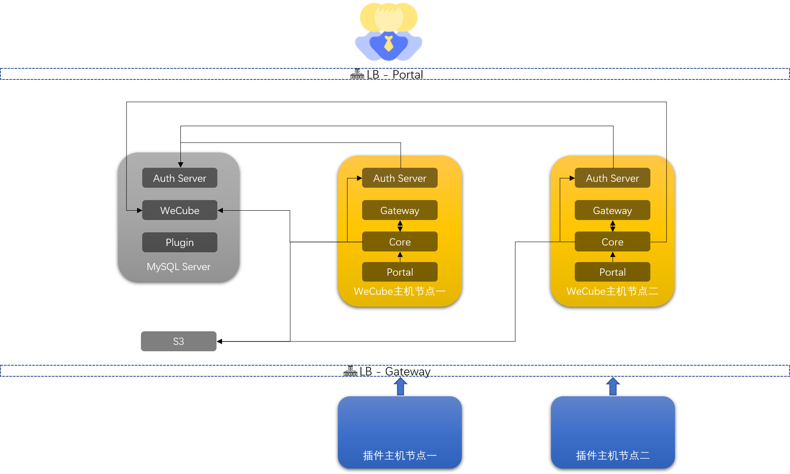

# 在私有资源上手工集群模式安装WeCube

在这里，我们将为您说明如何在您自己的机器资源上手工安装以集群模式运行的WeCube。

本文旨在帮助用户理解WeCube软件的完整安装过程，并在离线环境中手工完成配置。

## 先决条件

### 硬件资源

在原有的WeCube单机部署中，我们默认内置了MySQL服务，S3服务，而在集群模式下，我们建议您使用您所在的组织/公司提供高可用服务(负载均衡 * 2 + MySQL * 3 + S3服务 * 1)

| 资源    | 数量  | 建议配置                       | 用途                                                                                                       |
|-------|-----|----------------------------|----------------------------------------------------------------------------------------------------------|
| 主机    | 2   | 2核 8G 100G硬盘              | WeCube平台软件运行(100用户规模)                                                                                    |
| 主机    | 2   | 4核 16G 100G硬盘              | WeCube插件运行(除Monitor插件其他插件)                                                                               |
| 主机    | 2   | 8核 32G 500G硬盘              | WeCube插件运行(Monitor插件独占,1000主机规模)                                                                         |
| MySQL服务 | 1   | 2核 4G 50G硬盘                | MySQL集群 - Auth Server数据库                                                                                 |
| MySQL服务 | 1   | 4核 8G 100G硬盘                | MySQL集群 - WeCube数据库                                                                                      |
| MySQL服务 | 1   | 4核 8G 100G硬盘(请根据实际业务量进行调整)  | MySQL集群 - 插件数据库                                                                                          |
| MySQL服务 | 1   | 4核 8G 500G硬盘(请根据实际业务量进行调整) | MySQL集群 - Monitor插件归档数据库                                                                                 |
| S3    | 2   | 2核 4G 200G硬盘(请根据实际业务量进行调整) | S3集群                                                                                                     |
| LB    | 1   |                            | WeCube-Gateway负载均衡(负载{{host_wecube1_ip}}:8005,{{host_wecube2_ip}}:8005)，健康检查地址：/platform/v1/health-check |
| LB    | 1   |                            | WeCube-Portal负载均衡（负载{{host_wecube1_ip}}:8080,{{host_wecube2_ip}}:8080）                                   |

> 若您的组织/公司内部未提供以上服务，或参照互联网文章进行安装部署，本文不再赘述，文中提供一个单节点作为演示说明用途，请勿应用于生产环境中。


### 系统和软件资源

#### CentOS 7

以下安装配置脚本基于CentOS操作系统，推荐使用CentOS 7.2+。

#### Docker

WeCube的运行依赖于Docker，在安装WeCube之前，需要在您的环境(每台服务器)上正确部署和配置docker和docker-compose软件，最新的docker软件可以从docker-ce源中获取，epel源中有版本稍旧的docker-compose但足够本次安装使用，这需要您所在的组织/公司提供这些软件的源。

??? note "如果您使用CentOS，也可以考虑使用这里提供的命令行指令来进行Docker的安装与配置，请展开来查看。"
    我们还是**建议**您从 [Docker官方网站 :fa-external-link:](https://docs.docker.com/engine/install/){: target=\_blank} 获取最新的安装和配置的指引。

    ``` bash
    # 移除已安装的旧版本Docker
    yum remove docker \
              docker-client \
              docker-client-latest \
              docker-common \
              docker-latest \
              docker-latest-logrotate \
              docker-logrotate \
              docker-engine

    # 安装Docker
    yum install -y yum-utils device-mapper-persistent-data lvm2
    # yum-config-manager --add-repo https://download.docker.com/linux/centos/docker-ce.repo
    # yum-config-manager --add-repo https://mirrors.cloud.tencent.com/docker-ce/linux/centos/docker-ce.repo
    yum makecache fast
    yum install -y docker-ce docker-ce-cli containerd.io

    # 安装Docker Compose
    yum install -y docker-compose

    # 安装基础工具
    yum install -y unzip

    # 配置Docker Engine以监听远程API请求
    mkdir -p /etc/systemd/system/docker.service.d
    cat <<EOF >/etc/systemd/system/docker.service.d/docker-wecube-override.conf
    [Service]
    ExecStart=
    ExecStart=/usr/bin/dockerd -H tcp://0.0.0.0:2375 -H fd:// --containerd=/run/containerd/containerd.sock
    EOF

    # 启动Docker服务
    systemctl daemon-reload
    systemctl enable docker.service
    systemctl start docker.service

    # 启用IP转发并配置桥接来解决Docker容器对外部网络的通信问题
    cat <<EOF >/etc/sysctl.d/zzz.net-forward-and-bridge-for-docker.conf
    net.ipv4.ip_forward = 1
    net.bridge.bridge-nf-call-ip6tables = 1
    net.bridge.bridge-nf-call-iptables = 1
    EOF
    sysctl -p /etc/sysctl.d/zzz.net-forward-and-bridge-for-docker.conf

    ####
    ```


安装并配置完成后，您可以使用以下命令行指令来确认Docker的运行情况：

``` bash
docker version
docker-compose version
curl http://127.0.0.1:2375/version

```

### 离线镜像准备

首先，需要确认要安装的WeCube版本，版本号通常定义为vX.Y.Z，如v4.1.0，具体版本号可以从官方Release中找到

[GitHub Release](https://github.com/WeBankPartners/wecube-platform/releases)

[Gitee Release](https://gitee.com/WeBankPartners/wecube-platform/releases)

并且可以从Release中找到插件包的下载地址，可以下载备用

```bash
WECUBE_VERSION=v4.1.0
# pull images
docker pull ccr.ccs.tencentyun.com/webankpartners/minio
docker pull ccr.ccs.tencentyun.com/webankpartners/mysql:$WECUBE_VERSION
docker pull ccr.ccs.tencentyun.com/webankpartners/platform-core:$WECUBE_VERSION
docker pull ccr.ccs.tencentyun.com/webankpartners/wecube-portal:$WECUBE_VERSION
docker pull ccr.ccs.tencentyun.com/webankpartners/platform-gateway:$WECUBE_VERSION
docker pull ccr.ccs.tencentyun.com/webankpartners/platform-auth-server:$WECUBE_VERSION

# save images
docker save -o webankpartners-minio.tar ccr.ccs.tencentyun.com/webankpartners/minio
docker save -o webankpartners-mysql.tar ccr.ccs.tencentyun.com/webankpartners/mysql:$WECUBE_VERSION
docker save -o webankpartners-platform-core.tar ccr.ccs.tencentyun.com/webankpartners/platform-core:$WECUBE_VERSION
docker save -o webankpartners-wecube-portal.tar ccr.ccs.tencentyun.com/webankpartners/wecube-portal:$WECUBE_VERSION
docker save -o webankpartners-platform-gateway.tar ccr.ccs.tencentyun.com/webankpartners/platform-gateway:$WECUBE_VERSION
docker save -o webankpartners-platform-auth-server.tar ccr.ccs.tencentyun.com/webankpartners/platform-auth-server:$WECUBE_VERSION
```


## 开始安装WeCube安装

### 部署图



### 环境变量整理

**请按需修正一下环境变量值**

```bash
# wecube版本
WECUBE_VERSION='v4.1.0'
# 部署的主机ip,如果是多台机部署每台机都要用自身ip部署一次
HOSTIP='10.0.0.1'
# 日志级别
LOG_LEVEL='info'
# (非必须)wecube内置的私钥，用于wecube yaml里数据库密码等敏感信息的加解密，rsa1024公钥加密私钥解
WECUBE_PRIVATE_KEY='rsa_private_key.pem'
# wecube用户token加解密种子
JWT_SIGNING_KEY='Platform+Auth+Server+Secret'
# wecube mysql服务信息
mysql_wecube_host='10.0.0.10'
mysql_wecube_port='3307'
mysql_wecube_username='root'
# 该password可用上面的WECUBE_PRIVATE_KEY对应的公钥加密，程序内会用WECUBE_PRIVATE_KEY尝试解密
mysql_wecube_password='WeCube@1234'
# s3服务信息
s3_host='10.0.1.10'
s3_port='9000'
s3_access='access_key'
s3_secret='secret_key'
# wecube主机ssh认证信息
host_wecube_username='root'
host_wecube_password='WeCube@1234'
# 邮件通知(auth-server角色到期邮件提醒)
MAIL_SENDER_NAME=''
MAIL_SENDER=''
MAIL_SERVER=''
MAIL_PASSWORD=''
MAIL_SSL='Y'
```

WECUBE_PRIVATE_KEY 的生成与 mysql_wecube_password 加密:      
```bash
# 生成rsa私钥
openssl genrsa -out rsa_key.pem 1024
# 生成公钥
openssl rsa -in rsa_key.pem -pubout -out rsa_public_key.pem
# 把私钥转成pkcs8格式
openssl pkcs8 -topk8 -inform PEM -in rsa_key.pem -outform PEM -nocrypt -out rsa_private_key.pem
# 加密，注意copy加密后的base64内容时不要有换行符，有些终端比较窄可能会换行
echo 'WeCube@1234' > test.txt
openssl rsautl -encrypt -pubin -inkey rsa_public_key.pem -in test.txt -out test.enc
echo "RSA@`base64 test.enc`"
# 把输出的密文赋值给mysql_wecube_password 
```

### MySQL服务(仅演示用途)：

在本地准备以下db的yaml文件

1-wecube-db.yml

```yaml
version: "3"
services:
  mysql-wecube:
    image: ccr.ccs.tencentyun.com/webankpartners/mysql:{{WECUBE_VERSION}}
    restart: always
    command:
      [
        "--character-set-server=utf8mb4",
        "--collation-server=utf8mb4_unicode_ci",
        "--default-time-zone=+8:00",
        "--max_allowed_packet=4M",
        "--lower_case_table_names=1",
      ]
    volumes:
      - /etc/localtime:/etc/localtime
      - /data/installer/wecube/database/platform-core:/docker-entrypoint-initdb.d
      - /data/mysql-wecube/data:/var/lib/mysql
    environment:
      - MYSQL_ROOT_PASSWORD=WeCube@1234
      - MYSQL_DATABASE=wecube
    ports:
      - 3307:3306

```

启动db服务

docker-compose -f 1-wecube-db.yml up -d 

### S3服务(仅演示用途)：

2-wecube-minio.yml     

```yaml
version: '3'
services:
  wecube-minio:
    image: ccr.ccs.tencentyun.com/webankpartners/minio
    restart: always
    command: [
        'server',
        'data'
    ]
    ports:
      - 9000:9000
    volumes:
      - /data/wecube-minio/data:/data    
      - /data/wecube-minio/config:/root
      - /etc/localtime:/etc/localtime
    environment:
      - MINIO_ACCESS_KEY=access_key
      - MINIO_SECRET_KEY=secret_key
```

启动minio服务

docker-compose -f 2-wecube-minio.yml up -d 
```bash
# 需要新建minio数据目录
mkdir -p /data/wecube-minio/data/wecube-plugin-package-bucket
mkdir -p /data/wecube-minio/data/salt-tmp                    
mkdir -p /data/wecube-minio/data/taskman-file
mkdir -p /data/wecube-minio/data/terminal    
mkdir -p /data/wecube-minio/data/wecube-agent
mkdir -p /data/wecube-minio/data/wecube-artifacts
```


### 主机：WeCube节点一

#### 准备yaml内容

在本地准备以下2个yaml文件

3-wecube-auth-server.yml

```yaml
version: '3'
services:
  platform-auth-server:
    image: ccr.ccs.tencentyun.com/webankpartners/platform-auth-server:{{WECUBE_VERSION}}
    container_name: platform-auth-server-{{WECUBE_VERSION}}
    restart: always
    volumes:
      - /etc/localtime:/etc/localtime
      - /data/app/platform/platform-auth-server/logs:/app/platform-auth-server/logs
      - /data/app/platform/platform-auth-server/certs:/app/platform-auth-server/config/certs
    ports:
      - "{{HOSTIP}}:8002:8080"
    environment:
      - LOG_LEVEL={{LOG_LEVEL}}
      - PASSWORD_PRIVATE_KEY_PATH=/app/platform-auth-server/config/certs/{{WECUBE_PRIVATE_KEY}}
      - MYSQL_SERVER_ADDR={{mysql_wecube_host}}
      - MYSQL_SERVER_PORT={{mysql_wecube_port}}
      - MYSQL_USER_NAME={{mysql_wecube_username}}
      - MYSQL_USER_PASSWORD={{mysql_wecube_password}}
      - MYSQL_SERVER_DATABASE_NAME=auth_server
      - SIGNING_KEY={{JWT_SIGNING_KEY}}
      - USER_ACCESS_TOKEN=20
      - USER_REFRESH_TOKEN=30
      - WECUBE_CORE_ADDRESS={{HOSTIP}}:8000
      - SENDER_NAME={{MAIL_SENDER_NAME}}
      - SENDER_MAIL={{MAIL_SENDER}}
      - AUTH_SERVER={{MAIL_SERVER}}
      - AUTH_PASSWORD={{MAIL_PASSWORD}}
      - SSL={{MAIL_SSL}}
      - NOTIFY_PERCENT=80
```

4-wecube-platform-core.yml

```yaml
version: '3'
services:
  platform-core:
    image: ccr.ccs.tencentyun.com/webankpartners/platform-core:{{WECUBE_VERSION}}
    container_name: platform-core-{{WECUBE_VERSION}}
    restart: always
    volumes:
      - /etc/localtime:/etc/localtime
      - /data/app/platform/platform-core/logs:/app/platform-core/logs
      - /data/app/platform/platform-core/certs:/app/platform-core/config/certs
    ports:
      - "{{HOSTIP}}:8000:8000"
    environment:
      - version={{WECUBE_VERSION}}
      - log_level={{LOG_LEVEL}}
      - password_private_key_path=/app/platform-core/config/certs/{{WECUBE_PRIVATE_KEY}}
      - https_enable=false
      - http_port=8000
      - db_server={{mysql_wecube_host}}
      - db_port={{mysql_wecube_port}}
      - db_user={{mysql_wecube_username}}
      - db_pass={{mysql_wecube_password}}
      - db_database=wecube
      - auth_server_url=http://{{HOSTIP}}:8002
      - jwt_signing_key={{JWT_SIGNING_KEY}}
      - s3_address={{s3_host}}:{{s3_port}}
      - s3_access_key={{s3_access}}
      - s3_secret_key={{s3_secret}}
      - static_resource_server_ips={{HOSTIP}}
      - static_resource_server_user={{host_wecube_username}}
      - static_resource_server_password={{host_wecube_password}}
      - static_resource_server_port=22
      - static_resource_server_path=/data/app/platform/wecube-portal/data/ui-resources
      - plugin_base_mount_path=/data
      - plugin_deploy_path=/data/app/plugin-image
      - plugin_password_pub_key_path=
      - resource_server_password_seed=defaultSeed
      - gateway_url={{HOSTIP}}:8005
      - gateway_host_ports={{HOSTIP}}:8005
      - sub_system_private_key=
      - cron_keep_batch_exec_days=20
      - host_ip={{HOSTIP}}
```

5-wecube-platform-gateway.yml

```yaml
version: '3'
services:
  platform-gateway:
    image: ccr.ccs.tencentyun.com/webankpartners/platform-gateway:{{WECUBE_VERSION}}
    container_name: platform-gateway-{{WECUBE_VERSION}}
    restart: always
    volumes:
      - /etc/localtime:/etc/localtime
      - /data/app/platform/platform-gateway/logs:/app/platform-gateway/logs
    ports:
      - "{{HOSTIP}}:8005:8080"
    environment:
      - LOG_LEVEL={{LOG_LEVEL}}
      - GATEWAY_ROUTE_CONFIG_SERVER=http://{{HOSTIP}}:8000
      - GATEWAY_ROUTE_CONFIG_URI=/platform/v1/route-items
      - WECUBE_CORE_ADDRESS={{HOSTIP}}:8000
      - AUTH_SERVER_ADDRESS={{HOSTIP}}:8002
```

6-wecube-portal.yml

```yaml
version: '3'
services:
  wecube-portal:
    image: ccr.ccs.tencentyun.com/webankpartners/wecube-portal:{{WECUBE_VERSION}}
    container_name: wecube-portal-{{WECUBE_VERSION}}
    restart: always
    volumes:
      - /etc/localtime:/etc/localtime
      - /data/app/platform/wecube-portal/log:/var/log/nginx/
      - /data/app/platform/wecube-portal/data/ui-resources:/root/app/ui-resources
    ports:
      - "{{HOSTIP}}:8080:8080"
    environment:
      - GATEWAY_HOST={{HOSTIP}}
      - GATEWAY_PORT=8005
      - PUBLIC_DOMAIN={{HOSTIP}}:8080
      - TZ=Asia/Shanghai
    command: /bin/bash -c "/etc/nginx/start_platform_portal.sh"
```


#### 修正yaml内容的值

```bash
# 请修改以下变量为正确值
# 粘贴以上整理的环境变量
sed -i "s/{{WECUBE_VERSION}}/$WECUBE_VERSION/g" 1-wecube-db.yml

sed -i "s/{{WECUBE_VERSION}}/$WECUBE_VERSION/g" 3-wecube-auth-server.yml
sed -i "s/{{HOSTIP}}/$HOSTIP/g" 3-wecube-auth-server.yml
sed -i "s/{{LOG_LEVEL}}/$LOG_LEVEL/g" 3-wecube-auth-server.yml
sed -i "s/{{WECUBE_PRIVATE_KEY}}/$WECUBE_PRIVATE_KEY/g" 3-wecube-auth-server.yml
sed -i "s/{{JWT_SIGNING_KEY}}/$JWT_SIGNING_KEY/g" 3-wecube-auth-server.yml
sed -i "s/{{mysql_auth_host}}/$mysql_auth_host/g" 3-wecube-auth-server.yml
sed -i "s/{{mysql_auth_port}}/$mysql_auth_port/g" 3-wecube-auth-server.yml
sed -i "s/{{mysql_auth_username}}/$mysql_auth_username/g" 3-wecube-auth-server.yml
sed -i "s/{{mysql_auth_password}}/$mysql_auth_password/g" 3-wecube-auth-server.yml
sed -i "s/{{MAIL_SENDER_NAME}}/$MAIL_SENDER_NAME/g" 3-wecube-auth-server.yml
sed -i "s/{{MAIL_SENDER}}/$MAIL_SENDER/g" 3-wecube-auth-server.yml
sed -i "s/{{MAIL_SERVER}}/$MAIL_SERVER/g" 3-wecube-auth-server.yml
sed -i "s/{{MAIL_PASSWORD}}/$MAIL_PASSWORD/g" 3-wecube-auth-server.yml
sed -i "s/{{MAIL_SSL}}/$MAIL_SSL/g" 3-wecube-auth-server.yml


sed -i "s/{{WECUBE_VERSION}}/$WECUBE_VERSION/g" 4-wecube-platform-core.yml
sed -i "s/{{HOSTIP}}/$HOSTIP/g" 4-wecube-platform-core.yml
sed -i "s/{{LOG_LEVEL}}/$LOG_LEVEL/g" 4-wecube-platform-core.yml
sed -i "s/{{WECUBE_PRIVATE_KEY}}/$WECUBE_PRIVATE_KEY/g" 4-wecube-platform-core.yml
sed -i "s/{{JWT_SIGNING_KEY}}/$JWT_SIGNING_KEY/g" 4-wecube-platform-core.yml
sed -i "s/{{mysql_wecube_host}}/$mysql_wecube_host/g" 4-wecube-platform-core.yml
sed -i "s/{{mysql_wecube_port}}/$mysql_wecube_port/g" 4-wecube-platform-core.yml
sed -i "s/{{mysql_wecube_username}}/$mysql_wecube_username/g" 4-wecube-platform-core.yml
sed -i "s/{{mysql_wecube_password}}/$mysql_wecube_password/g" 4-wecube-platform-core.yml
sed -i "s/{{s3_host}}/$s3_host/g" 4-wecube-platform-core.yml
sed -i "s/{{s3_port}}/$s3_port/g" 4-wecube-platform-core.yml
sed -i "s/{{s3_access}}/$s3_access/g" 4-wecube-platform-core.yml
sed -i "s/{{s3_secret}}/$s3_secret/g" 4-wecube-platform-core.yml
sed -i "s/{{host_wecube_username}}/$host_wecube_username/g" 4-wecube-platform-core.yml
sed -i "s/{{host_wecube_password}}/$host_wecube_password/g" 4-wecube-platform-core.yml


sed -i "s/{{WECUBE_VERSION}}/$WECUBE_VERSION/g" 5-wecube-platform-gateway.yml
sed -i "s/{{HOSTIP}}/$HOSTIP/g" 5-wecube-platform-gateway.yml
sed -i "s/{{LOG_LEVEL}}/$LOG_LEVEL/g" 5-wecube-platform-gateway.yml


sed -i "s/{{WECUBE_VERSION}}/$WECUBE_VERSION/g" 6-wecube-portal.yml
sed -i "s/{{HOSTIP}}/$HOSTIP/g" 6-wecube-portal.yml
```


#### 启动docker容器

- 启动auth-server服务

  docker-compose -f 3-wecube-auth-server.yml up -d

- 启动core服务

  docker-compose -f 4-wecube-platform-core.yml up -d

- 启动gateway服务

  docker-compose -f 5-wecube-platform-gateway.yml up -d

- 启动portal服务

  docker-compose -f 6-wecube-portal.yml up -d

  

  至此，已经可以打开系统页面进行正常访问，但还无法正常使用插件功能

  **WeCube主页：http://{主机节点一IP}:8080   默认账户密码：admin/admin**

#### 更改系统变量值

修改正确的值，以正确启动插件

Web页面：系统-系统参数

| key                               | value                              |
| --------------------------------- |------------------------------------|
| system\_\_global\_\_GATEWAY_URL   | http://\{\{lb_gateway_ip}}:8080    |
| system\_\_global\_\_S3_SERVER_URL | http://\{\{s3_host}}:\{\{s3_port}} |
| system\_\_global\_\_S3_ACCESS_KEY | \{\{s3_access}}                    |
| system\_\_global\_\_S3_SECRET_KEY | \{\{s3_secret}}                    |

### 主机：WeCube节点二

按WeCube节点一的方式在节点二中部署，其中HOSTIP变量替换成节点二本机ip

#### 准备yaml内容

在本地准备以下2个yaml文件


### 主机：Plugin节点一

完成先决条件中的Docker环境准备即可

### 主机：Plugin节点二

完成先决条件中的Docker环境准备即可

### LB服务(仅演示用途)

简单配置只需要使用nginx配置upstream即可，配置完负载均衡，需要把系统参数的GATEWAY_URL改成gateway的负载均衡地址

```
# gateway upstream
upstream gateway {
  server {{host_wecube1_ip}}:8005;
  server {{host_wecube2_ip}}:8005;
}

server {
  server_name _;
  listen 8005;
  location / {
    proxy_pass http://gateway;
    proxy_set_header Host $host;
    proxy_set_header User-Agent $http_user_agent;
    proxy_set_header X-Real-IP $remote_addr;
    proxy_set_header X-Forwarded-For $proxy_add_x_forwarded_for;
  }
}
```

```
# portal upstream
upstream portal {
  server {{host_wecube1_ip}}:8080;
  server {{host_wecube2_ip}}:8080;
}

server {
  server_name _;
  listen 80;
  location / {
    proxy_pass http://portal;
    proxy_set_header Host $host;
    proxy_set_header User-Agent $http_user_agent;
    proxy_set_header X-Real-IP $remote_addr;
    proxy_set_header X-Forwarded-For $proxy_add_x_forwarded_for;
  }
}
```


### 添加系统资源

需要正确添加mysql数据库，S3服务，docker主机服务到WeCube系统资源中，插件才能从资源中申请到实例，插件所需的实例写在插件包的register.xml文件中，但您无需担心，只要添加了资源，系统会自动进行实例分配。

Web页面：系统-资源管理

1. 添加mysql(默认全部插件会用此数据库实例)：{{mysql_plugin_host}}:{{mysql_plugin_port}}  {{mysql_auth_username}}/{{mysql_auth_password}}
2. 添加s3：{{s3_host}}:{{s3_port}} {{s3_access}}/{{s3_secret}}
3. 添加host：{{host_plugin1_ip}}:22 root/你的主机密码
4. 添加host：{{host_plugin2_ip}}:22 root/你的主机密码
5. 如果插件想单独用一个数据库实例请添加个mysql，然后把名称设置为插件名，比如wecmdb、monitor等，注意请在实例中预先建好数据库并授权给所录用户，除了wecmdb插件的数据库名wecmdb_pro，其它插件的数据库名与插件名相同。

### 安装插件包

首次使用插件请先登录S3服务(http://{主机IP}:9000)，创建bucket：wecube-plugin-package-bucket

插件包下载地址：https://github.com/WeBankPartners/wecube-platform/releases

下载的插件包可在 协同-插件注册 页面手动上传，上传完毕后确认注册，并手动运行

> 请留意！！
>
> 插件包仅包含运行所需软件，不一定包含正常体验所需的预置数据
>
> 比如CMDB插件包，上传运行后，其模型为空，流程编排中cmdb注册的插件接口服务也为空，旨在提供给需要自定义模型的用户，并根据自定义模型配置对应的插件接口服务。
>
> 若希望快速体验WeCube服务，可在Release中下载 **插件配置最佳实践** - [标准安装配置](https://github.com/WeBankPartners/wecube-platform/releases)
>
> 最佳实践的标准安装配置包含了**插件预置数据** & **插件预置数据对应的服务接口定义**
>
> **插件预置数据** 通常为sql，直接导入到对应的插件数据库中即可
>
> **插件预置数据对应的服务接口定义** 通常为xml，在插件管理页面中进行配置导入

到这里，您已经完成了WeCube的安装部署，请尽情体验吧。

## 卸载WeCube

如果您想要卸载已经安装的WeCube，或者想要使用不同的版本或插件配置方案来安装WeCube，请执行以下命令行指令来清除WeCube的运行组件和安装目录（默认为 `/data/wecube`，请根据您的实际情况对命令行指令进行调整）：

```bash
docker rm -f $(docker ps -a -q -f name=wecube -f name=open-monitor -f name=service-mgmt) && sudo rm -rfI /data/wecube
```


## 进一步了解

关于WeCube安装目录结构的详细信息，请参见文档“[WeCube安装目录结构](installation-directory-structure.md)”。
