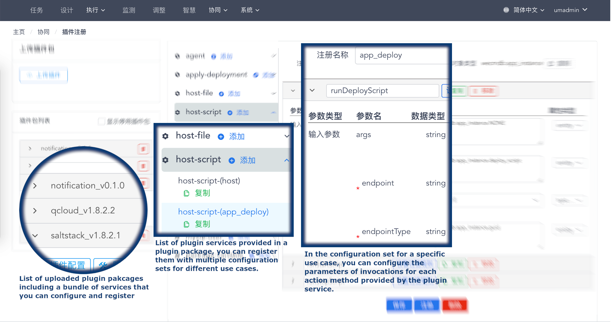

# WeCube: A Manamgement Framework for Distributed Architecture

WeCube is an open source, one-stop tool for architecture management and IT operation, which aims to simplify the IT management of distributed architecture. Its features can be easily extended by plugins.

During the implementation of distributed architecture, core banking systems are built in WeBank. Comparing this to traditional monolithic architecture, there are quite a few different pain points, e.g. increasing number of servers, complicated deployment process, difficulties in service tracing and problem diagnosis due to complex systems and long invocation chains.

In the process of finding the solutions for these pain points, we have come up with a set of methodology and best practices for IT management in such scenarios and also developed necessary supporting tools. WeCube is the result of extracting the methodology and best practices form WeBank's internal tools, which is then packaged into an integrated out-of-box solution for IT management.

## Typical Scenarios

- **To build a data center on public cloud from scratch**

    With Wecube, you can design and plan your brand new data center on public cloud, including its network resources, computing resources and storage resources. Theses resources required as infrastructure of you data center will be then created and configured automatically by WeCube and together with its plugins, just according to you design and plan.

    All required is to provide your cloud account information, then you left WeCube deal with the resource purchase,  creation and configuration. It will also enable monitoring on those resources with preset alarming rules and start immediately monitor their status.

- **To manage lifecycle of IT resources in a existing data center**

    You can model your entire IT system (infrastructure, business applications) and feed the configuration managemnt data model into WeCube. With the core CMDB feature, WeCube can help you with data enquiry and data management; you can also create more sophisticated data queries and even new query APIs for your daily operation tasks as well as for integration with other systems. 

- **To enforce architecture compliance**

    You can also maintain your architectural design of your applications in WeCube, so that these design information will be used as a basis for IT resource creation, application deployemnt and other operation tasks. In addition, by introducing automated processes and probably also a mix with manual approvals, we expect to see an improvement on the management of architecture compliance in the organization.

- **To implement the closed loop of "design-build-deploy-monitor-operate" for application systems**

    In the perspective of applications, you can have all information recorded in WeCube about the systems, sub-systems (or any other form of system components), services and the relations between them. Then, by uploading to WeCube the artifacts of each deployment unit in your application system, you can count on WeCube for the remaining lifecycle phases of your application services.

    All requried is the application architectural design and the artifacts produced by your build/CI system, WeCube can help you with the automated operation tasks including resource provision, application deployment, monitoring configuration.

## Design Philosophies

- **Open Platform**

    WeCube is composed of a fully open-sourced platform, plenty of plugins co-created in the open-source community and best practices for different use cases cultivated in the user eco-system. We stick to the **OPEN** philosophy when developing this product, by massively adopting open-source components and open standards. Therefore, we wish to have a eco-system owned, shared and built together with the entire open-source community.

- **Extendable by Plugins**

    WeCube platform provides features as data modeling, business process management, UI management, role based access control, system parameters, etc. Except for these, the other features required for concrete scenarios are all provided by plugins. 

    We have provided some plugins out-of-box for your usage based on our own experiences. In the meanwhile, you are also welcome to develop new plugins for new requirements and customizations. Just following the plugin development specification, you can extend the features and services provided on WeCube very easily.

- **Interconnected with Business Process Engine**

    In complicated use cases and automation, we rely on the businsess process engine provided in WeCube to interconnect all relevant plugin services together, so as to accomplish operation tasks. The powerful flexibility of the business process engine enable you to create SOPs specific to your own case, you can also integrate a manual approval process with an automated one.

- **Design Driving Implementation**

    We fully understand the painpoints in IT opeartion and management, as a result, we stick to the "Design Driving Imeplmentation" philosophy. Specifically, we expect to gather architectural designs on infrastructure and on application systems from early phase and to use them as a basis for all opeartion tasks such as resource creation, change and destruction. With this emphasis on the information consistency between when we design and when we implement, we believe the architecture complicne can be ensured.

## Key Features

### Plugins

!!! note "**Plugin Package**、**Plugin Service** and **Service Method**"

    WeCube plugins are encapsulated and delivered in **plugin packages**, a plugin package is usually composed of a bundle of related **plugin services**. The terms **plugin** and "plugin package" are basically interchangeable. For example, we have provided the following plugins (plugin packages) with the platform: `WeCMDB`, `Saltstack`, `Qcloud`, etc. 

    Each **plugin service** is typically responsible for managing a specific type of IT resource, a "plugin service" usually provides multiple **service methods** to implement different operations on the IT resource. For example, in the plugin (package) `Qcloud`, we have provided a plugin service `vpc` who can manage the virtual private cloud instances and a plugin service `vm` who is responsible for managing cloud server instances.
    
    Each **service method** can accomplish one specific type of operation on a resource, multiple **service methods** together complete the feature extension on that IT resource provided by the **plugin service**. For example, the above-mentioned plugin service `vpc` provides the `create` and the `terminate` action methods to actually create an destroy virutal private cloud instances.

You can upload a plugin package, then configure, register and enable the included plugin services on WeCube. Each plugin service can be treated separately, so you can choose to enable only those required in your case. 

In addition, for different use cases, you can have multiple configuration sets for one single plugin service, the plugin service can be actually registered more than once with these different configuration sets, so that you can have different settings (eg. security settings for differnt level, settings in different environment, etc.) in different scenarios.

### CMDB

WeCube uses `WeCMDB` plugin as the default CMDB to manage all its configuration management data, of course, you can choose to replace it with another plugin.

You can fully customize data model in WeCMDB, including data model layers, data types, data attributs and the associations between data types.

We have improved data management in WeCMDB with automatic data filling and option value filtering. In your data model, you can set these rules on applicable data attributes, so when you input and maintain those CI data, WeCMDB will fill the attribute value by its own or prompt you valid option values for that attribute. We believe these feature can help improve the data accuracy and efficiency.

About visualization, we embed 4 common views in WeCMDB (Data Center Design, Resource Plan, Application Architecture and Application Deployment) and hope the can help your architects and operation engineers to quickly retrieve the information they need. Furthermore, you can also create new report queries for more sophisticated use cases.  

In WeCMDB, we have built a quite delicate data protection mechanism and wish it can ensure the validity and correctness of your data. A role-based access control is in place so you can have fine-grain control on which role can access which resources. On the other hand, when data is to be changed no matter if it's triggered by automated process or manually, WeCMDB will check the data state agianst a built-in state machine and only execute the change when the state transition rule is permitted.

### Business Process Engine

Based on the BPMN 2.0 specification, WeCube provides a business process engine and a process editor. You can design you own process which we name a "**Task Orchestration**"" directly on WeCube and configure it to use existing plugin services to execute operation tasks in the process. In the "best practice" pakcage, we have provided some out-of-box orchestrations you can try directly, including one for initializing all network resources in data center and another for application deployments.

By materializing your SOPs into WeCube as task orchestrations, your operation engineers can easily choose the desired orchestration to execute without worrying about the standardized steps, they can also choose the execution targets and then focus on the execution progress as well as the result and execution history. When deciding the execution targets, you can always choose to include only part of the target according to your own needs (for example when you want to do canary release).

WeCube provides access control on process design and execution, separately, together with the access control in WeCMDB on the data, you can easily control for different roles in your organization which operations and data they can touch.

By the way, you can try the task orchestrations included in the "best practices" package and see how WeCube can accomplish fully automated operation tasks from resource creation to appication deployment.

### Batch Execution

In order to accomplish daliy ad-hoc operation tasks, we provide this "batch execution" feature in WeCube.

You can define how you want to query for data freely on the data model and retrieve the result data set for the candidate target. If needed, you can also save you query for further use or to share with others.

Once retrieving the data set and refining the target scope, you can choose any one of the existing service method of from plugin services registered on the WeCube platform. After you provide the parameters required for the service method, WeCube will then execute the service method automatically as a batch job on the specified target scope and you can check the aggregated execution result once finished.

### Monitoring

We provide the plugin `Open-Monitor` for setting up monitoring on IT resources and application services on WeCube. It supports different resource types, process and log files as target object, you can also customize alarm rules for different objects or object groups.

In the "best practices" package, we integrate the `Open-Monitor` plugin in the task orchestrations for resoure creation and application deployment, so you can notice that the created resources and deployed apllication will be displayed in the monitoring dashboard without extra intervention. In addition, we also provide a "application view" of the monitoring dashboard that focus from an application system on all the IT resources it occupies and application services it owns.

### Artifact Managment

WeCube provide a plugin `Artifacts` to support aritfact management for you applications. You can upload your application packages and associate each of them with a deployment unit in your application system design recorded in WeCube. After this, WeCube will find and use the correct artifact to deploy or upgrade the deployment unit in your application system. 
