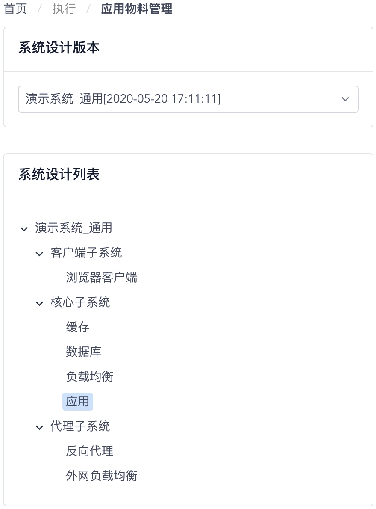
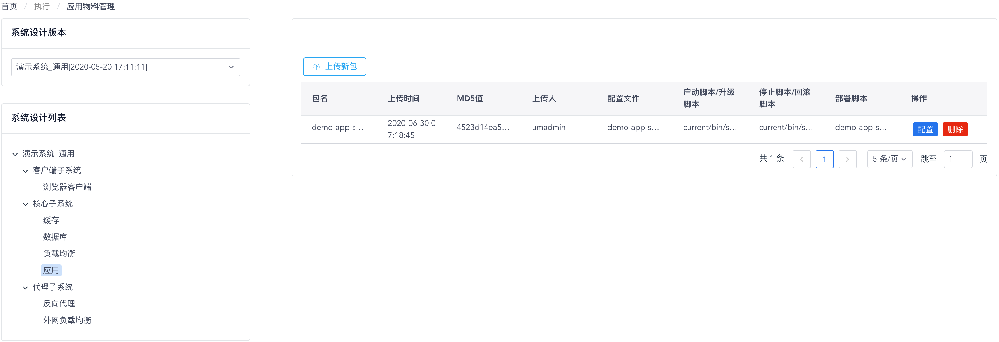
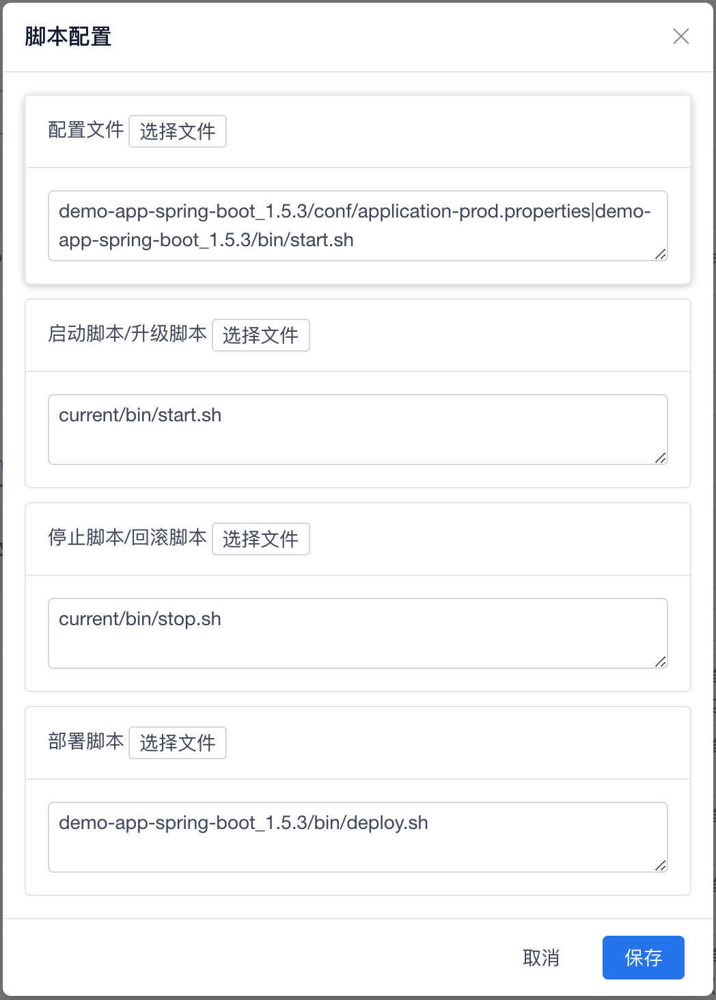
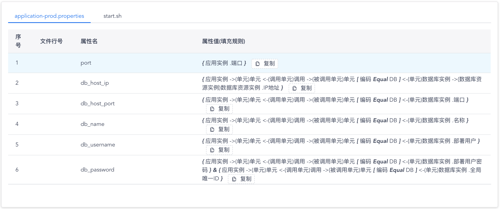

# 应用物料管理

您可以通过 “**执行**菜单” - “**应用物料管理**菜单项” 来访问应用物料管理功能页面。在应用物料管理功能页面中，您可以为业务应用系统逻辑架构设计中最细粒度的系统组件（如部署单元）上传、配置和维护将在部署中使用的应用物料包。

页面左上的 “**系统设计版本**” 列表中会显示与已经过确认定稿的应用系统设计方案版本，当您选择了一个系统设计方案版本后，页面左侧会以树状图形的方式显示该设计方案中的所有系统组件。

[{: style="display: block; width: 55%; margin: 0 auto;"}](images/application-artifacts/deployment-units.png){: target=\_image}

接着，您可以选择一个最细粒度的系统组件（即部署单元，对应树状图形的叶子结点），然后开始配置与其对应的应用部署物料包。

{: target=\_image}

点击页面上方的 “**上传新包**” 按钮，可以为选中的应用系统部署单元上传一个新版本的应用部署物料包；页面上方的列表中会显示与当前选中的应用系统部署单元相关的所有应用部署物料包。

应用部署物料包上传完成后，可以点击物料包列表项右侧的 “**配置**” 按钮来指定物料包中包含的配置文件、启动脚本文件、停止脚本文件和部署脚本入口文件。

[{: style="display: block; width: 61.8%; margin: 0 auto;"}](images/application-artifacts/package-files.png){: target=\_image}

脚本配置完成后，页面下方会显示出当前已选中的应用部署物料包内含有的配置文件中定义并使用的所有差异化变量，如下图所示：

{: target=\_image}

在使用这个应用部署物料包进行应用部署之前，您应当确保配置文件中使用到的每一个差异化变量的属性值填充规则都被正确地进行了配置。

在这里，每一个差异化变量的属性值填充规则，都是一个以CMDB模型中代表应用实例的CI数据对象为起点的 **数据模型表达式（DME）**。因此，实际上这些表达式会引导WeCube如何从作为部署目标的应用实例所对应的CI数据对象开始，通过CMDB模型中的关联关系找到与其关联的其它CI数据对象，并最终取得需要的数据属性值作为设定给差异化变量的结果值。
