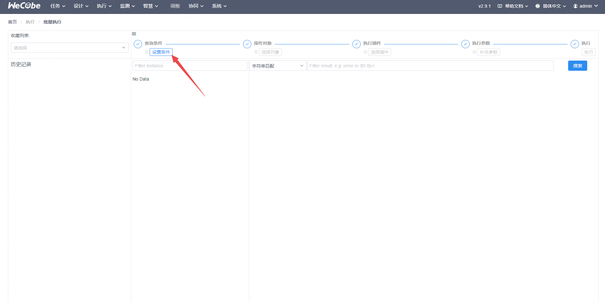
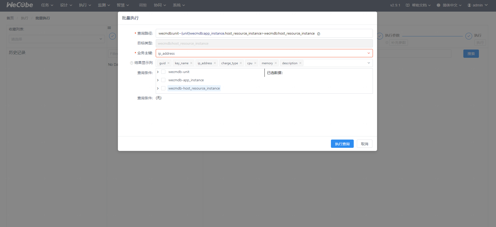
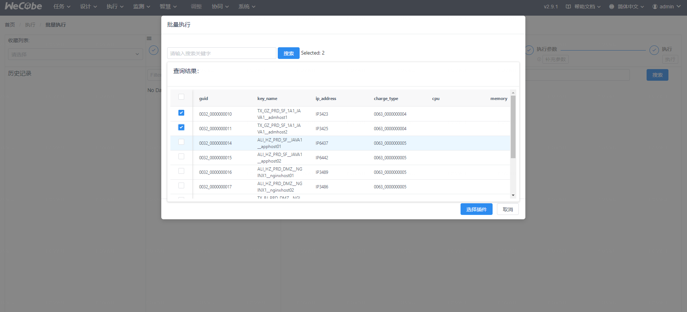
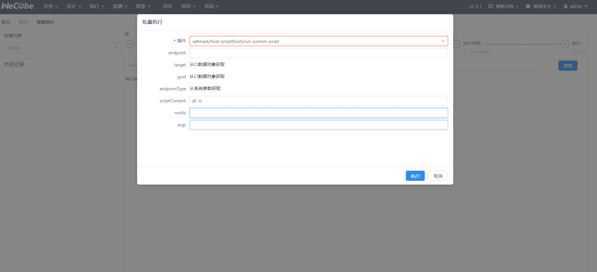
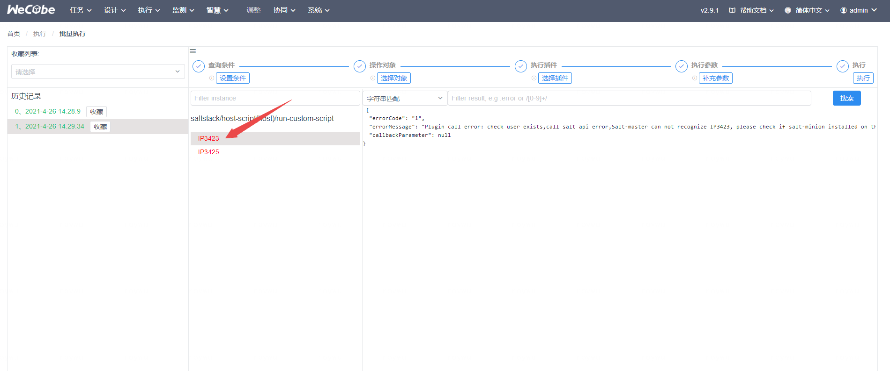
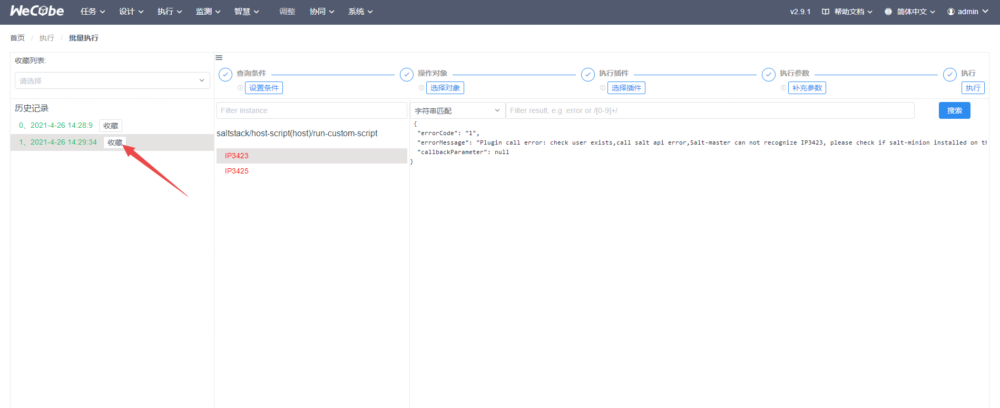
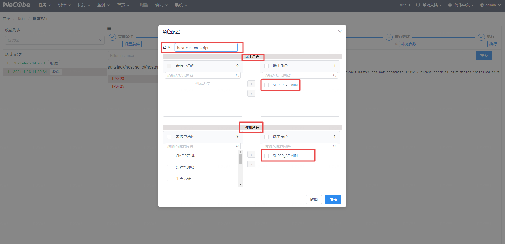
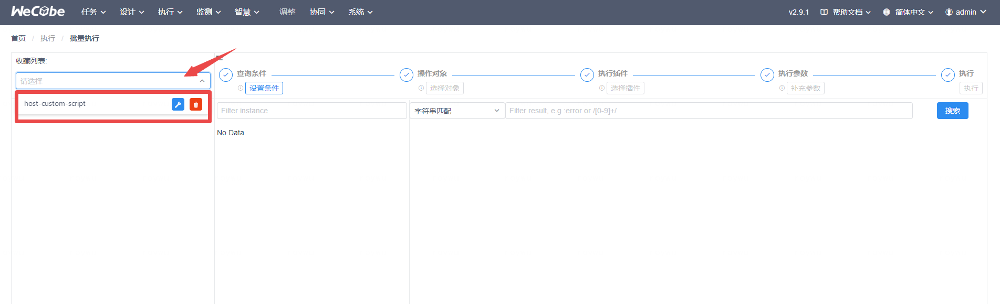

# 批量执行使用指引

“批量执行”功能是为了满足在日常运维管理工作中出现的较为随机和零散的运维操作的执行而设计的。用户可以通过四个步骤来完成针对一批特定数据对象的批量运维操作。

## 定义操作对象的查询方式

以WeCube数据模型中的数据类型以及它们之间的关系为基础，用户需要定义出操作执行目标类型的查询路径、业务主键、查询条件等，这些是操作对象查询方式的关键要素。

其中

*目标类型* 是应于批量操作最终执行时的数据对象类型，系统会自动将查询路径的最后一个类型作为目标类型。

*查询路径* 是由WeCube数据模型中的对象关联所组成的数据链式表达式（请参考 *数据模型表达式DME* 的相关概念）。

*业务主键* 是代表对象的主要标识，用于结果展示。

*查询条件* 可以作为精确指定操作对象范围的过滤条件。由于查询条件可以作用在目标数据类型的属性上，也可以作用在与目标数据类型相关联的其它数据类型上面，因此 *查询路径* 实际上就定义了：

- 用户希望在哪些关联的数据类型和它们的属性上应用查询条件

- 这些关联数据类型之间通过哪种关联关系进行连接并能够最终到达目标数据类型

    

如图所示，通过点击 “设置条件”,可以在弹出的对话框中定义操作对象的查询方式。

用户需要在对话框中指定刚刚介绍的操作对象查询方式的所有关键要素。

## 查询并指定操作对象

在定义好查询方式之后，即可进行操作对象的查询，点击图中的*执行查询*按钮

WeCube会按照之前定义好的查询方式返回匹配的数据对象列表，以便用户在列表中选择批量操作的执行对象。

## 选择插件并配置参数

在数据对象列表中选择好批量操作的执行对象后，点击 *选择插件* 按钮可以在弹出的对话框中继续配置将要执行的操作和操作的输入参数。

在 *插件* 列表中，可以选择一项在WeCube平台中已经注册的插件服务作为将要执行的批量操作，另外，列表中能够选择的插件服务与查询结果的数据类型有关。选择好操作后，对话框中会显示出插件服务对应的输入参数，并且根据WeCube中的插件服务配置提示用户输入本次操作执行中需要的参数值。

## 查看和检索执行结果

批量操作的执行结果是以下图的方式进行展示

左侧的操作对象列表中显示本次操作执行涉及的操作对象，操作对象将按照之前在查询方式定义中选择的业务主键作为标识来进行显示与区别。每个操作对象的执行结果状态将通过颜色的方式进行区分：
- 红色代表操作执行失败或发生错误
- 绿色代表操作执行顺利完成

用户可以通过点击列表中的操作对象，在右侧的操作结果窗口中查看具体的执行结果信息。另外，如果操作对象过多，可以通过列表上方的输入框对操作对象进行过滤显示，操作对象列表中将只显示与输入关键字相匹配的操作对象。

## 收藏批量执行配置

点击执行结果的左侧*收藏* 按钮

会弹出配置收藏页面，配置收藏的名称和权限，属主角色即管理角色，使用角色只能使用收藏而不能修改，点击确定即可。

若需要使用收藏的批量执行，可从左侧区域列表中选择，并从任意步骤开始进行配置修改就可以快速使用批量执行了。

