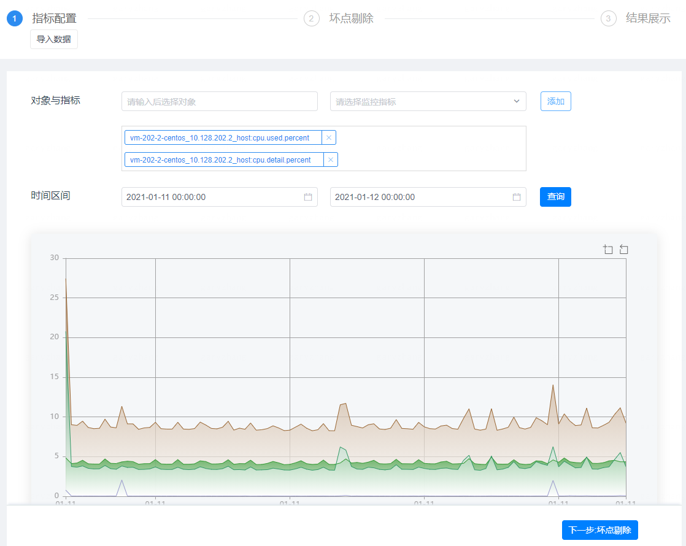
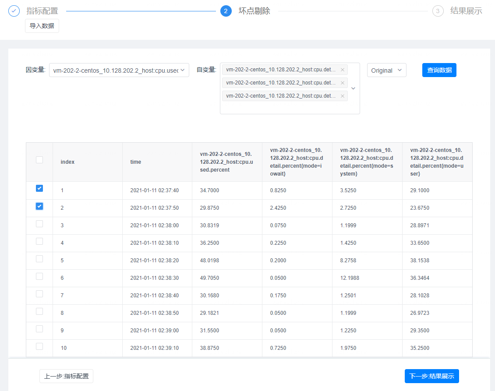
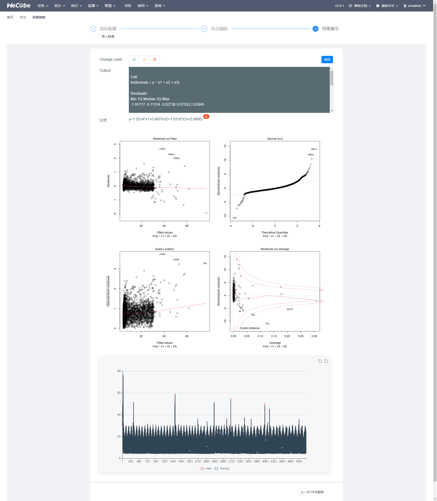
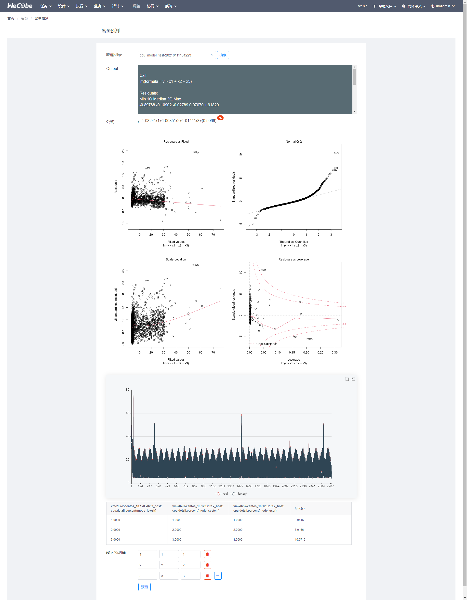

# Wecube-Plugins-Capacity 用户手册

## 主菜单介绍

Wecube-Plugins-Capacity插件主要有两个菜单功能，一是容量建模，通过监控中采集到的数据，筛选出需要进行多元一次建模的自变量和因变量，通过R语言的线性回归分析生成分析结果。第二个容量预测则是使用第一步建模的结果公式来根据用户输入的自变量去计算因变量。

## 容量建模
容量建模包括 指标配置、坏点剔除、结果展示。
#### 指标配置
指标配置中可以选monitor插件中采集到的指标数据，可支持选择多组指标数据

#### 坏点剔除
坏点剔除是通过选择要进行线性分析的自变量和因变量，其中自变量可以有多个，因变量只能有一个，因为数据中的某些类似于峰值这样的异常数可能会影响建模的最终结果，所以这里建议把这类特殊点都进行手动剔除操作。

#### 结果展示
点击下一步结果展示，系统会把坏点剔除后的数据作为线性分析的变量输入，输出分析的内容结果与公式，其中包含有线性回归分析的残差与方差正态分布图、参数的系数可信度P值、公式数据与原始数据的拟合曲线图等，通过点保存可持久化该结果，或选择上一步继续进行坏点剔除再建模。

## 容量预测
容量预测是使用容量建模保存后的模型公式，通过输入自定义的自变量，来计算对应的因变量并展示。

