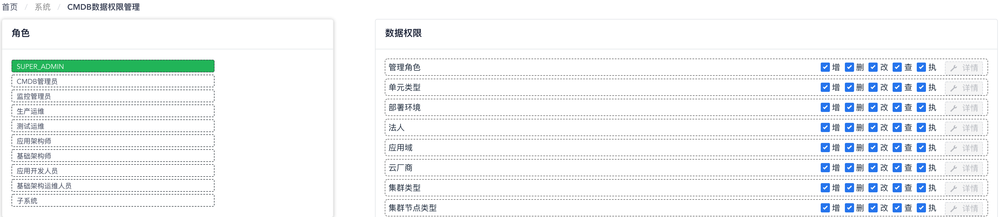
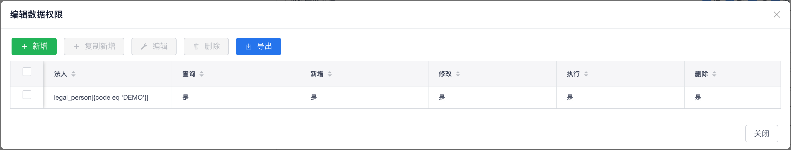

# CMDB数据权限管理

您可以通过 “**设计**菜单” - “**模型配置**菜单项” 来访问CMDB数据权限管理功能页面。在CMDB数据权限管理功能页面中，您可以基于WeCube平台上的角色针对CMDB中CI数据对象的访问控制进行授权管理。

页面左侧部分会显示WeCube平台上所有的角色列表，当您在列表中选中一个角色时，页面右侧的列表将为您显示此角色拥有的CMDB数据权限详情，如下图所示：

{: target="\_image"}

权限列表中的每一行对应CMDB系统中的一个CI数据类型，数据权限种类分为：

- 增：为该CI数据类型创建新的数据对象
- 删：删除该CI数据类型的数据对象
- 改：编辑该CI数据类型的数据对象
- 查：查询该CI数据类型的数据对象
- 执：在执行任务编排或批量任务时选择该CI数据类型的数据对象作为执行目标

所以，您可以根据需要针对不同的CMDB数据类型为不同角色配置数据的访问控制规则。

{: target="\_image"}

如果您希望进行更细粒度的访问控制，即针对同一CMDB数据类型中不同的数据对象范围进行访问控制，可以点击页面最右侧CMDB数据类型对应列表项中的 “**详情**” 按钮来打开数据对象访问控制规则表格，如下图所示：

{: target="\_image"}

您需要提供数据模型表达式来控制被访问的目标数据对象范围，之后就可以针对这个CI数据类型中已经确定的数据对象范围来为该角色设置访问控制规则了。
