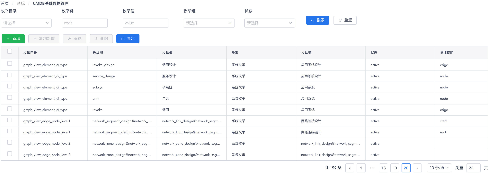

# CMDB基础数据管理

您可以通过 “**系统**菜单” - “**CMDB基础数据管理**菜单项” 来访问CMDB基础数据管理功能页面。在CMDB基础数据管理功能页面中，您可以检视和维护当前CMDB系统内的所有枚举类型和枚举数据。

CMDB枚举数据以表格形式显示，如下图所示：

{: target=\_image}

您可以使用表格组件上方的过滤搜索进行有针对性的查询，也可以使用动作按钮对系统参数进行查看、编辑、删除和导出等操作。关于CMDB枚举数据的属性说明，请参见下表：

属性 | 说明
- | -
枚举目录 | 由一组相关的键-值定义组成的枚举数据类型的标识符名称。
枚举键 | 用作数据存储用途的枚举数据标识符。
枚举值 | 用作显示用途的枚举数据文本值。
枚举组 | 此枚举数据所属的上一级关联枚举数据。
状态 | active - 枚举值生效，可以正常使用；inactive - 枚举值未生效，无法使用。
描述说明 | 详尽的文字说明。
