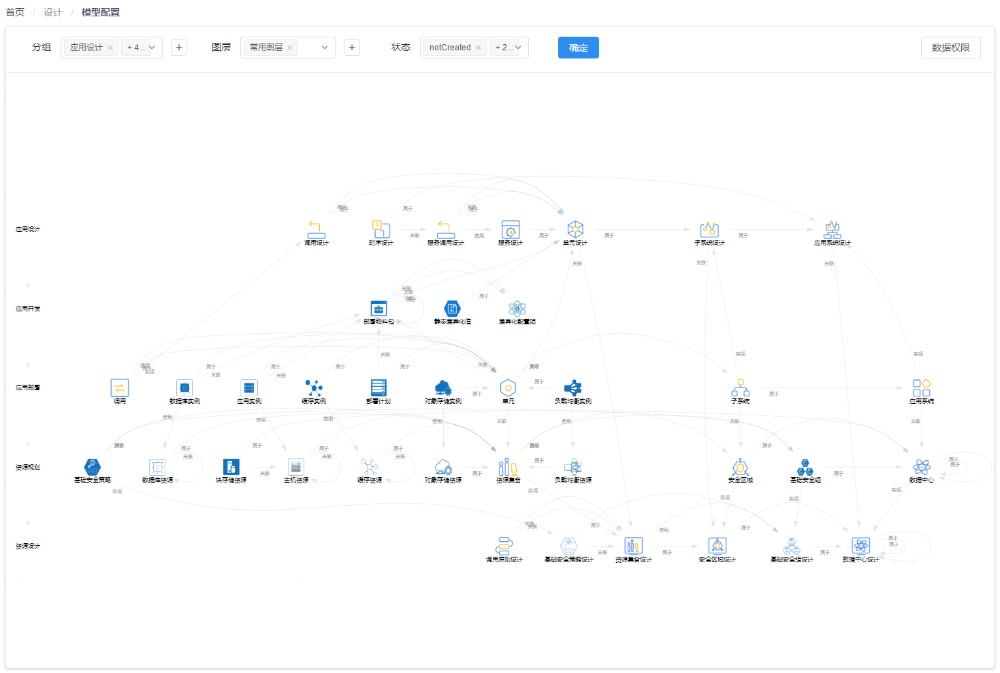
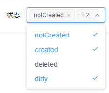

# CMDB模型管理

您可以通过 “**系统**菜单” - “**CMDB模型管理**菜单项” 来访问CMDB模型管理管理功能页面。在CMDB模型管理功能页面中，您可以对模型中的层级、CI数据类型、CI数据属性以及CI数据类型间的关联关系等要素进行维护和管理。

## 模型层级与图层

模型层级是通过将模型中的数据类型进行分组而形成的，每个模型层级中的CI数据类型通常共同聚焦于IT系统生命周期的同一个阶段，或者更多地由同一个的角色关注和管维护。这些层级可以根据需要由您随意进行配置。每个CI数据类型都属于一个层级，并在CMDB模型图中所属层级对应的位置范围中显示出来。

{: target=\_image}

如上图所示，我们使用了5个模型层级对整个模型进行了分组：

1. 应用架构层：聚焦应用系统的逻辑架构，数据多由应用系统架构师关注和维护；

1. 应用开发层：聚焦应用开发阶段活动的结果产物，数据多由开发团队维护；

1. 应用部署层：聚焦应用部署所涉及的部署环境和逻辑实例等，通常被应用运维更多关注；

1. 资源规划层：聚焦数据中心的物理资源实例，通常被基础设施运维更多关注；

1. 资源架构层：聚焦数据中心级的通用性架构设计，通常由企业架构师维护。

点击页面左上方的 “**+**” 按钮可以添加新的模型层级；通过点击页面左侧各模型层级的名称，可以在页面右侧打开模型层级编辑器进行数据维护，包括修改层级名称以及调整层级顺序。

[{: style="display: block; width: 61.8%; margin: 0 auto;"}](images/cmdb-model/layer-editor.png){: target=\_image}

另一方面，图层则是根据WeCube的产品设计思想将CI数据类型显式地划分在“常规图层”、“网络图层”和“基础图层”3个不同的图层区域中，其中“常规图层”包含大部分与计算和存储资源相关的数据模型，“网络图层”则仅包含网络资源相关的模型，“基础图层”中包含的模型则作为WeCube功能运作的基础数据来源。在查看模型时，您可以通过页面右上方的 “**切换图层**” 列表来指定想要查看或过滤掉的图层。

[{: style="display: block; width: 61.8%; margin: 0 auto;"}](images/cmdb-model/perspectives.png){: target=\_image}

这样，模型层级和图层就成为了很好的分离不同角色关注点的工具，也使整个模型变得更加简洁。

## CI数据类型

在页面上的CMDB模型图中选择了一个模型层级之后，即可在页面右侧看到模型层中已经存在的CI数据类型，并可以通过点击 “**+**” 按钮在模型层中添加新的CI数据类型。关于CI数据类型的属性说明，请参见下表：

属性 | 说明
- | -
名称 | 简洁易懂的描述性名称。
CI类型ID | CI数据类型的英文标识符，用于物理存储引擎的标识符以及在数据模型表达式中作为对该CI数据类型的引用名称。
所属图层 | CI数据类型所属的图层：常规图层 - 聚焦与计算、存储资源相关的CI数据类型；网络图层 - 聚焦与网络资源相关的CI数据类型；基础图层 - 聚焦与支持性基础数据相关的CI数据类型。
所属层级 | CI数据类型所属的模型层级，在选择模型层级时已确定。
描述说明 | 详尽的文字描述。
图标 | 此CI数据类型在CMDB模型图中显示时使用的图标。

当您完成对CI数据类型的编辑并保存后，CI数据类型实际上处于 `notCreated` 状态。此时，您还不能为这个CI数据类型创建任何CI数据对象。在CMDB模型图上，也将以绿色突出显示CI数据类型的名称。

[{: style="display: block; width: 61.8%; margin: 0 auto;"}](images/cmdb-model/ci-type-status.png){: target=\_image}

您应当在页面右侧CI数据类型编辑器中点击 “**提交**” 按钮，将新创建的CI数据类型信息提交给物理存储引擎，完成后，该CI数据类型的状态将变为 `created` 并可以被正常使用了。

[{: style="display: block; width: 61.8%; margin: 0 auto;"}](images/cmdb-model/ci-type-submission.png){: target=\_image}

## CI数据属性

通过点击CMDB模型图中的CI数据类型图标，您可以在页面右侧看到该CI数据类型下的所有数据属性。

[{: style="display: block; width: 61.8%; margin: 0 auto;"}](images/cmdb-model/ci-attributes.png){: target=\_image}

您可以创建新的CI数据属性，对现有的CI数据属性进行编辑并把提交到物理存储引擎以使更改生效，删除CI数据属性，或者调整CI数据属性的顺序。关于CI数据属性的属性说明，请参见下表：

属性 | 说明
- | -
CI属性ID | CI数据属性的英文标识符，用于物理存储引擎的标识符以及在数据模型表达式中作为对该CI数据属性的引用名称。
CI属性名称 | 简洁易懂的描述性名称。
描述说明 | 详尽的文字描述。
搜索条件排序序号 | 在数据表格附属的搜索过滤条件中显示此CI数据属性及对应页面输入组件的顺序号。
数据类型 | 此CI数据属性在用户界面上呈现的类型，会影响该属性的数据显示以及对应的页面输入组件。
正则规则 | 为该CI数据属性配置的合法数据输入值的正则表达式规则。
真实类型 | 该CI数据属性在物理存储引擎中使用的数据类型。
是否复用 | 当对所属的CI数据类型的对象进行编辑并产生了新的数据版本时，是否将此CI数据属性在旧版本中的值自动复用并设置到新的数据对象版本之中。
是否在表 | 是否将该CI数据属性作为数据列显示在所属CI数据类型的表格组件中。
允许为空 | 是否允许将该CI数据属性的值设为空值（或不提供输入值）。
是否可编辑 | 是否允许在所属的CI数据类型的表格组件中对该CI数据属性的值进行编辑。
是否唯一 | 是否为该CI数据属性的输入值添加唯一性约束（即在所属的CI数据类型的所有对象中，该CI数据属性的值必须唯一、不能重复）。
自动填充 | 是否为该CI数据属性的输入值开启自动填充功能。
填充规则 | 当自动填充开启后，定义该CI数据属性自动填充值的计算规则。

当完成对CI数据属性的编辑并保存后，您应当点击CI数据属性编辑表单下方的 “**提交**” 按钮，将变更提交到物理存储引擎以使更改生效。

## CI数据类型的关联关系

CI数据类型之间的关联关系实际上一类特殊的CI数据属性。

[{: style="display: block; width: 61.8%; margin: 0 auto;"}](images/cmdb-model/ci-relationships.png){: target=\_image}

您需要确定关联关系所属的CI数据类型，并在拥有这个关联关系的CI数据类型上创建一个类型为 “**ref**” 或着 “multiRef” 的CI数据属性。在要创建的CI数据属性中，与关联关系有关的属性请参见下表：

属性 | 说明
- | -
CI属性ID | 关联关系的英文标识符，用于物理存储引擎的标识符以及在数据模型表达式中作为对该关联关系的引用名称。
CI属性名称 | 简洁易懂的描述性名称。
描述说明 | 详尽的文字描述。
数据类型 | ref - 对端最多关联一个CI数据对象的关联关系类型；multiRef - 对端可关联多个CI数据对象的关联关系类型。
引用选择 | 对端关联的CI数据类型。
引用命名 | 在CMDB模型图上为该关联关系标注的文字，如不指定则使用引用类型。
引用类型 | 关联关系的语义说明。
删除校验 | 在删除对端关联的CI数据类型的数据对象时，如果待删除的数据对象已经被此关联关系引用，是否应当禁止删除操作。

## 模型状态

对于CI数据类型和CI数据属性来说，它们总是处在以下的4种状态之一：

1. `notCreated`

    CI数据类型或CI数据属性刚刚被定义出来，还没有被提交到物理存储引擎，所以创建操作还没有生效，不能正常使用。

1. `created`

    CI数据类型或CI数据属性的定义已经被提交到物理存储引擎并完成了创建操作，可以正常使用，并且定义在创建后也没有再发生过变更。

1. `dirty`

    CI数据类型或CI数据属性的定义已经被提交到物理存储引擎并完成了创建操作，可以正常使用，但是定义又发生了变更，需要把变更重新提交到物理存储引擎，而在此之前这些变更不会生效。

1. `decommissioned`

    CI数据类型或CI数据属性已经被标记为下线，不能再对相应的CI数据对象或CI数据属性值进行操作。

在CMDB模型图上，您可以通过页面上方的 “**状态**” 选择列表来指定想要查看或者过滤到的CI数据类型的状态。

[{: style="display: block; width: 61.8%; margin: 0 auto;"}](images/cmdb-model/ci-status-filter.png){: target=\_image}
