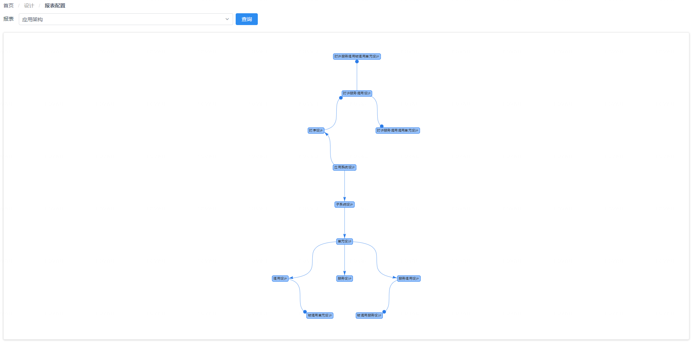
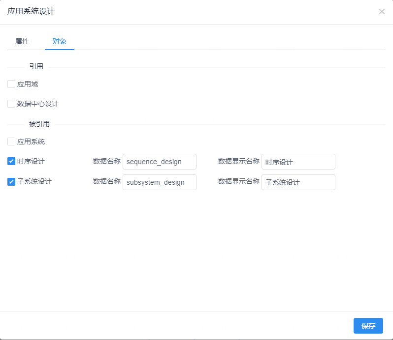
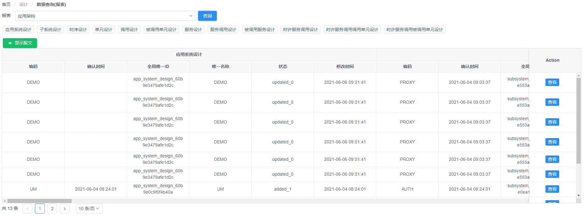

# CMDB报表管理

报表通过CI之间的关联性配置，提供一次性获取多种CI数据的方式。
您可以通过 “**设计**菜单” - “**报表配置**菜单项” 来访问CMDB报表配置页面。
您可以通过 “**设计**菜单” - “**数据查询(报表)**菜单项” 来访问CMDB报表数据查询页面。

## 报表配置
报表通过CI间的引用，多选引用属性进行多个CI的关联绑定，并配置主要关注字段信息，最终可以获取到多种CI的组合数据，主要用于自定义接口数据，视图管理等场景。
{: target="\_image"}
{: target="\_image"}

## 报表数据查询
您可以选中需要的报表，点击查询即可获取报表中定义的CI数据
{: target="\_image"}