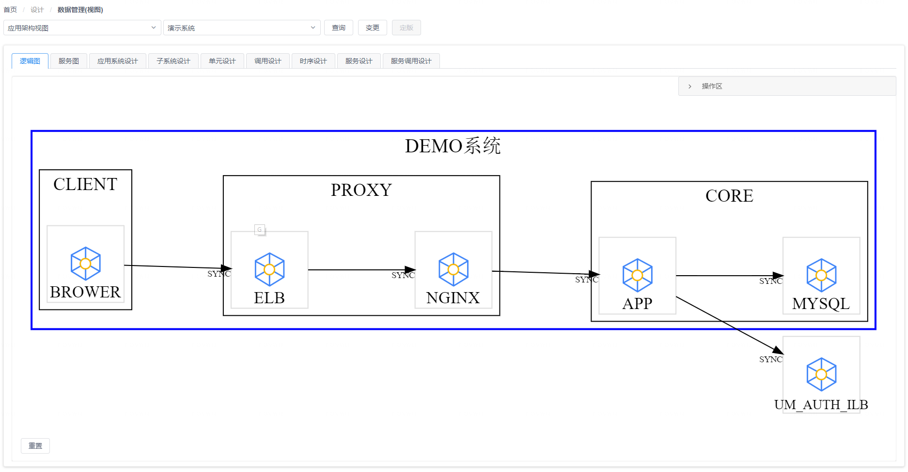
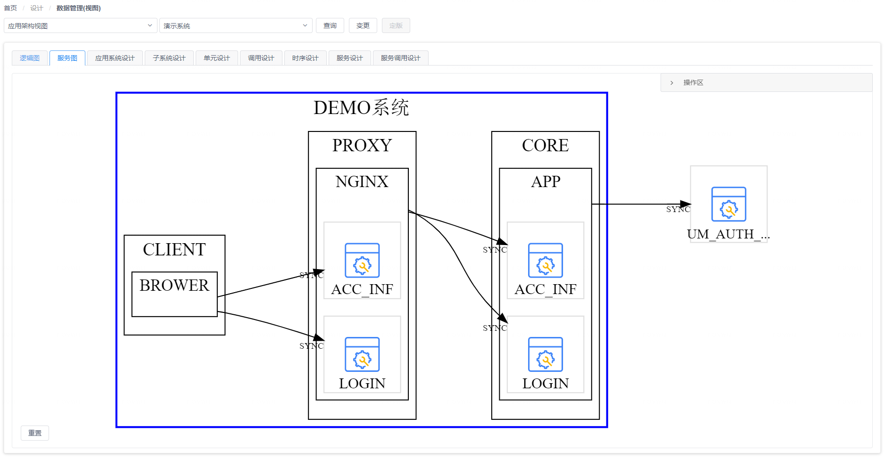

# 应用视图 - 架构设计

您可以通过 “**设计**菜单” - “**应用视图 - 架构设计**菜单项” 来访问CMDB应用视图的架构设计功能页面。在应用视图的架构设计功能页面中，您可以维护和管理业务应用系统的逻辑架构和部署架构的设计方案。

在选择了一个已有业务应用系统设计方案后，您可以在页面上看到该系统设计方案中包含的逻辑架构图、服务调用图、部署架构图以及构成设计方案的CI数据对象。

## 逻辑架构图视角

在逻辑架构图视角中，您可以看到页面左侧将以图形方式展现出业务应用系统的逻辑功能组件（如子系统、部署单元、服务等）及它们之间的关系，如下图所示：

{: target="\_image"}

您可以在逻辑架构图上点击某个图形元素将其选中，这样页面右侧将会显示选中图形对应的CI数据对象信息，您可以对数据对象进行编辑以及添加作为图形子节点的关联CI数据对象。

## 服务调用图视角

在服务调用图视角中，您可以在页面上看到业务应用系统各组件（部署单元）间的服务调用关系。

{: target="\_image" style="display: block; width: 61.8%; margin: 0 auto;"}

您也可以在页面右侧的调用时序设计列表中选择一个服务调用场景，查看该场景下服务调用的具体顺序。

{: target="\_image"}

## 部署架构图视角

在部署架构图视角中，您可以在页面上看到业务应用系统各组件（部署单元）在部署时与数据中心规划方案中的资源集合之间的映射关系。

{: target="\_image"}

## CI数据对象视角

在页面上方的面板标签中，除了代表逻辑架构图、服务调用图和部署架构图的前3个标签之外，其它每个标签都对应逻辑架构设计中包含的一种CI数据类型，如下图所示：

{: target="\_image"}

通过切换这些标签页，您可以对相应的CI数据对象进行查看、编辑、删除和导出等操作，也可以使用表格组件上方的过滤搜索进行有针对性的查询。

{: target="\_image"}
