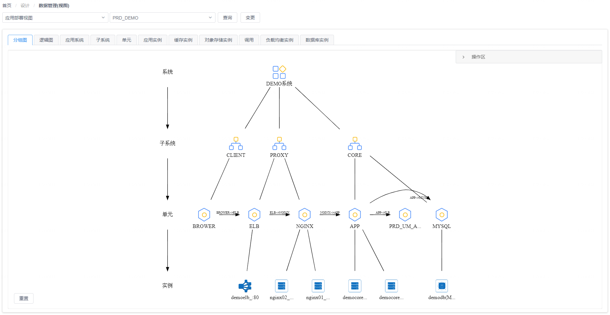
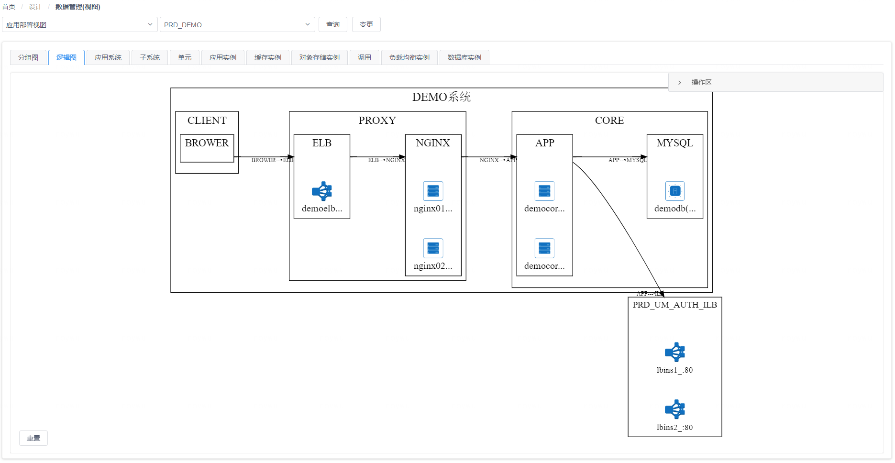
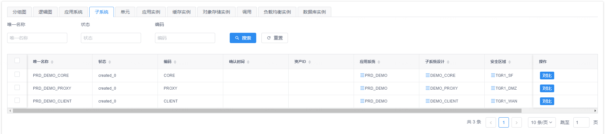

# 应用部署视图

在应用视图的部署管理功能页面中，您可以选择一个已有的业务应用系统后，可以在页面上看到与该系统对应的逻辑架构部署映射图、树状组件部署映射图以及部署方案中涉及到的CI数据对象。

## 树状组件部署映射图视角

在树状组件部署映射图视角视角中，您可以看到页面将以树状图形的方式展现出业务应用系统的逻辑功能组件以及其中最细粒度的系统组件（部署单元）在部署时与对应所需的资源实例之间的映射关系，如下图所示：

{: target="\_image"}

## 逻辑架构部署映射图视角

在逻辑架构部署映射图视角中，您可以看到页面左侧将以图形方式展现出业务应用系统的逻辑架构以及逻辑架构中最细粒度的系统组件（部署单元）在部署时与对应所需的资源实例之间的映射关系，如下图所示：

{: target="\_image"}

您可以在图上点击某个图形元素将其选中，这样页面右侧将会显示选中图形对应的CI数据对象信息，您可以对数据对象进行编辑以及添加作为图形子节点的关联CI数据对象。

## CI数据对象视角

在页面上方的面板标签中，除了图视角的标签之外，其它每个标签都对应图中包含的一种CI数据类型，如下图所示：

{: target="\_image"}

通过切换这些标签页，您可以对相应的CI数据对象进行查看、编辑、删除和导出等操作，也可以使用表格组件上方的过滤搜索进行有针对性的查询。

{: target="\_image"}
