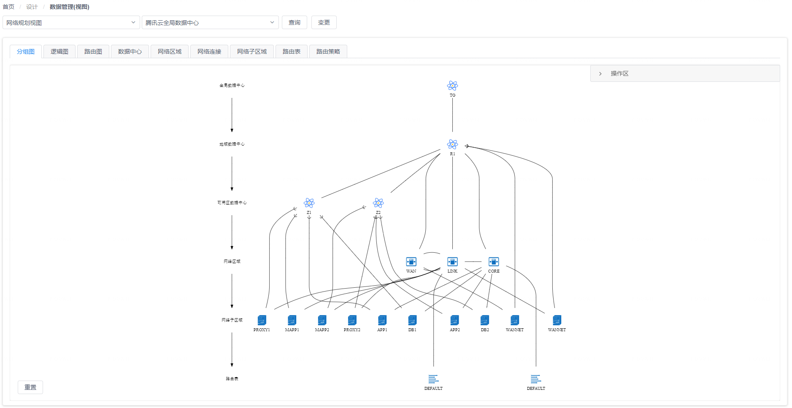
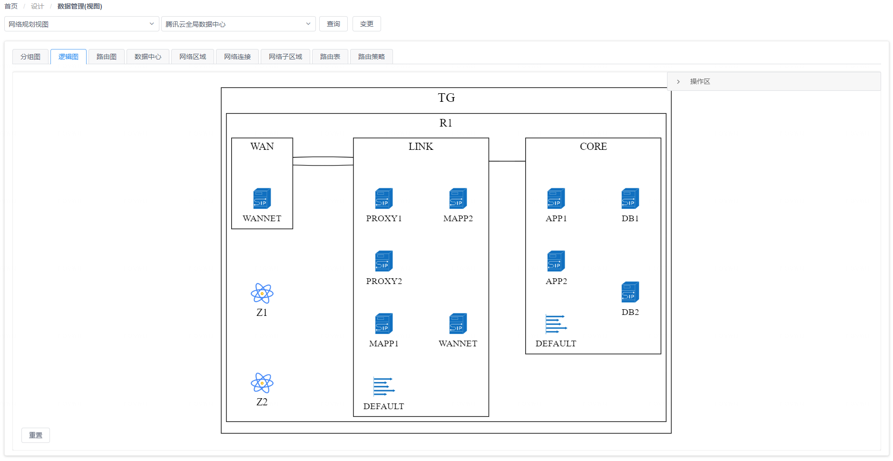
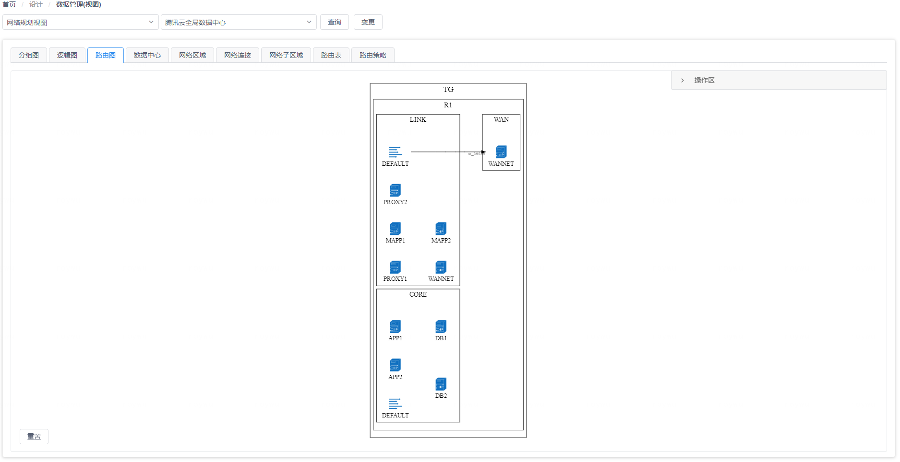
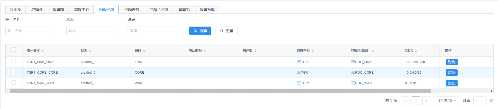

# 网络架构视图

在网络架构视图页面中，您可以设计和维护企业IT数据中心的网络规划设计蓝图。这些规划设计可以作为企业级IT基础网络设施的标准化蓝图，在搭建新的数据中心时可以用作模板从而在保证标准化的同时也大大降低新数据中心的设计成本。

在选择了一个已有的数据中心设计蓝图后，您可以在页面上看到与该规划设计对应的规划设计图以及其中包含的所有CI数据对象，点击变更进行数据的修改，修改完毕后可以进行统一定版操作。

## 树状图视角

在树状图视角中，您可以看到页面将以树状图形的方式展现出数据中心与网络区域之间的映射关系，如下图所示：

{: target="\_image"}

您可以在图上点击某个图形元素将其选中，这样页面右侧的 “**操作区**”  标签页中将会显示选中图形对应的CI数据对象信息，您可以对数据对象进行编辑以及添加作为图形子节点的关联CI数据对象。

## 逻辑连接图视角

在逻辑连接图视角中，您可以看到页面左侧将以图形方式展现出数据中心规划设计的元素，包括针对网络区域、网络子区域、网络子区域之间的连接规划等CI数据对象的设计方案，如下图所示：

{: target="\_image"}

您可以在图上点击某个图形元素将其选中，这样页面右侧的 “**操作区**”  标签页中将会显示选中图形对应的CI数据对象信息，您可以对数据对象进行编辑以及添加作为图形子节点的关联CI数据对象。

## 路由访问图视角

在路由访问图视角中，您可以看到页面左侧将以图形方式展现出数据中心规划设计的元素，包括针对网络区域、网络子区域、网络子区域之间的路由规划方案，如下图所示：

{: target="\_image"}

您可以在图上点击某个图形元素将其选中，这样页面右侧的 “**操作区**”  标签页中将会显示选中图形对应的CI数据对象信息，您可以对数据对象进行编辑以及添加作为图形子节点的关联CI数据对象。

## CI数据对象视角

在页面上方的面板标签中，除了图视角的标签之外，其它每个标签都对应图中包含的一种CI数据类型，如下图所示：

{: target="\_image"}

通过切换这些标签页，您可以对相应的CI数据对象进行查看、编辑、删除和导出等操作，也可以使用表格组件上方的过滤搜索进行有针对性的查询。

{: target="\_image"}
