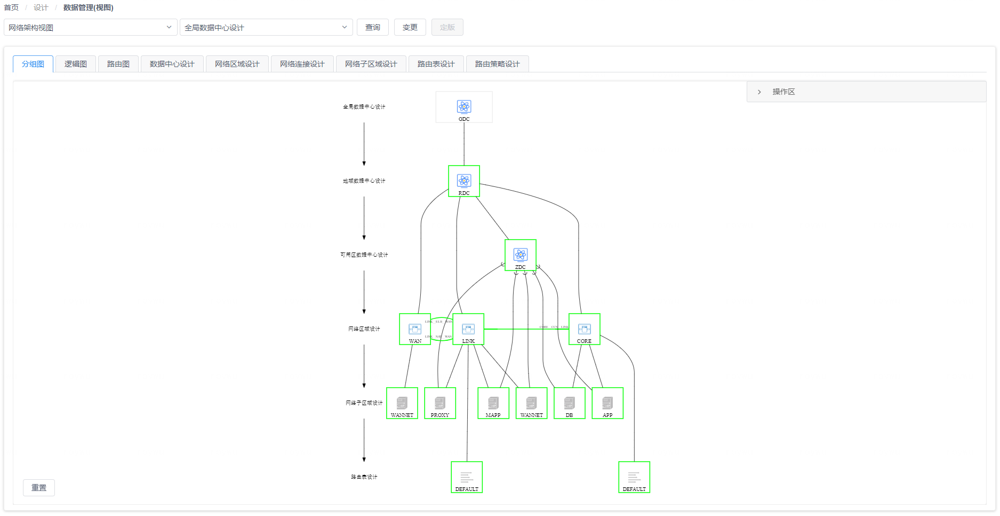
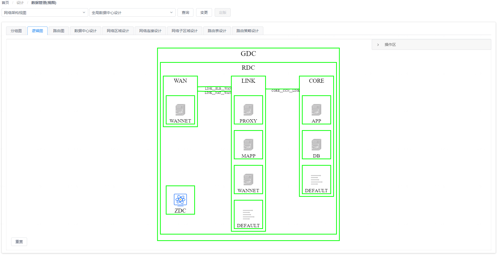
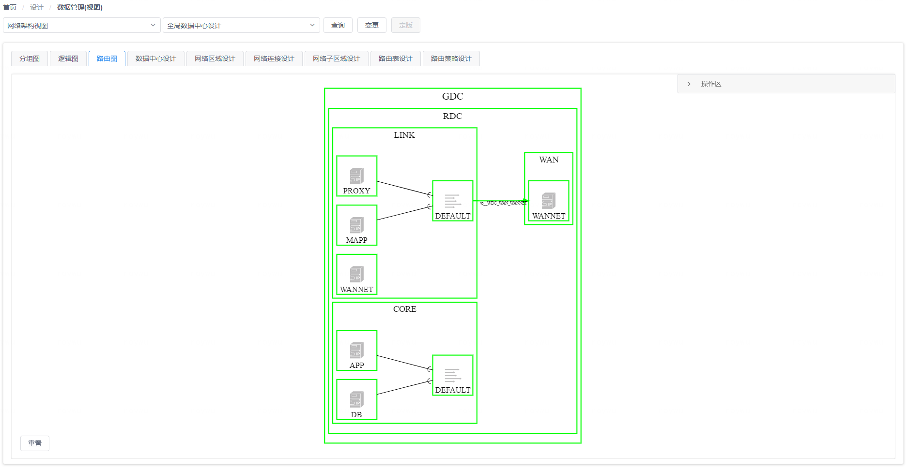
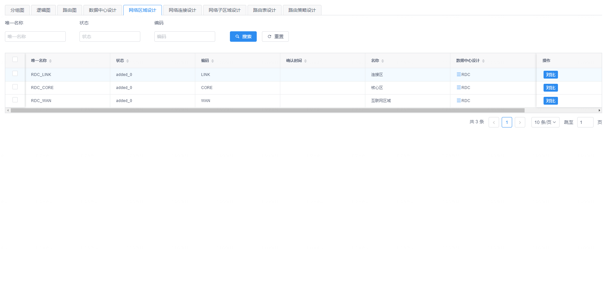

# 网络规划视图

在网络规划视图页面中，您可以选择一个数据中心查看数据中心下的网络区域，网络子区域，路由信息以及其关联关系信息。

## 树状图视角

在树状图视角中，您可以看到页面将以树状图形的方式展现出与网络架构设计对应的数据中心与网络区域之间的映射关系，如下图所示：

{: target="\_image"}

您可以在图上点击某个图形元素将其选中，这样页面右侧的 “**操作区**”  标签页中将会显示选中图形对应的CI数据对象信息，您可以对数据对象进行编辑以及添加作为图形子节点的关联CI数据对象。

## 逻辑连接图视角

在逻辑连接图视角中，您可以看到页面左侧将以图形方式展现出数据中心下的现存的网络区域，网络子区域，路由表元素，以及它们之间的网络连接关系，如下图所示：

{: target="\_image"}

您可以在图上点击某个图形元素将其选中，这样页面右侧的 “**操作区**”  标签页中将会显示选中图形对应的CI数据对象信息，您可以对数据对象进行编辑以及添加作为图形子节点的关联CI数据对象。

## 路由访问图视角

在路由访问图视角中，您可以看到页面左侧将以图形方式展现出数据中心下的网络子区域的已有路由通道，如下图所示：

{: target="\_image"}

您可以在图上点击某个图形元素将其选中，这样页面右侧的 “**操作区**”  标签页中将会显示选中图形对应的CI数据对象信息，您可以对数据对象进行编辑以及添加作为图形子节点的关联CI数据对象。

## CI数据对象视角

在页面上方的面板标签中，除了图视角的标签之外，其它每个标签都对应图中包含的一种CI数据类型，如下图所示：

{: target="\_image"}

通过切换这些标签页，您可以对相应的CI数据对象进行查看、编辑、删除和导出等操作，也可以使用表格组件上方的过滤搜索进行有针对性的查询。

{: target="\_image"}
