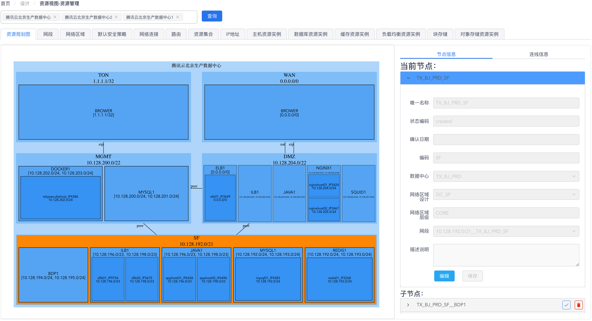
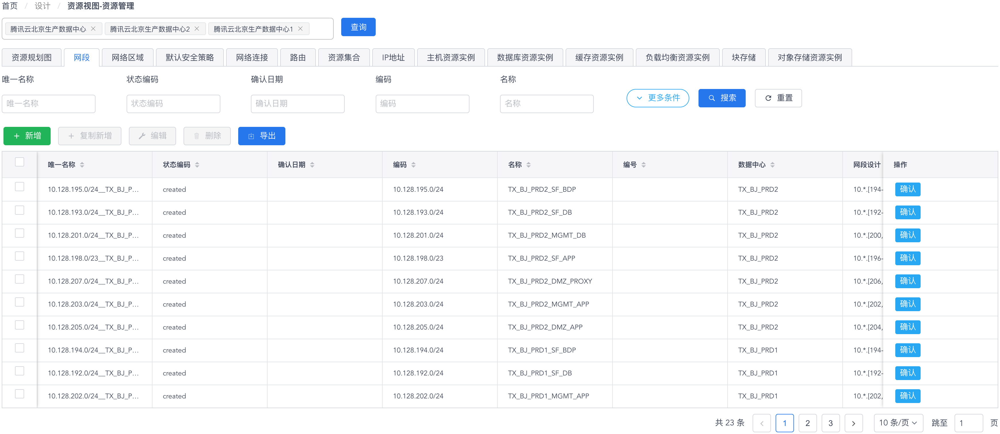

# 资源视图 - 资源管理

您可以通过 “**设计**菜单” - “**资源视图 - 资源管理**菜单项” 来访问CMDB资源视图的资源管理功能页面。在资源视图的资源管理功能页面中，您可以方便地维护和管理数据中心所有IT基础设施资源所对应的CI数据对象。

在选择了想要查看的数据中心并点击 “**查询**” 按钮后，您就可以在页面上看到与所选的数据中心相关的所有CI数据对象。

## 资源规划图视角

在资源规划图视角中，您可以看到页面左侧将以图形方式展现出数据中心的IT基础设施资源，包括网络资源、计算资源、存储资源等，如下图所示：

{: target="\_image"}

您可以在资源规划图上点击某个图形元素将其选中，这样页面右侧的 “**节点信息**” 或 “**连线信息**” 标签页中将会显示选中图形对应的CI数据对象信息，您可以对数据对象进行编辑以及添加作为图形子节点的关联CI数据对象。

## CI数据对象视角

在页面上方的面板标签中，除了代表规划设计图的第一个标签之外，其它每个标签都对应规划设计中包含的一种CI数据类型，如下图所示：

{: target="\_image"}

通过切换这些标签页，您可以对相应的CI数据对象进行查看、编辑、删除和导出等操作，也可以使用表格组件上方的过滤搜索进行有针对性的查询。

{: target="\_image"}
