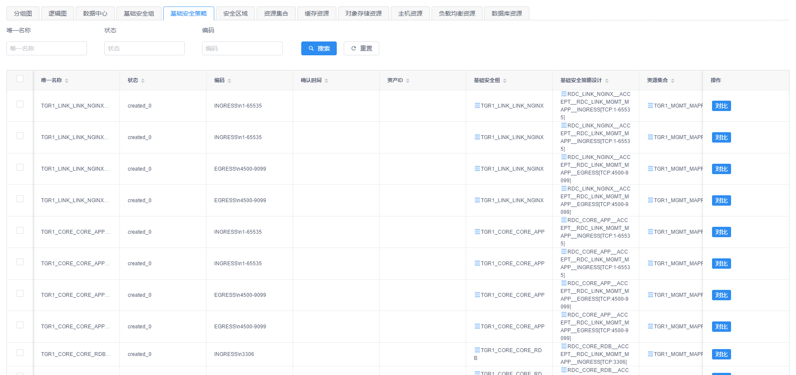

# 资源视图 - 规划设计

您可以通过 “**设计**菜单” - “**资源视图 - 规划设计**菜单项” 来访问CMDB资源视图的规划设计功能页面。在资源视图的规划设计功能页面中，您可以设计和维护企业IT数据中心的规划设计蓝图。这些规划设计可以作为企业级IT基础设施的标准化蓝图，在搭建新的数据中心时可以用作模板从而在保证标准化的同时也大大降低新数据中心的设计成本。

在选择了一个已有的数据中心设计蓝图后，您可以在页面上看到与该规划设计对应的规划设计图以及其中包含的所有CI数据对象。

## 规划设计图视角

在规划设计图视角中，您可以看到页面左侧将以图形方式展现出数据中心规划设计的元素，包括针对网络区域、网络区域连接和资源集合等CI数据对象的设计方案，如下图所示：

{: target=\_image}

您可以在规划设计图上点击某个图形元素将其选中，这样页面右侧的 “**节点信息**” 或 “**连线信息**” 标签页中将会显示选中图形对应的CI数据对象信息，您可以对数据对象进行编辑以及添加作为图形子节点的关联CI数据对象。

## CI数据对象视角

在页面上方的面板标签中，除了代表规划设计图的第一个标签之外，其它每个标签都对应规划设计中包含的一种CI数据类型，如下图所示：

{: target=\_image}

通过切换这些标签页，您可以对相应的CI数据对象进行查看、编辑、删除和导出等操作，也可以使用表格组件上方的过滤搜索进行有针对性的查询。

{: target=\_image}
