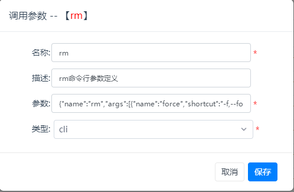
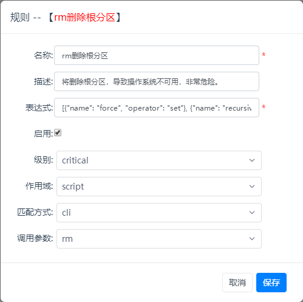
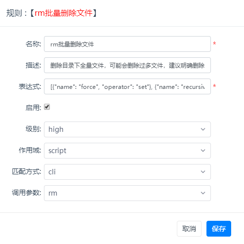
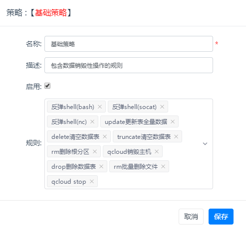
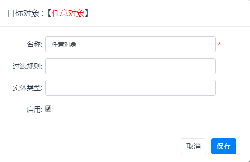
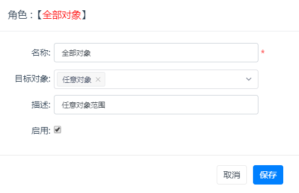
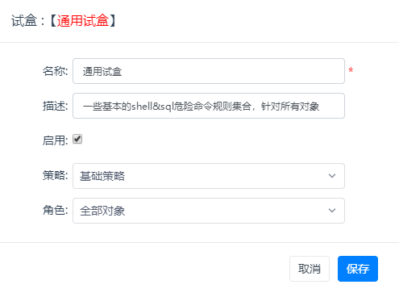
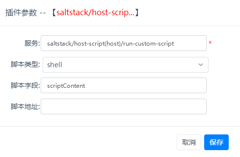
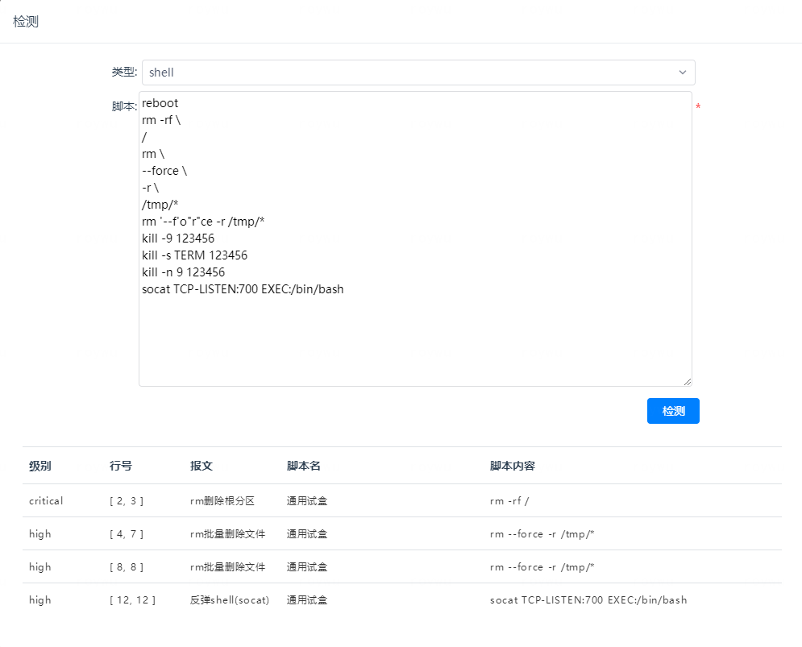
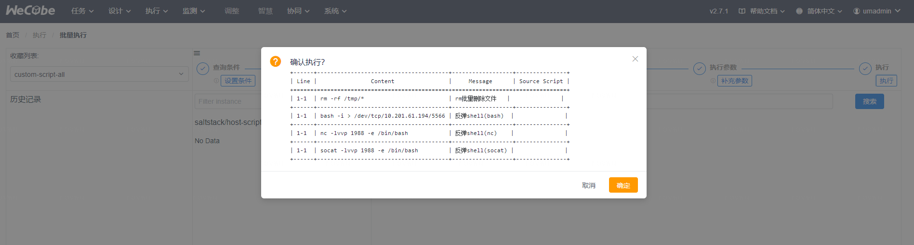

Itsdangerous使用说明：

### 概念说明

调用参数：一个命令或者一次检测中的参数

规则：数据的检测明细动作，比如对脚本检测 或 输入参数json字段进行检测，使用正则 或 调用参数 进行匹配

策略：规则的集合

目标对象：定义规则/策略将作用于的对象范围，对象可以使用 输入参数json特定字段值，或wecube模型定位表达式 来表述

角色：对象的集合

试盒：将策略和角色关联，以对调用的行为进行高危检测

插件参数：定义插件最佳实践服务所对应的脚本提取字段，支持内容字段，以及物料地址/S3地址压缩包自动提取

高危检测：针对要执行的插件参数及模型实例，进行目标对象范围界定，若符合则使用其规则进行脚本内容的检测。


​    

### 配置步骤

首先要明确检测范围，比如本次要针对所有对象增加一个rm的命令检测，只要使用强制删除参数(-f,--force)，递归删除(-r,-R,--recursive)就命中规则，以下为具体配置步骤

**a) 添加调用参数**

首先我们了解rm在linux中的参数定义为

```bash
roy@roywu-NB1:Desktop$ rm --help
Usage: rm [OPTION]... [FILE]...
Remove (unlink) the FILE(s).

  -f, --force           ignore nonexistent files and arguments, never prompt
  -i                    prompt before every removal
  -I                    prompt once before removing more than three files, or
                          when removing recursively; less intrusive than -i,
                          while still giving protection against most mistakes
      --interactive[=WHEN]  prompt according to WHEN: never, once (-I), or
                          always (-i); without WHEN, prompt always
      --one-file-system  when removing a hierarchy recursively, skip any
                          directory that is on a file system different from
                          that of the corresponding command line argument
      --no-preserve-root  do not treat '/' specially
      --preserve-root   do not remove '/' (default)
  -r, -R, --recursive   remove directories and their contents recursively
  -d, --dir             remove empty directories
-v, --verbose         explain what is being done
        --help     display this help and exit
  --version  output version information and exit
```

  那么我们可以将rm参数的参数定义转化为调用参数专用表达方式（json）

```json
  {
      "name":"rm",
      "args":[
          {
              "name":"force",
              "shortcut":"-f,--force",
              "action":"store_true"
          },
          {
              "name":"recursive",
              "shortcut":"-r,-R,--recursive",
              "action":"store_true"
          },
          {
              "name":"help",
              "shortcut":"--help",
              "action":"store_true"
          },
          {
              "name":"version",
              "shortcut":"--version",
              "action":"store_true"
          },
          {
              "name":"path",
              "repeatable":"*"
      }
      ]
}
```

在args里，我们可以使用以下参数来模拟转换linux中的调用参数

- *name：必须，参数名称*
- *shortcut：可选，具体命令行参数，比如-f,--force  可以用逗号分隔多个参数*

- *convert_int：可选，所有参数解析后默认为字符串，如果后续需要进行数字对比，则可以使用本字段转换，比如convert_int: true*

- *action：可选，store(default)/store_true/store_false/count/append，store即存储对应的值，store_true/store_false即存在此参数置为true/false, count记录参数出现次数，append即多次出现本参数时将结果记录为一个列表*

- *repeatable: 可选，None(default)/?/+/*/1/2/3...，限定参数可出现的次数? - 一次或0次，+ - 至少一次，\* - 0次或N次，指定数字即指定次数*
                          *出现多次的时候，结果将记录为列表，不使用repeatable时(默认)后面参数值将覆盖前面的值*

​		

  

  > 当调用参数类型为cli时，按照以上说明进行填写，类型为regex时，当前仅支{"flag":"I"}代表忽略大小写


​		**b) 添加规则**

​		我们认为rm只要存在递归和强制2个参数，若路径是/或者包含*的即符合危险操作，所以我们需要添加2个规则

​		

​		表达式明细如下：代表命令调用中设置了force & recursive参数，没有使用help或version参数（使用这2个参数时，并不会执行命令，所以不存在危险），并且路径是/ 

```
[
    {
        "name":"force",
        "operator":"set"
    },
    {
        "name":"recursive",
        "operator":"set"
    },
    {
        "name":"help",
        "operator":"notset"
    },
    {
        "name":"version",
        "operator":"notset"
    },
    {
        "name":"path",
        "operator":"eq",
        "value":"/"
    }
]
```

​		同理我们再添加一个删除批量文件的规则

​		

```
[
    {
        "name":"force",
        "operator":"set"
    },
    {
        "name":"recursive",
        "operator":"set"
    },
    {
        "name":"help",
        "operator":"notset"
    },
    {
        "name":"version",
        "operator":"notset"
    },
    {
        "name":"path",
        "operator":"ilike",
        "value":"*"
    }
]
```


在配置规则的表达式中，我们使用了作用域为script以及匹配方式为cli的方式，其表达式与wecube filter类似的规则(json列表)来进行数据的匹配： [{name: xxx, operator: xxx[, value: xxx]}]

operator支持 set/noset/null/notNull/like/ilike/eq/ne/in/nin/regex/iregex, 为set/noset/null/notNull时，value可以不设置

- *当作用域为param+匹配方式为filter时：表达式为{name op value}{...}的形式*

- *当作用域为script+匹配方式为sql时：表达式为正则表达式*

- *当作用域为script+匹配方式为sql时：表达式为正则表达式（建议调用参数选iregex忽略大小写）*

- *当作用域为script+匹配方式为text时：表达式为正则表达式，对目标脚本进行按行的匹配（建议调用参数选iregex忽略大小写）*

- *当作用域为script+匹配方式为fulltext时：表达式为正则表达式，对目标脚本进行多行的匹配（建议调用参数选iregex忽略大小写）*


​		**c) 添加策略**

​		

​		**d) 添加目标对象**

​		

​		过滤规则：可以使用filter字符串的表达式进行匹配，如希望仅匹配qcloud插件调用，{'serviceName' ilike 'qcloud'}，留空则默认全部放通

​		实体类型：wecube定位表达式，可以从批量执行中选择对象并赋值表达式到此处粘贴，比如生产环境主机：wecmdb:deploy_environment{code eq 'PRD'}~(deploy_environment)wecmdb:app_system~(app_system)wecmdb:subsys~(subsys)wecmdb:unit~(unit)wecmdb:app_instance.host_resource_instance>wecmdb:host_resource_instance，同样留空则默认全部放通


​		**e) 添加角色**

​		

​		**f) 试盒**

​		

​		试盒提供了单独检测的能力（单独检测时，因不存在实体实例信息，因此默认跳过对象范围检测，认为总是符合检测范围）


​		**g) 插件参数**

​		需要根据插件最佳实践进行填写，比如saltstack/host-script(host)/run-custom-script，脚本内容直接存在于scriptContent字段中，因此我们可以这样填写

​		

> ​	源码中提供了根据现有wecube最佳实践整理的插件参数配套设置：https://github.com/WeBankPartners/wecube-plugins-itsdangerous/blob/master/wecube_standard.sql


### 检测

1. 在试盒页面 - 操作列 - 检测 功能可以提供策略的检测测试功能，比如：

> 在本页面中进行检测，默认会跳过对象范围检测(即角色范围不生效)



   2. 在wecube页面 执行 - 批量执行中，当高危命令检测插件已注册且有实例运行时，会默认启用插件检测。

      如果命中高危规则，页面会弹出确认信息，您需要根据提示信息确认是否要继续执行。

      