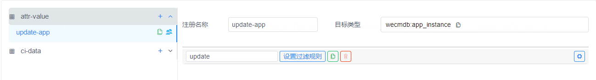
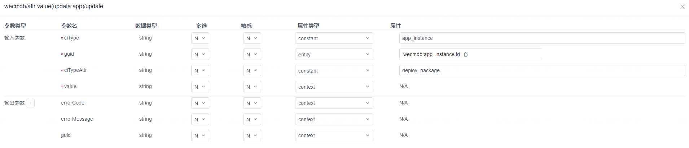
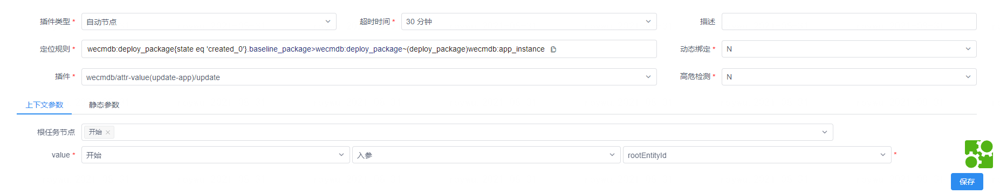

# Jenkins集成
Jenkins一个常见的持续集成工具，在开发流程中，常用于提交代码后自动触发编译打包，并输出版本物料包。

本章节主要介绍如何通过Jenkins对接WeCube平台实现自动化版本发布

## 物料包规范

WeCube平台中使用的物料包目录结构规范：

-  物料压缩包格式为zip/tar/tar.gz/tar.bz2，压缩包内第一层级为应用名称命名的文件夹
-  二级目录bin  - 用于存放程序文件和启动/停止/首次部署脚本，脚本的执行结果需是幂等的(可重复执行不影响结果)，脚本文件中可以包含[@变量名]格式的变量，比如操作系统环境变量，启动参数等
-  二级目录conf - 用于存放程序配置文件，配置文件中可以包含[@变量名]格式的变量，比如数据库连接串等
-  二级目录sql  - 用于存放数据库的DDL/DML语句
-  三级目录upgrade    - 用于存放升级SQL语句，每个版本一个sql文件
-  三级目录downgrade  - 用于存放降级SQL语句，每个版本一个sql文件


```
demo_core/
├── bin
│   ├── application.bin
│   ├── deploy.sh
│   ├── start.sh
│   └── stop.sh
├── conf
│   └── application.conf
└── sql
    ├── downgrade
    │   ├── v1.0.0.sql
    │   └── v1.0.1.sql
    └── upgrade
        ├── v1.0.0.sql
        └── v1.0.1.sql

```

## 自动发布
### 自动发布要求

- 首个版本包需手动上传并在物料插件中进行正确配置(手动发布)
- 迭代版本中暂不支持有新增的差异化变量(若有，请按照第一条要求处理)
- sql语句必须按每个版本进行拆分，每个sql文件中仅包含版本增量部分
- 提前准备Nexus环境

### 自动发布流程
#### **构建物料包**

请参考**物料包规范**进行jenkins打包配置，并将物料包上传至Nexus指定repository的component下

```
上传Nexus示例：
上传当前目录下的app.zip至Nexus的/path路径下

BASIC_AUTH=`echo 'username:password'|base64`
curl -X 'POST' \
  'http://127.0.0.1:8888/service/rest/v1/components?repository=artifacts' \
  -H 'accept: application/json' \
  -H "Authorization: Basic $BASIC_AUTH" \
  -H 'Content-Type: multipart/form-data' \
  -F 'raw.directory=/path' \
  -F 'raw.asset1=@./app.zip;type=application/octet-stream' \
  -F 'raw.asset1.filename=app.zip'
```

repository值与Artifacts插件中的环境变量ARTIFACTS_NEXUS_REPOSITORY相对应

component值用于**配置物料包**步骤


#### **登陆WeCube平台**

使用账户密码登陆wecube平台，获取access token，用于后续的接口认证

```
请求：
curl -X 'POST' \
  'http://127.0.0.1:19090/auth/v1/api/login' \
  -H 'accept: application/json' \
  -H 'Content-Type: application/json' \
  -d '{
  "username": "username",
  "password": "password"
}'

响应：
{
    "status":"OK",
    "message":"success",
    "data":[
        {
            "expiration":"1630386321754",
            "token":"refresh_token",
            "tokenType":"refreshToken"
        },
        {
            "expiration":"1630380321755",
            "token":"access_token",
            "tokenType":"accessToken"
        }
    ]
}
```


#### **配置物料包**

本步骤会调用Artifacts插件接口自动从Nexus中拉取指定的物料包，与基线物料包(baselinePackage)进行对比自动集成配置并识别新增的sql语句，并记录到CMDB中。

请记录新的deploy_package的guid，以便下次自动发布时自动填充到baselinePackage中

```
请求：

curl -X 'POST' \
  'http://127.0.0.1:19090/artifacts/packages/auto-create-deploy-package' \
  -H 'accept: application/json' \
  -H 'Content-Type: application/json' \
  -H 'Authorization: Bearer access_token' \
  -d '{
  "nexusUrl":"/path/app.zip",
  "baselinePackage":"deploy_package_00000001"
}'


响应：
{
    "status":"OK",
    "message":"success",
    "data":{"guid": "deploy_package_00000002"}
}
```


#### **执行应用发布**

首先我们需要在CMDB的服务注册中新增一个插件：





进入“协同->任务编排”，点击右上角【创建】，新建一个编排。

在授权界面授权“SUPER_ADMIN”角色为属主和使用角色。

- 编排类型选择“wecmdb:deploy_package”，点击该对象类型，在弹出选项中选择“添加过滤规则”，过滤规则设置为 {state eq 'created_0'} ；

- 右侧信息栏填写编排名称为“应用更新_V0.1”。 

按参考操作手册和如下说明增加“开始 - 应用实例绑包 - 暂停告警 - 更新实例 - 启用告警 - 确认实例 - 确认物料包 - 结束” 8个步骤。 

1. 在“应用实例绑包”节点编辑插件，选择自动节点，定位规则为“wecmdb:deploy_package{state eq 'created_0'}.baseline_package>wecmdb:deploy_package~(deploy_package)wecmdb:app_instance”，插件 选择“wecmdb/attr-value(update-app)/update”，按照下图所示配置上下文参数，点击【保存】。 



2. 在“暂停告警”节点编辑插件，选择自动节点，定位规则为“wecmdb:deploy_package{state eq 'created_0'}~(deploy_package)wecmdb:app_instance”， 插件选择“monitor/nginx(nginx)/stop-alarm” ，**启用动态绑定**，点击【保存】。

    > 此处我们假设应用是一个基于Nginx部署的Web (并且配置了nginx监控)。
    > 
    > 注意从第二个节点开始，定位规则没有再使用wecmdb:deploy_package{state eq 'created_0'}.baseline_package，并且都启用了动态绑定，因为应用实例与包的绑定关系已经从 app_instance -> baseline_package 变为 app_instance -> new_package

3. 在“更新实例”节点编辑插件，选择自动节点，定位规则为“wecmdb:deploy_package{state eq 'created_0'}~(deploy_package)wecmdb:app_instance”， 插件选择“saltstack/apply-deployment(app_deploy)/update” ，**启用动态绑定**，点击【保存】。 

4.  在“启用告警”节点编辑插件，选择自动节点，定位规则为“wecmdb:deploy_package{state eq 'created_0'}~(deploy_package)wecmdb:app_instance”， 插件选择“monitor/nginx(nginx)/start-alarm” ，**启用动态绑定**，点击【保存】。

5. 在“确认实例”节点编辑插件，选择自动节点，定位规则为“wecmdb:deploy_package{state eq 'created_0'}~(deploy_package)wecmdb:app_instance”， 插件选择“wecmdb/ci-data(confirm)/operation” ，并配置上下文和静态参数，**启用动态绑定**，点击【保存】。

    **上下文参数**：

    根任务节点： 更新实例

    jsonData：更新实例 - 出参 - guid

    静态参数：

    ciType：app_instance

6. 在“确认物料包”节点编辑插件，选择自动节点，定位规则为“wecmdb:deploy_package{state eq 'created_0'}”， 插件选择“wecmdb/ci-data(confirm)/operation” ，并配置上下文和静态参数，点击【保存】。

    **上下文参数**：

    根任务节点： 开始

    jsonData：开始 - 入参 - rootEntityId

    **静态参数**：

    ciType：deploy_package

    > 实例中假设应用包已经使用完毕，因此最后进行确认，若您需要多次发布(比如多个环境发布，共用物料包，可以将过滤条件{state eq 'created_0'}删除，移除确认物料包步骤，并且再每个定位规则为wecmdb:app_instance的步骤中添加环境过滤条件)
    
    

全部配置完成后入下图，最后点击【发布编排】。如发布时会做后台校验，如遇异常请根据报错提示做相应处理。

复制编排id备用（编排id是一个"稳定"值，每次更新编排后，id保持不变，因此可以在不改动调用代码的情况下直接更新编排流程）

执行应用更新编排

```
请求：

curl -X 'POST' \
  'http://127.0.0.1:19090/platform/v1/operation-events' \
  -H 'accept: application/json' \
  -H 'Content-Type: application/json' \
  -H 'Authorization: Bearer access_token' \
  -d '{
  "eventSeqNo":"生成uuid",
  "eventType":"APP_AUTO_UPGRADE",
  "sourceSubSystem":"SYS_ARTIFACTS",
  "operationKey":"编排id",
  "operationData":"deploy_package_00000002",
  "operationUser":"jenkins",
}'


响应：
{
    "status":"OK",
    "message":"success",
    "data":null
}

```

编排执行完成后，可以查看应用确认已经更新到最新版本。
