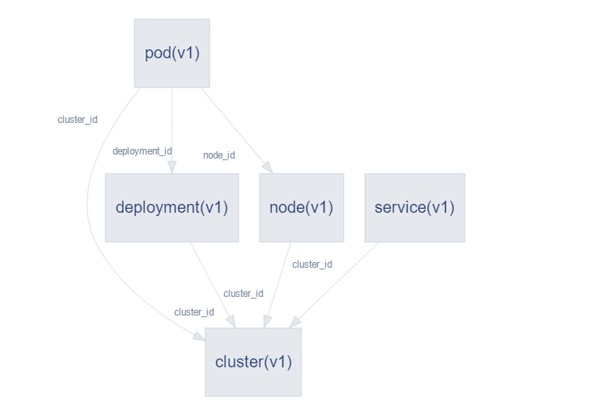

### 简介
Kubernetes插件基于Kubernetes(简称K8S)集群，围绕模型注册，应用部署，多K8S集群管理，事件监听等能力，提供更统一的管理入口，更实时的部署/监控管理。

### 数据模型
Kubernetes插件接入WeCube平台的数据模型，提供多集群Cluster/Node/Deployment/POD/Service信息实时查询，结合标签能力与其他插件的数据模型进行关联

### 应用部署
支持无状态的应用部署管理，支持私有化镜像，以及Service负载均衡配置

#### 多集群管理
插件支持管理多个K8S集群，可以通过插件服务进行增删改操作，通过数据模型实现查操作。
集群记录了外部关联ID，api地址，认证token用于应用部署的调度，还记录了metric exporter的IP和端口用于提供增强型的监控数据

#### 无状态应用部署
插件提供了基于Deployment和Service的部署服务，支持私有化镜像(可以与Artifacts插件结合使用)

### 监控集成
插件已与Monitor插件实现无缝对接，您可以通过Monitor插件的接口服务自动化注册K8S集群信息

#### 手动添加集群
这里演示如果通过Monitor插件页面手动添加K8S集群信息，进入监测-监控配置页面

切换到采集器标签页，录入K8S集群的信息，点击保存即可

> 添加集群信息后，并不是自动获取所有的POD进行监控，若需要实现，可以使用编排设计通过数据模型Cluster->Deployment->POD获取所有POD并注册到Monitor监控中

#### POD动态监听
POD的变化是非常迅速的，如果监控系统中POD信息无法及时更新，就无法给运维工作提供有效帮助，Kubernetes插件通过事件监听的方式，实时获取POD变化动态，并触发WeCube编排执行，您可以通过编排自定义响应操作。

> 默认事件触发如下：
> 
> KUBERNETES_NOTIFY_POD_ADDED -> 编排ID：kubernetes-pod-added
> 
> KUBERNETES_NOTIFY_POD_DELETED -> 编排ID：kubernetes-pod-deleted
> 
> 您可以修改以上系统参数以实现自定义事件