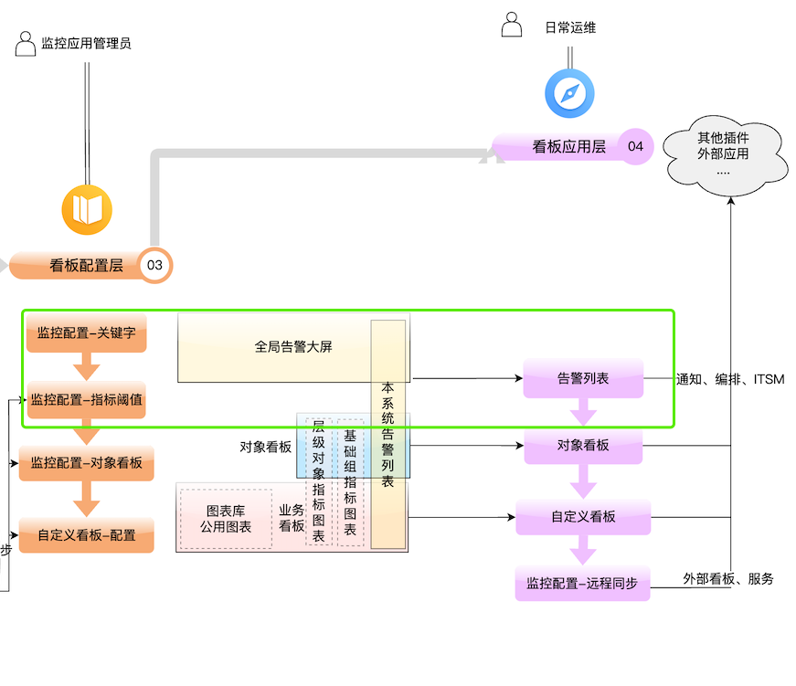
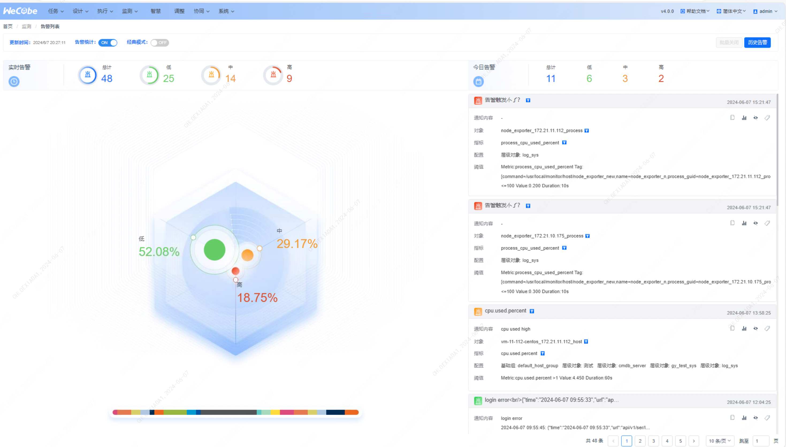
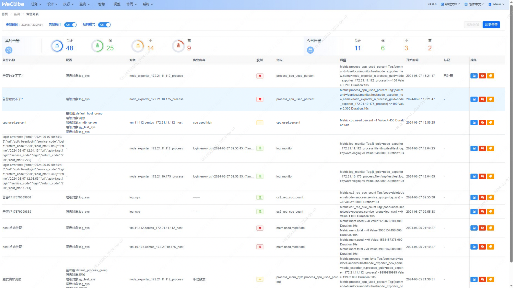
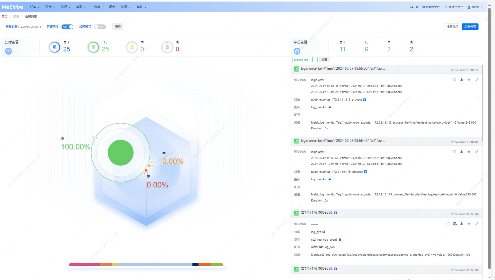
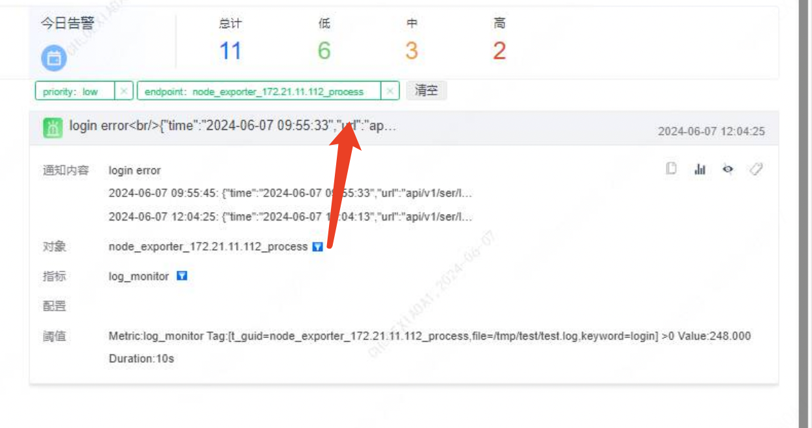
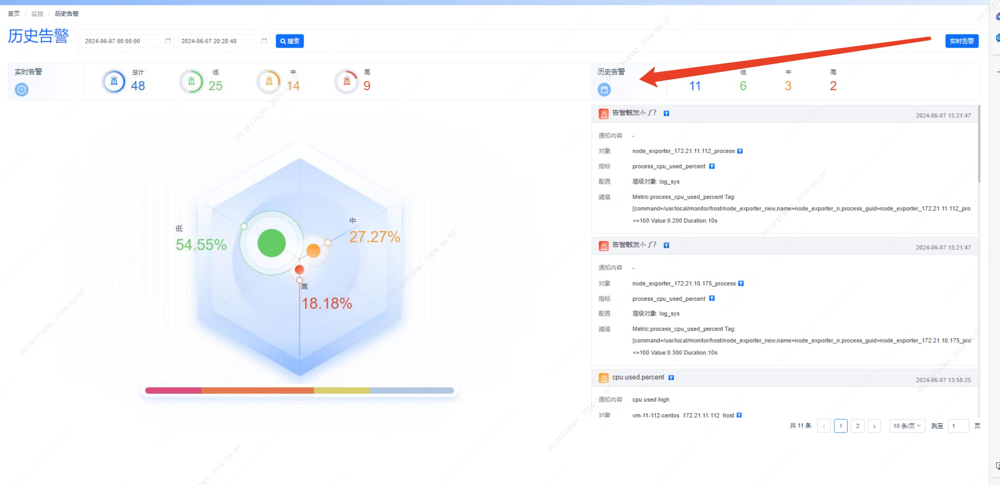
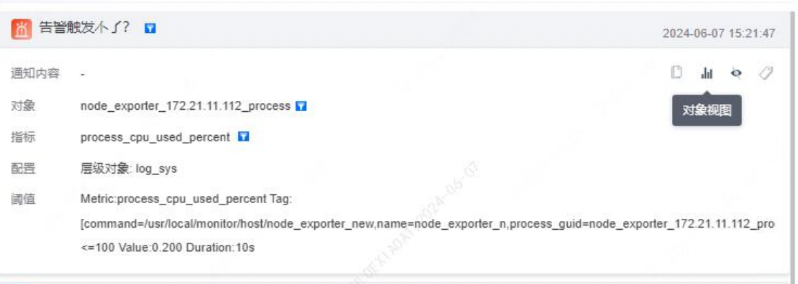
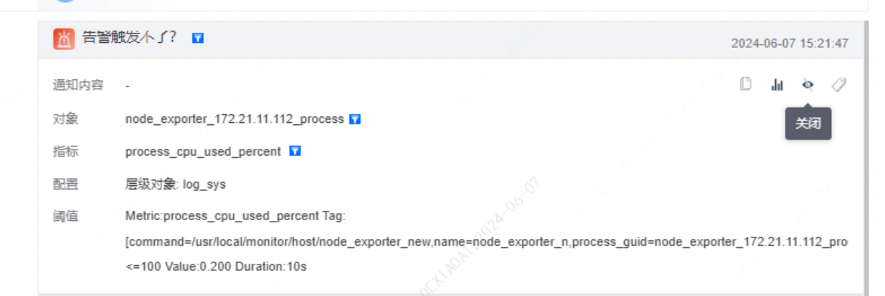
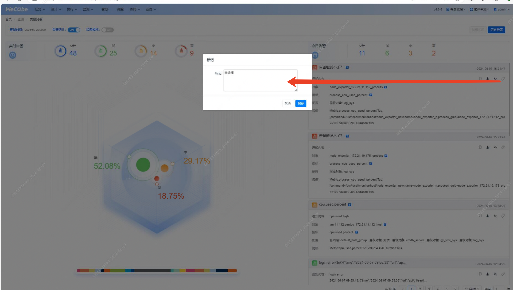
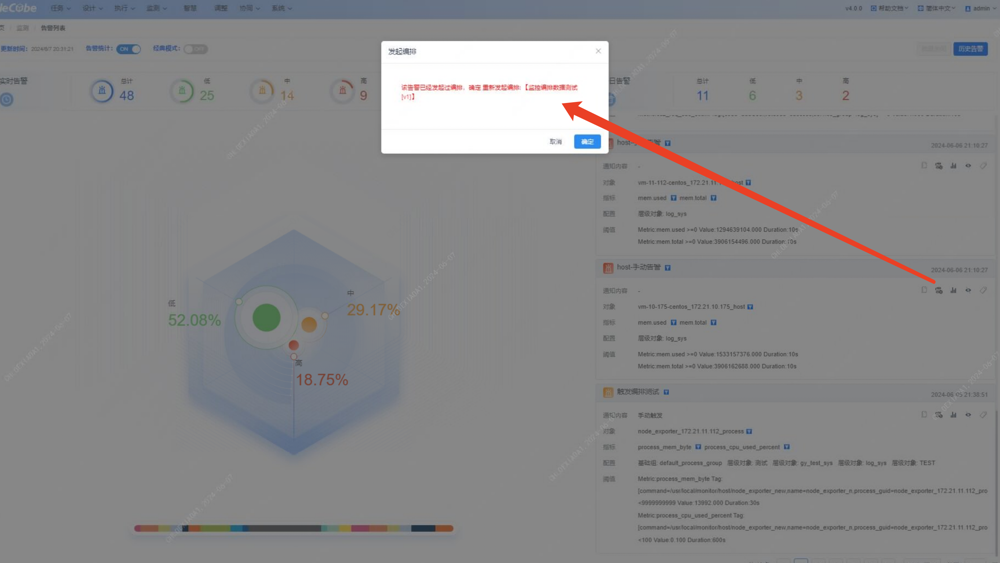

#### 功能说明

##### 告警视图默认以推荐模式展示监控情况，同时提供经典模式切换选项和多种告警操作功能。

#### 具体步骤说明

##### 1. 切换展示模式

- **推荐模式**：默认展示内存使用情况，如上图所示。
- 
- **经典模式**：点击切换按钮，切换为列表形式展示，可以在一个页面查看更多的告警列表。
- 

##### 2. 通过扇形图对告警进行分类统计和过滤

- 扇形统计图对众多告警进行分类统计，主要包括告警指标和告警优先级两个维度。
- 点击某个显示项，对右侧告警列表进行过滤。
- 

##### 4. 通过按钮对告警列表进行条件过滤

- 点击告警列表上的加号按钮，弹出条件过滤选项。
- 根据需求设置过滤条件，点击确认进行过滤。
- 

##### 5. 查询历史告警

- 点击“查询历史告警”按钮，进入历史告警查询页面。
- 设置查询条件，查看历史告警记录。
- 

##### 6. 跳转到该告警的监控对象看板

- 选择要查看的告警。
- 点击“跳转到对象看板”按钮，进入对应的监控对象看板页面。
- 

##### 7. 手动关闭告警

- 选择要关闭的告警。
- 点击“手动关闭告警”按钮，确认关闭操作。
- 

##### 8. 给告警添加备注

- 选择要添加备注的告警。
- 点击“添加备注”按钮，输入备注内容。
- 备注内容会显示在告警详情中。
- 

##### 9. 手动触发告警编排

- 选择要编排的告警。
- 点击“手动触发编排”按钮，执行相应的编排操作。
- 

#### 常见问题

##### Q1：告警分类统计图无法关闭

- \**A2*1：确保点击了正确的关闭按钮；尝试刷新页面或重新登录系统。

##### Q2：无法查询历史告警

- **A2**：检查网络连接是否正常；确保有真实的历史数据。

通过以上步骤和方法，可以有效操作和管理告警视图，确保监控系统的告警信息能够快速展示和处理。
