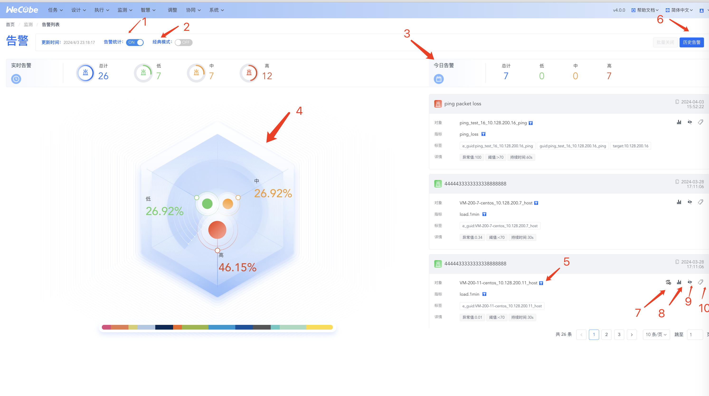

# 告警列表

1. 默认为推荐模式展示，内存如上图所显示的那样
1. 可选择切换到经典模式，其展示方式是列表形式，可以一个页面查看更多的告警列表
1. 可手动关闭左边那个扇形统计图
1. 该图是对众多告警的一个分类统计，主要有告警指标和告警优先级这两个维度，可点击某个显示项对右边列表进行过滤
1. 可点击那个加号对告警列表进行条件过滤
1. 点击查询历史告警
1. 可跳转到该告警的监控对象视图上
1. 可手动关闭该告警
1. 可给告警加备注，加了后会显示到告警内容上
1. 告警手动触发编排

