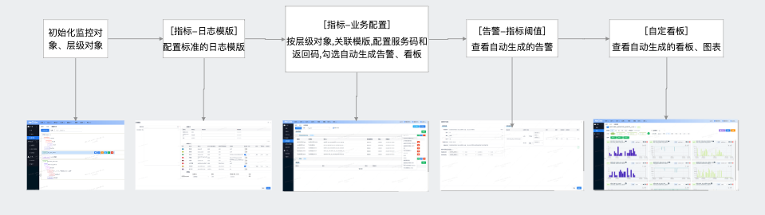
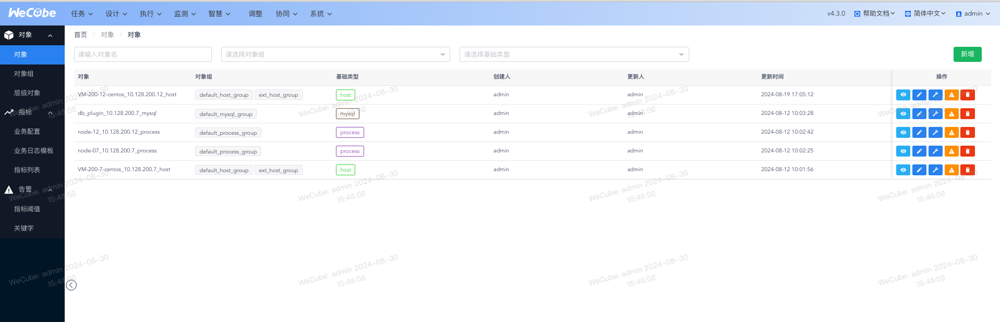
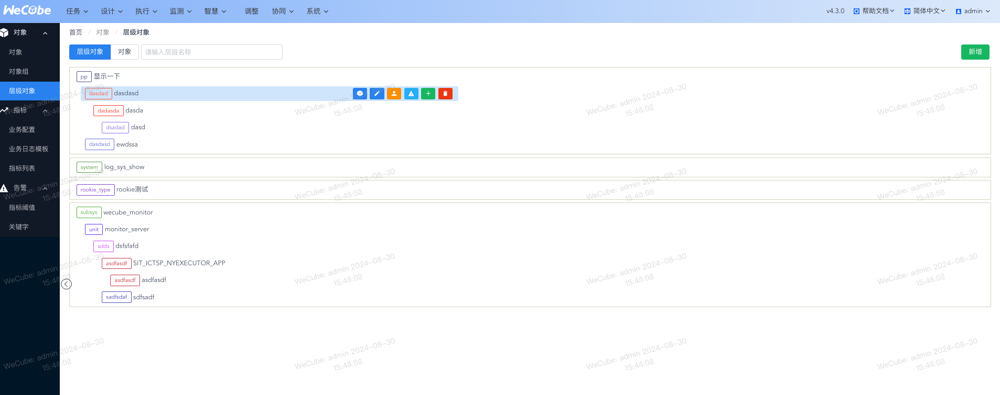
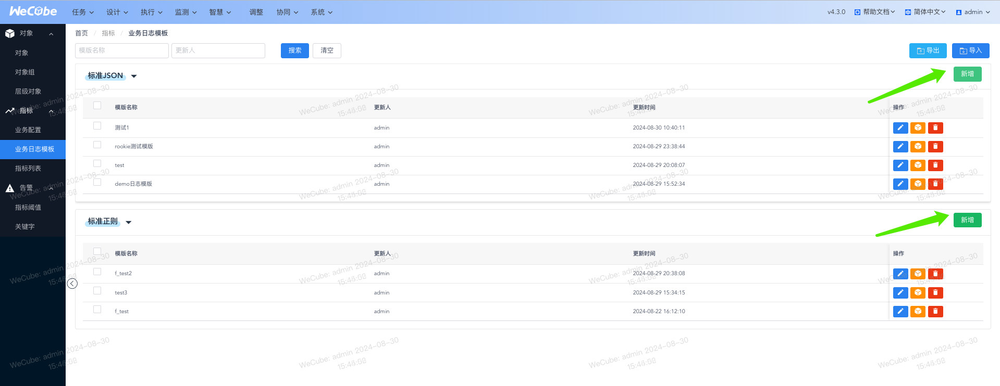
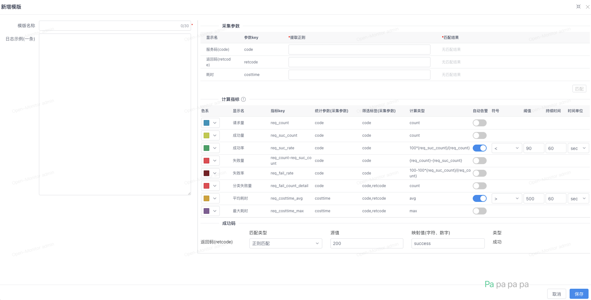

# 监控自动化配置

#### 概述

监控自动化配置功能的目标是提升监控配置效率和自动化程度,实现标准监控,一键生成,一键关联。

#### 

#### 1 前续步骤

最佳实践:使用编排自动根据cmdb创建以下监控配置

##### [监控配置-对象]初始化监控对象

##### [监控配置-层级对象]初始化层级对象,一般按照系统-子系统-单元层级划分

#### **2 [指标-日志模版]配置模版**

1. **进入日志模板配置**：在[监控配置-指标-业务日志模板]选项。

2. **新增模板**：

   点击“新增模板”/“导入模版”，根据您的日志规范配置模版:json日志选择json模版,其他日志选择正则模版

   a.粘贴demo日志,配置json提取表达式,查看匹配结果,
   b.配置采集指标的采集规则,
   c.配置指标对应的色系、告警开关、阈值

   d.配置通用的成功码

   

   

   

   计算指标说明:

   | 序号 | 字段名称     | 描述                                                         |
   | ---- | ------------ | ------------------------------------------------------------ |
   | 1    | 色系         | 作为指标默认的色系，在自定义看板中使用                       |
   | 2    | 显示名       | 指标说明，用于在界面上展示指标的名称或描述                   |
   | 3    | 指标key      | 指标的唯一标志，用于系统内部识别和管理指标                   |
   | 4    | 统计参数     | 指标的基础数据，来源于上面配置的采集参数，是指标计算的基础   |
   | 5    | 筛选标签     | 指标在配置告警、看板时支持的标签筛选。条件字段来源于采集参数，条件可选值来源于业务配置的标签值+真实采集值（如失败量仅可筛选服务码，分类失败量可筛选服务码和返回码） |
   | 6    | 计算类型     | 指标的计算公式，可使用其他指标作为参数，定义指标如何根据基础数据计算得出 |
   | 7    | 自动告警     | 开关，控制是否根据指标值自动创建告警。当开启时，系统会根据预设规则自动检测并生成告警 |
   | 8    | 阈值告警配置 | 打开自动告警时生效，将按照预设的模板规则自动生成告警。包括告警的触发条件、通知方式等配置 |

3. **保存模板**：完成模板编辑后保存,所有业务配置可以引用。

#### **3 [指标-业务配置]给系统配置指标模版**

1. **关联层级对象与模板**：在[监控配置-指标-业务配置]中，选择已创建的层级对象，在对应日志下新增业务配置,选择关联之前配置的日志模板。

   

2. **设置服务码与返回码**：根据业务需求，按照接口配置服务码,按照规范的错误码配置返回码，以便系统能够识别并分析关键信息。

   

3. **自动生成告警与看板**：勾选“自动生成告警”和“自动生成看板”，系统将根据日志模板和业务规则自动创建告警条件和自定义看板,创建成功提示具体创建的告警和看板名。

#### **4 [告警-指标阈值]查看自动生成的告警**

1. **进入告警管理**：在“告警-阈值告警”菜单下，查看系统根据业务配置自动生成的告警规则,

   1. 支持用户手动新增告警,同时支持一键筛选用户手动创建的数据

   2. 支持二次修改自动生成的告警

      

      

2. **告警效果**：系统会根据预设的阈值和实际数据自动触发告警，您可以在[告警列表]查看告警详情、状态及历史记录。

3. **告警生成模版说明**

   **目的**：
   在层级对象的`process`下，根据预设的模版中定义的`code`类型及其对应的成功率和耗时阈值，自动生成告警。

   **模版配置示例**：

   - 假设模版中配置了`code=1`和`code=2`，并为每种`code`分别设置了成功率和耗时的阈值。

   **告警生成规则**：

   1. 针对特定`code`的告警
      - 对于code=1生成高级别告警：
        - `code1成功率告警`：当`code=1`的成功率低于设定的阈值时触发。
        - `code1耗时告警`：当`code=1`的耗时超过设定的阈值时触发。
      - 对于code=2将生成高级别告警：
        - `code2成功率告警`：当`code=2`的成功率低于设定的阈值时触发。
        - `code2耗时告警`：当`code=2`的耗时超过设定的阈值时触发。
   2. 其他`code`的通用告警,中级别告警
      - 对于模版中未明确列出但存在数据的其他code将生成以下两类告警（告警名称中需拼接相应的code值）：
        - `其他code成功率告警`（告警列表里-告警名称需拼接具体`code`）：当任意未明确列出的`code`的成功率低于设定的通用阈值时触发。
        - `其他code耗时告警`（告警列表里-告警名称需拼接具体`code`）：当任意未明确列出的`code`的耗时超过设定的通用阈值时触发。

   **自动生成规则**：

   - 告警的自动生成仅在初次满足条件时有效，避免重复告警。

   **Title规则**：

   - 告警标题采用英文拼接方式，格式为`[code]+[指标]+[符号]+[阈值]`。例如，对于`code=1`的耗时超过500ms的告警，标题可能为`code1_costtime>500ms`。

   **通知角色**：

   - 默认使用层级对象的第一个管理角色

   **注意**：

   - 请确保模版中的`code`、阈值等配置正确无误，以避免误报或漏报。
   - 如果二次修改了日志模版/业务配置,不会影响已经创建的告警配置

#### **3 [自定看板]查看自动生成的看板、图表**

1. **访问看板**：在[自定义看板]菜单下，您将看到根据业务配置自动生成的看板和图表。

2. 

3. 

4. **看板生成模版说明**

   **目的**：
   根据模版中定义的`code`类型和色系，自动生成与层级对象同名的数据看板，以便于监控和分析各`code`类型的请求量、成功率、耗时等关键指标。

   **生成规则**：

   1. **看板名称**：自动生成与层级对象开头的看板，名称格式为`层级对象名-指标编排`。
   2. **指标与图表类型**：
      - 假设模版中有code=1和code=2，将生成以下图表：
      - 针对特定`code`的告警
        - 对于code=1生成三张图：
          - `code1请求量+失败量`：柱状图，展示`code=1`的请求量及失败量。
          - `code1成功率`：折线图，基于`retcode`展示`code=1`的成功率变化。
          - `code1耗时`：折线图，展示`code=1`的平均耗时或耗时分布。
        - 对于code=2生成三张图：
          - `code2请求量+失败量`：柱状图，展示`code=12的请求量及失败量。
          - `code2成功率`：折线图，基于`retcode`展示`code=2`的成功率变化。
          - `code2耗时`：折线图，展示`code=12的平均耗时或耗时分布。
      - 其他`code`的通用看板三张图
        - `其他code成功率`、`其他code请求量`、`其他code耗时`。
   3. **自动生成与修改**：
      - 自动生成功能仅在初次配置时有效，之后可以根据需求手动修改看板内容。
   4. **默认配置**：
      - 默认采用三列布局，图表将自动填充至合适位置。
      - 默认时间段设置为30分钟，定时刷新间隔为60秒（可根据模版指标实际计算间隔调整）。
   5. **图表管理**：
      - 新生成的图表将自动加入图表库，图表名称唯一且不可修改。
      - 图表`标签名（映射值）-指标名/层级对象`将用于图表标识，层级对象名称将在看板内换行展示。
   6. **权限与分组**：
      - 默认使用层级对象的第一个管理角色作为看板的管理角色和使用角色
      - 数据按接口服务码`code`进行分组展示，以便于快速定位和分析。

   **注意**：

   - 请确保模版中的`code`、色系等配置正确无误，以生成符合预期的看板。
   - 如果二次修改了日志模版/业务配置,不会影响已经创建的看板配置
