### 指标阈值

阈值配置是对监控对象组或层级对象进行一些指标的阈值配置，可配置告警的内容与接收人等，

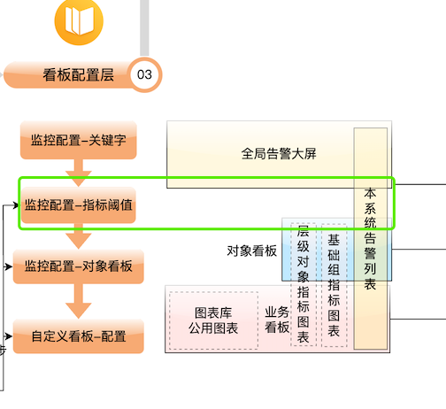

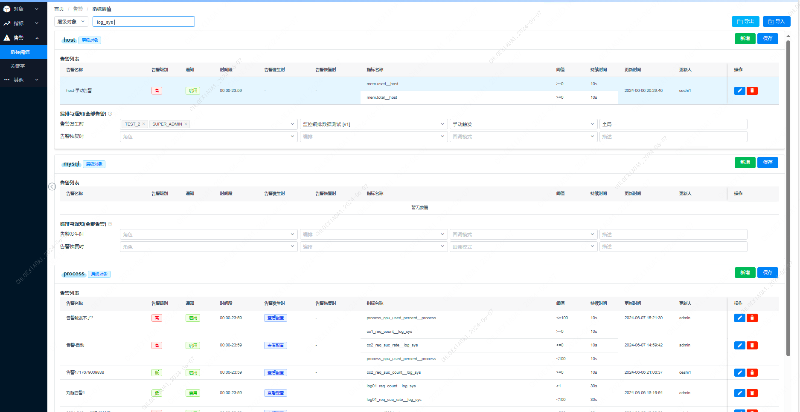

#### 功能说明

##### 1. 配置告警

- **功能描述**：配置层级对象下基础组、通用基础组的告警阈值,阈值基于监控配置-指标中的指标。

- 步骤

  1. 选择业务层级对象,自动拉出相关的基础组类型

  2. 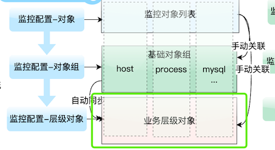

  3. 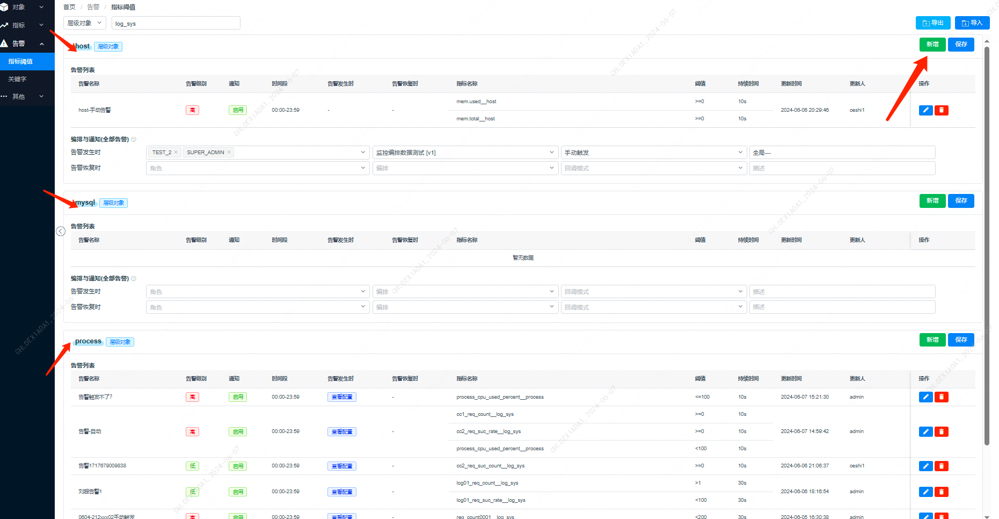

  4. 选择对应类型新增告警,配置告警基础信息、指标阈值(支持多选,取交集)

     1. 填写通知内容
     2. 持续异常时间数值
     3. 告警级别，有高中低三个级别
     4. 可选择告警是否发送通知
     5. 可选择告警发送通知的延迟，如果在延迟时间内该告警恢复，则不会发告警，为了避免持续异常恢复的情况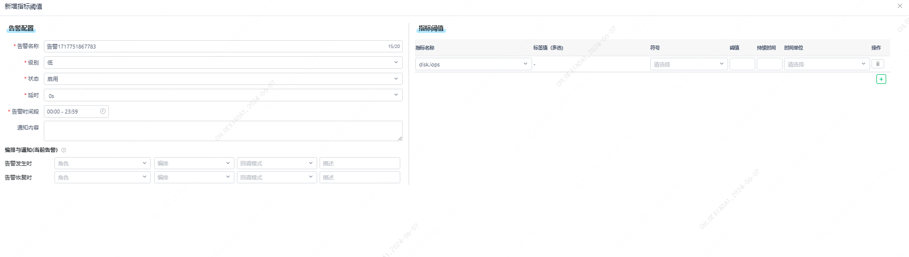

  5. 新增一个通知配置，当前告警的编排与通知角色(也可以针对所有指标统一配置,配置到告警的编排与通知级别更高)。
  
     1. 可选择是在告警发生时通知还是告警恢复时
     2. 通知的角色，如果配置了邮箱发送人，那么会对这些角色上的邮箱发送邮件,描述:描述行为
     3. 可选择所需要触发的流程编排,手动触发/自动触发:触发模式,手动触发需要在告警处点击按钮
  
  6. 编排手动触发:进入告警页面,找到按钮
  
     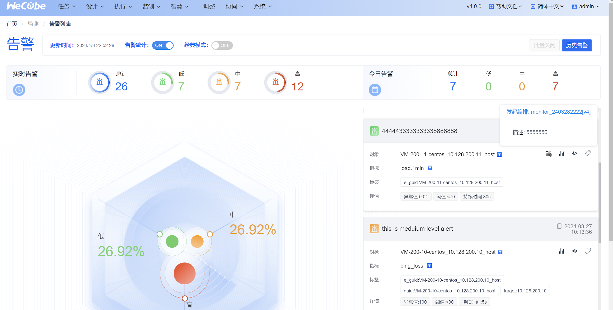
  
     
  
  7. 如果想配置基础组通用告警,切换基础组,配置组下告警,功能与层级对象一致
  
  8. 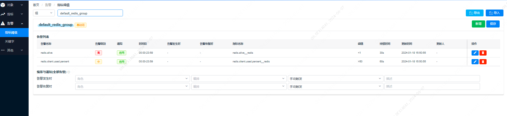
  
     

##### 2. 查询对象上的告警

- **功能描述**：查询一个基础对象上的告警,可能来自层级对象配置,也可能是基础组配置。
- 步骤

  1. 选择对象,自动拉出对象上的基础组告警配置和层级对象配置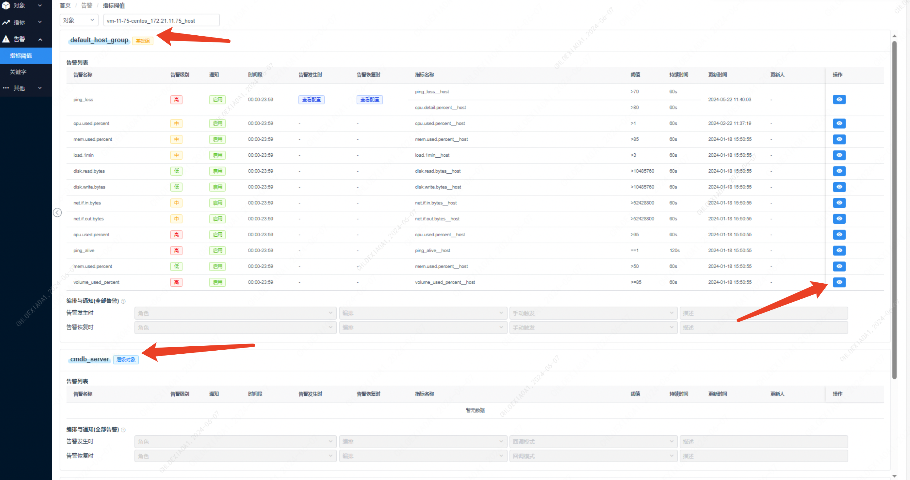
  2. 查看对应配置
     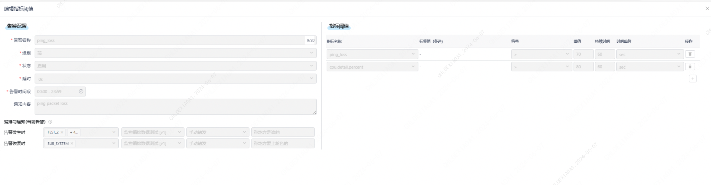

### 关键字

## 功能说明

### 关键字告警配置功能

关键字告警配置用于监控主机上的某个日志文件内容，一旦识别到有匹配的关键字则产生告警。此功能属于业务指标告警，并且归属于层级对象，配置在层级对象及其全部子对象所关联的与相应路径绑定的主机上生效。

#### 功能点概述

1. 选择层级对象或监控对象
2. 新增一个日志路径
3. 编辑日志路径的绑定信息
4. 删除日志路径配置
5. 编辑关键字
6. 删除关键字

#### 具体步骤说明

##### 1. 选择层级对象或监控对象

- **层级对象**：允许配置和查看。
- **对象**：仅允许查看，不允许配置。
- 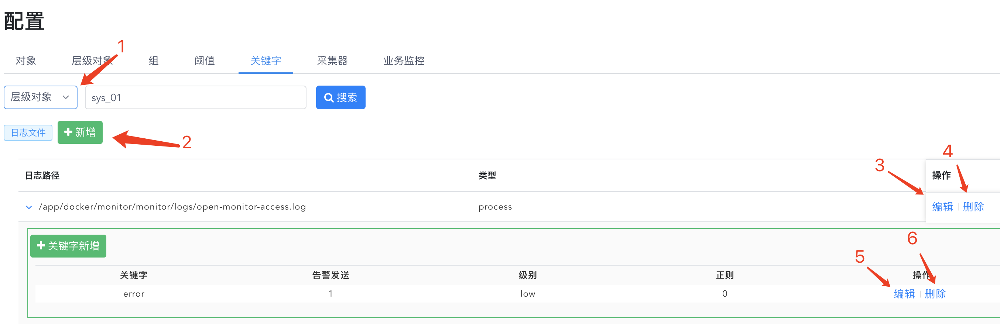

##### 2. 新增一个日志路径

- 点击“新增”按钮。
- 在弹出的对话框中输入日志路径，可以一次填多个路径，实现批量新增。
- 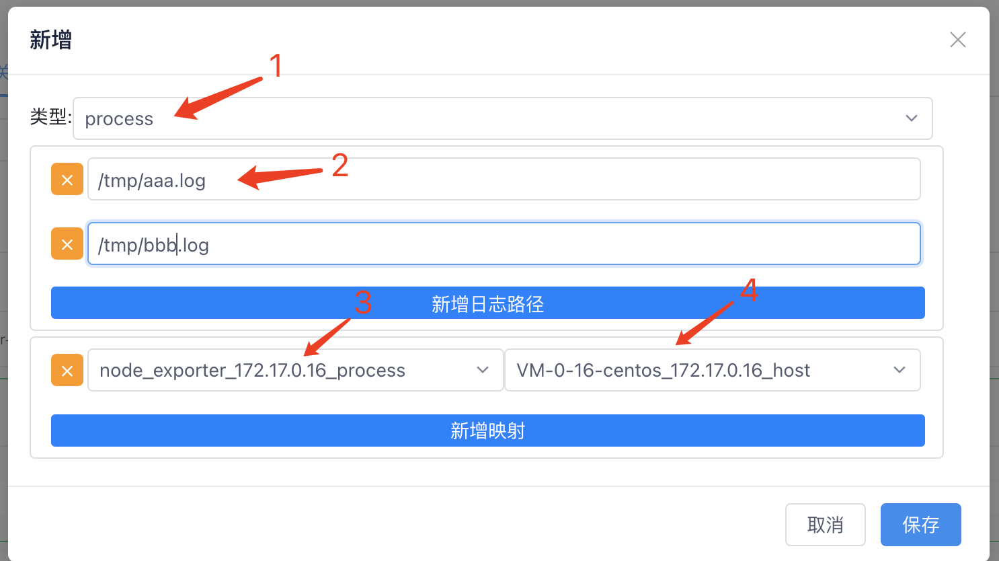

##### 3. 编辑日志路径的绑定信息

- 选择要编辑的日志路径，点击“编辑”按钮。
- 配置日志路径所属的业务监控类型，例如进程、Java等。
- 根据选择的监控类型，系统会自动带出属于该类型的监控对象，并配置监控对象所对应的主机监控对象。
- 例如：应用A部署在主机H上，日志路径为/tmp/test.log，那么在此处配置时，选择进程监控类型，并绑定应用A的进程监控对象与主机H的主机监控对象。

##### 4. 删除日志路径配置

- 选择要删除的日志路径，点击“删除”按钮。

##### 5. 编辑关键字

- 选择要编辑的日志路径，点击“编辑关键字”按钮。
- 填写要识别的关键字字符串（大小写敏感）。
- 可选择是否使用正则表达式匹配关键字。
- 配置关键字告警的级别。
- 设置关键字告警是否发送。
- 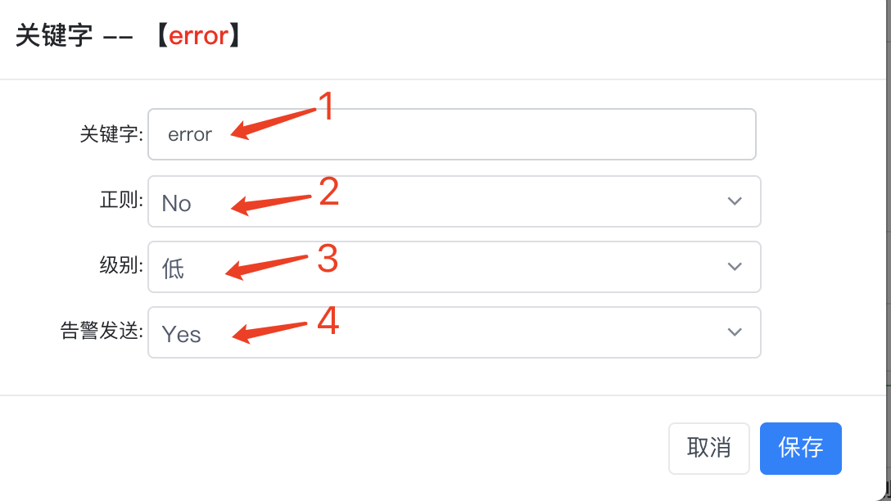

##### 6. 删除关键字

- 选择要删除的关键字，点击“删除”按钮。

#### 常见问题

##### 问题1：关键字告警配置不生效

**可能原因及解决方法：**

- 确认关键字字符串是否填写正确，是否区分大小写。
- 检查是否选择了正确的日志路径及绑定信息。
- 确认是否勾选了“关键字告警是否发送”选项。

##### 问题2：无法新增日志路径

**可能原因及解决方法：**

- 检查当前选择的是层级对象而非监控对象，监控对象下无法新增配置。
- 确认输入的日志路径格式是否正确，是否具有相应的权限。

##### 问题3：关键字正则表达式匹配失败

**可能原因及解决方法：**

- 确认正则表达式语法是否正确。
- 确认是否勾选了“使用正则去匹配”选项。
- 测试正则表达式匹配结果，确保能够匹配到实际日志内容。

##### 问题4：无法删除日志路径或关键字

**可能原因及解决方法：**

- 确认是否有删除权限。
- 检查是否选择了要删除的日志路径或关键字。
- 重新加载页面，确保配置界面无缓存问题。

##### 问题5：告警级别配置无效

**可能原因及解决方法：**

- 检查告警级别是否填写正确。
- 确认告警策略配置中是否包含所设置的告警级别。
- 确认是否正确绑定了相关的监控对象及主机对象。

关键字告警配置是监控主机上的某个日志文件内容，如果识别到有匹配的关键字则产生告警

关键字告警属于业务指标告警，所以它归属于层级对象当中，它的配置会对该层级对象及其全部子对象所关联的与相应路径绑定的主机上生效，比如它配置到层级对象A中，A的子层级对象B中关联了主机H1,H2，那么在此处配置的路径上可选择出H1、H2，如果只绑定了H1到该日志路径上，那么关键字监控只会作用于H1中。

