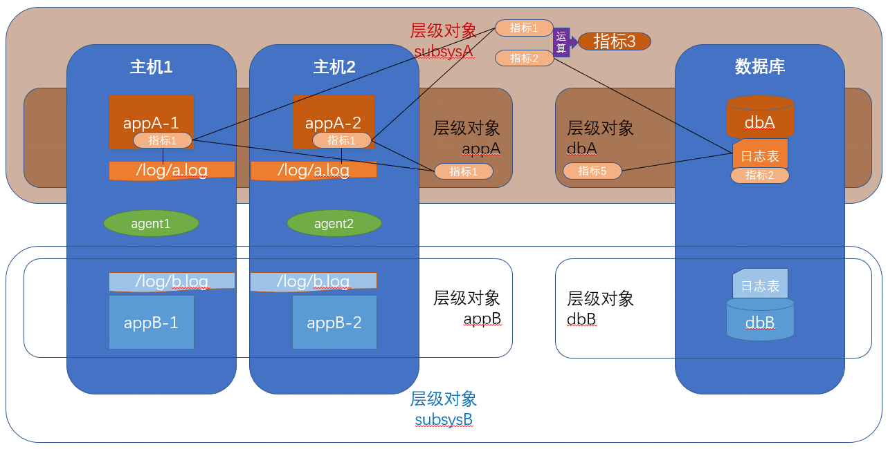
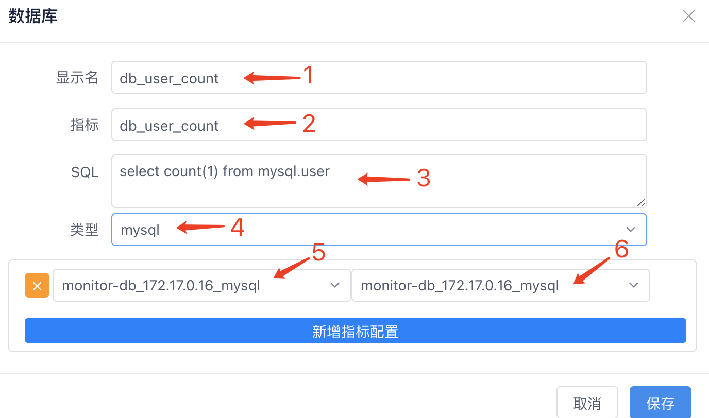

### 业务日志模版

#### 业务指标

- **配置单位**：业务日志监控配置以指标为单位。配置的指标与其他普通监控指标相同，但它是动态生成的表达式。
- **指标管理**：用户可以在指标设计页面修改或创建其他指标。这些指标的告警配置和视图展示以层级对象为单位出现。
- **可见性**：普通监控对象在配置视图和告警时不可见这些指标。

#### 业务指标作用对象

- **配置层级**：业务指标日志只能配置在层级对象上，作用范围是该层级对象及其所有子对象关联的对象集合。
- **对象绑定**：每个日志可选择对象集合中的某些监控对象进行绑定，只有绑定的对象才会生效。例如，层级对象A中配置了进程P1的日志路径/tmp/test.log，如果A的子对象B关联了主机H1、H2和进程P1、P2，那么日志配置可以通过选择进程类型(process)自动关联P1->H1、P2->H2。
- **自动匹配**：当新的监控对象加入层级对象A或其子对象时，系统会自动匹配它是否有对应的主机监控对象，并自动加入层级对象A配置的业务日志监控中。
- 

#### 采集流程

通过采集业务系统生成的日志来监控业务指标。具体流程如下：

1. **日志格式处理**：
   - **JSON格式日志**：直接配置提取JSON格式的正则表达式，从JSON的key/value中获取指标。
   - **非固定格式日志**：为每个指标配置一个正则表达式，从日志行中提取业务数据。
2. **数据汇总**：
   - 日志记录时间不固定，采集器默认**每10秒**汇总一次期间捕获的日志行上的指标数据。
   - 汇总方式包括：sum、count、max、min、avg。例如，10秒内生成1000行日志，如果指标配置为sum，采集器会将这些日志行中匹配到的值相加，生成一个10秒的汇总值。

#### 功能说明

##### 1. 标准JSON格式日志模版——JSON格式日志

- **功能描述**：生成配置存为模版,配置提取JSON格式的正则表达式，从JSON的key/value中获取指标。

- 步骤

  1. 填写模版名称、JSON提取正则、日志示例,查匹配结果符合预期.

  2. 采集参数:给标准的采集参数选择对应的JSON key,查看匹配结果符合预期。

  3. 计算指标:查看标准的计算指标、指标key、统计参数、筛选标签、计算类型。(计算指标=统计参数+筛选标签过滤条件+计算类型公式)

     ###### 计算指标框架说明

     1. **统计参数**：

        从源数据中采集的基础统计信息，是计算指标的原始数据来源。

     2. **筛选标签过滤条件**：

        根据业务需求和监控对象的属性，添加多个筛选标签。

     3. **计算类型公式**：

        使用系统内置的公式对经过筛选的数据进行计算。常用的计算类型包括sum（总和）、count（计数）、max（最大值）、min（最小值）、avg（平均值）等。

        

  4. 点击列表对象按钮,查看模版关联层级对象

- 

##### 2. 标准正则格式日志模版——非固定格式日志

- **功能描述**：生成配置存为模版,为每个指标配置一个正则表达式，从日志行中提取业务数据。
- 步骤
  1. 填写模版名称、日志示例.
  2. 采集参数:给标准的采集参数选择对应的提取正则,点击匹配,查看结果符合预期。
  3. 计算指标:查看标准的计算指标、指标key、统计参数、筛选标签、计算类型。(计算指标=统计参数+筛选标签过滤条件+计算类型公式)

##### 

#### 常见问题

##### Q1：如何根据日志选择模版类型?

- **A1**：根据日志是否为JSON格式选择,建议使用JSON格式日志。

##### Q2：如何根据业务层级对象分配日志模板?

- **A2**：建议一个系统统一日志风格,使用统一的采集模版。

### 业务配置

#### 功能说明

##### 1. 日志文件

- **功能描述**：配置日志文件的业务指标和计算规则,。

- 步骤

  1. 可选择层级对象、对象组或普通监控对象，普通监控对象只能查看配置

  2. 新增一个日志配置,配置日志类型、路径、映射,保存

     1. 选择该日志所属的业务监控类型，比如说进程、java等

     2. 配置日志路径，新增时可一次填多个，批量新增

     3. 上面所选的监控类型的监控对象，并且这些监控对象属于前面所选的层级对象及其所有子对象的关联监控对象中

     4. 主机监控对象，同样属于前面所选的层级对象及其所有子对象的关联监控对象中，并且与第3点的对象之间的关联关系会默认用ip来关联，可以手动修改绑定映射。

​     

     1. 
    
     2. 

  3. **如果日志是规范格式**:新增一个模板配置,选择日志模版,

     1. 

  4. 填写名称、指标编码(作为指标前缀)、配置服务码、返回码的映射值作为模版的筛选标签,查看关联模板

     1. 

  5. **如果日志是特殊格式**:新增一个自定义配置,填写配置名、日志示例

  6. 配置原始采集参数key、提取正则、确认匹配结果, 配置映射值

  7. 配置计算指标key、统计参数、筛选标签、计算类型,计算规则同日志模板

     1. 

##### 2. 数据库

- **功能描述**：配置数据库的业务指标和计算规则。
- 步骤
  - 填写数据库、指标
    1. 指标显示别名
    2. 指标名
    3. 要获取指标值的SQL
    4. 要把该指标关联到某个监控类型上去，方便配置告警的时候去作用于某一类的监控对象
    5. 配置上面所选类型与数据库监控对象间的绑定关系，可以简单的用数据库监控对象自己绑定自己

- 
- 

#### 常见问题

##### Q1：如何选择新增自定义配置还是模版配置?

- **A1**：。

##### Q2：如何配置标签映射,效果是什么

- **A2**：。

##### Q3：标准模版的配置需要注意什么

- **A3 **：。

### 自定义

最完整的指标列表,用户可以查看业务配置、基础组自动生成的指标表达式,也可以根据需求自定义监控指标表达式。

#### 功能说明

##### 1. 基础类型指标

- **功能描述**：查看、新增基础组指标:

- 步骤

  1. 选择基础类型对象组.查询所有指标

  2. 

  3. 支持查看名称、修改指标作用域、配置表达式,选择一个真实对象预览效果

  4. 

##### 2. 业务层级对象指标

- **功能描述**：查看业务配置中关联的指标,新增、编辑自定义业务指标
- 步骤

  1. 选择层级对象.查询所有指标.
     	业务配置 来源于监控配置-业务指标,表达式自动生成,**不建议修改**
     	自定义 来源于当前页面新增
  2. 
  3. 查看业务配置类型的指标名称、修改指标作用域、配置表达式,选择一个真实对象预览效果
  4. 
  5. 内置了一些表达式模版，比如说百分数除法等，如果不需要则选择custom
  6. 可以选择一些采集上来的原生prometheus指标，选择后会根据上面的模版自动填充生成到下面的表达式编辑框中
  7. 可以写prometheus查询表达式
  8. 
  9. 点击预览可以选择这个监控类型的某个监控对象来查看表达式查询的值，以此来验证表达式是否正确

