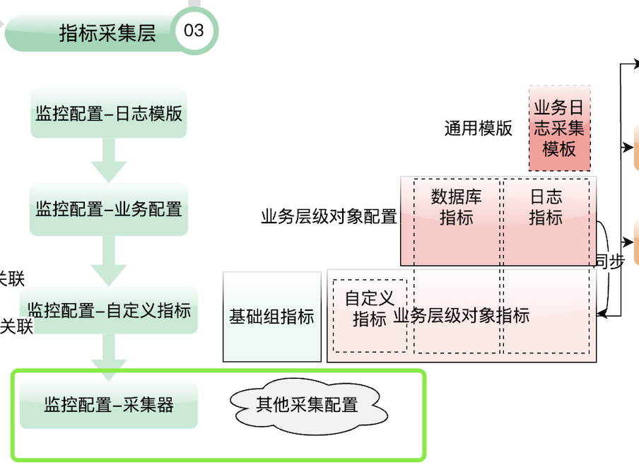
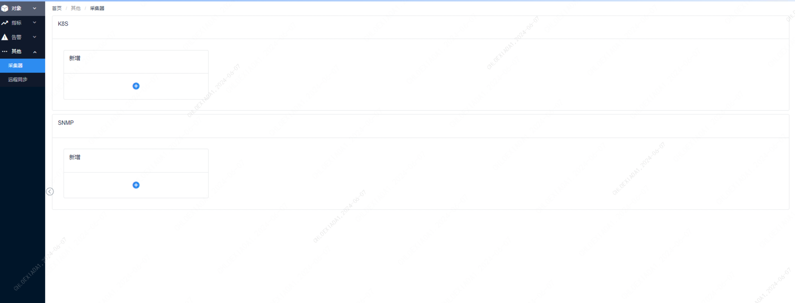
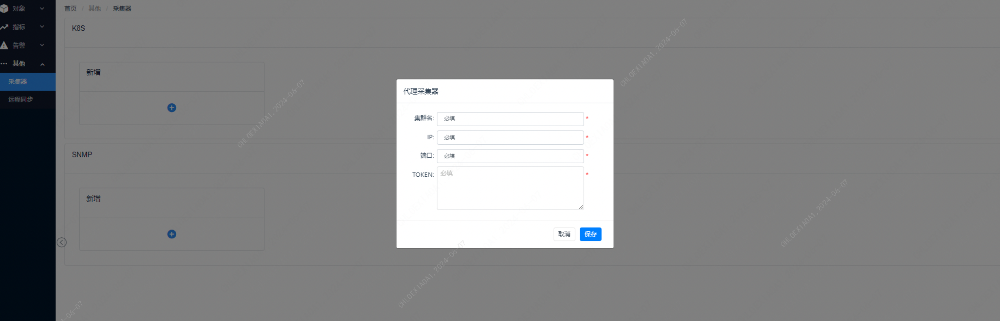
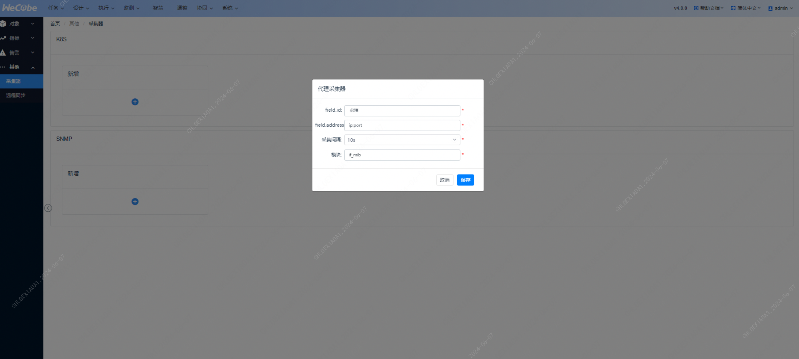
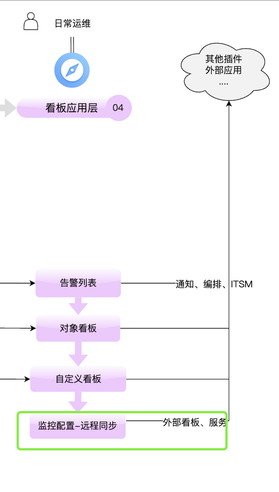
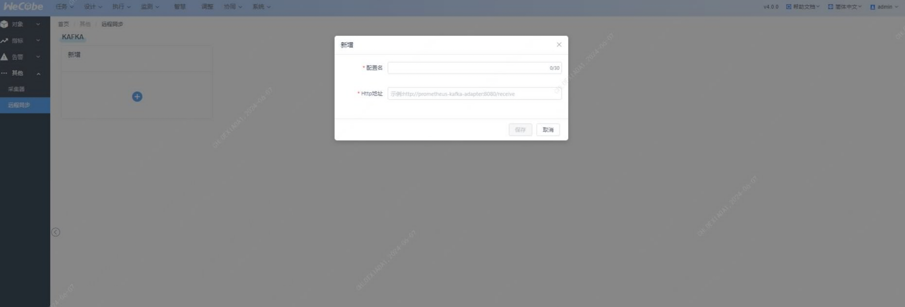

### 功能说明

### 采集器配置功能

采集器配置主要用于配置扩展类的监控，例如k8s和SNMP监控。这些配置需要添加到`prometheus.yml`配置文件中，以便Prometheus能够进行有效的监控。

#### 功能点概述

1. 新增一个k8s配置
2. 填写k8s集群名
3. 填写k8s连接的IP
4. 填写k8s连接的端口
5. 填写k8s连接的认证token
6. 新增一个SNMP配置
7. 填写SNMP采集的唯一标识
8. 填写SNMP exporter的IP
9. 选择采集间隔
10. 

#### 具体步骤说明

##### 1. 新增一个k8s配置

- 点击“新增”按钮，选择k8s配置。
- 在弹出的对话框中填写以下信息：
  - **集群名**：输入k8s集群的名称。
  - **连接的IP**：输入k8s集群的连接IP地址。
  - **连接的端口**：输入k8s集群的连接端口。
  - **认证token**：输入k8s集群的认证token。

##### 2. 新增一个SNMP配置

- 点击“新增”按钮，选择SNMP配置。
- 在弹出的对话框中填写以下信息：
  - **SNMP采集的唯一标识**：输入SNMP采集的唯一标识。
  - **SNMP exporter的IP**：输入SNMP exporter的IP地址。
  - **采集间隔**：选择采集数据的时间间隔。

### 常见问题

#### 问题1：k8s配置无法连接

**可能原因及解决方法：**

- 确认k8s连接的IP地址和端口填写正确。
- 检查认证token是否有效。
- 确认k8s集群的网络是否畅通。

#### 问题2：SNMP采集数据不准确

**可能原因及解决方法：**

- 确认SNMP exporter的IP地址填写正确。
- 检查采集间隔是否合理。
- 确认SNMP设备的配置是否正确。

#### 问题3：新增配置保存失败

**可能原因及解决方法：**

- 检查是否有新增权限。
- 确认输入的信息格式是否正确。
- 确认Prometheus配置文件是否有写入权限。

## 远程连接

### 功能说明

### kafka配置功能

支持把监控数据同步到一个kafka服务

#### 具体步骤说明

##### 1. 新增一个kafka配置

- 点击“新增”按钮。
- 在弹出的对话框中填写以下信息：
  - **配置名**
  - **HTTP地址**

