### 对象

监控对象是一个监控的最小单位，它属于某一监控类型，告警与视图的配置都是以监控对象为基础。

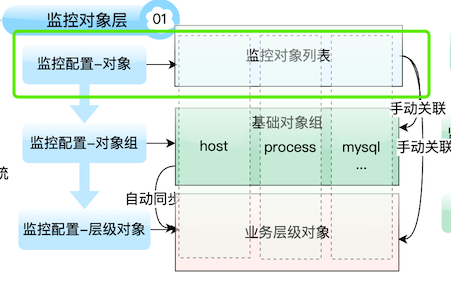

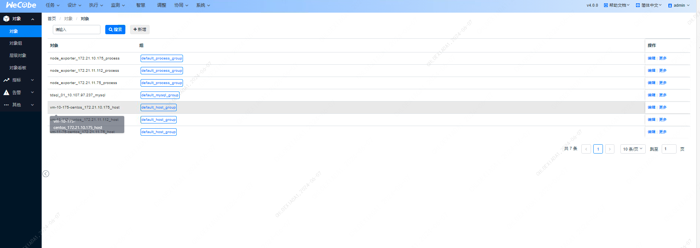

#### 功能说明

##### **新增监控对象**

- 输入对象名、IP 地址和选择监控类型，系统自动生成 GUID 并添加监控对象。
- 
  1. 选择监控对象类型
  1. 选择采集间隔
  1. 填写监控端口，这里的端口默认指 exporter 的端口，如果勾选了托管选项，这里的端口则是应用实例的端口
  1. 填写监控 IP，这里的 IP 默认指 exporter 的 IP，如果勾选了托管选项，这里的 IP 则是应用实例的 IP

##### **修改监控对象属性**

- 修改监控对象的描述、分组等属性，但保持对象名、IP 地址和监控类型不变。

##### **查看历史告警**

- 选择监控对象，查看其所有历史告警记录，支持按时间和告警类型过滤。

##### **删除监控对象**

- 选择需要删除的监控对象，确认删除操作，系统将移除该对象及其所有关联数据。

##### **暂时屏蔽告警**

- 进入维护窗口配置界面，设置维护开始时间和结束时间。在此期间，该监控对象的告警将被暂时屏蔽。

#### 常见问题

##### Q1：GUID 不可变更？

确保其他配置项的关联性和数据一致性。

##### Q2：如何设置维护窗口设置？

确保维护时间内告警不会触发，避免不必要的告警干扰。

### 对象组

监控对象组是一堆监控对象的集合，可方便地对其下面的所有监控对象配置告警阈值

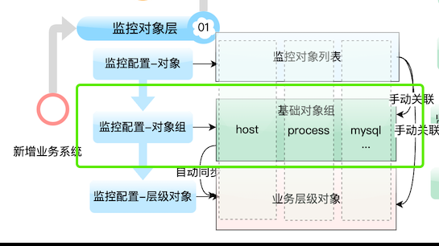

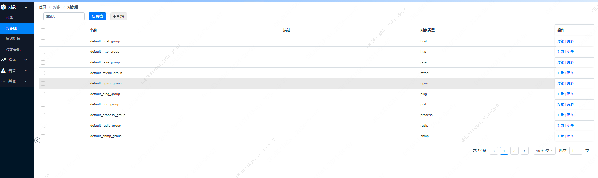

#### 功能说明

##### 新增一个组,修改组的名称和属性

- 步骤
  1. 在组管理配置界面，点击“新增”按钮。
  2. 填写组名和相关属性信息。点击“保存”按钮，完成组的创建。
  3. 在组列表中选择要修改的组。
  4. 点击“更多-编辑”按钮，进入组属性编辑界面。
  5. 修改组名和其他属性信息。点击“保存”按钮，完成修改。
  6. 点击“更多-删除”按钮。
  7. 系统会弹出确认提示，点击“确认”按钮，删除该组。
- **用途**：通过新增类型组，您可以创建一个新的监控对象集合，便于统一管理和配置。
- 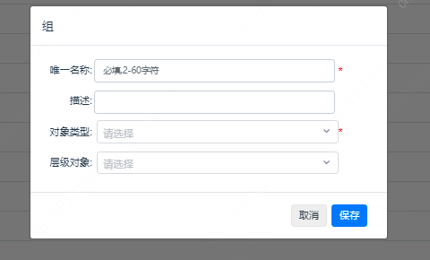

##### 管理组下的对象

- 步骤
  1. 在组列表中搜索要管理的组。
  2. 点击“对象”按钮，进入对象管理界面。
  3. 在对象管理界面，可以新增、删除或修改该组下的监控对象。
- **用途**：通过管理组下的对象，您可以动态调整监控对象的成员，确保监控覆盖的全面性和准确性。

##### 管理组下的对象

- 步骤
  1. 在组列表中选择要管理的组。
  2. 点击“对象”按钮，进入对象管理界面。
  3. 在对象管理界面，可以新增、删除或修改该组下的监控对象。
- **用途**：通过管理组下的对象，您可以动态调整监控对象的成员，确保监控覆盖的全面性和准确性。
- 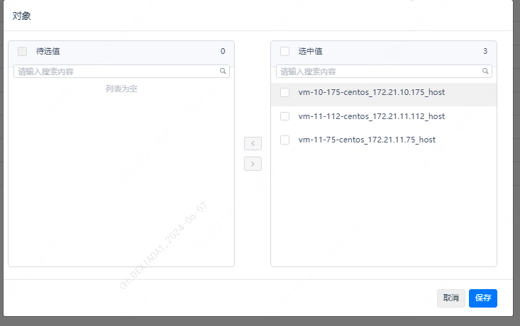

##### 授权组角色

- 步骤
  1. 在组列表中选择要授权的组。
  2. 点击“授权角色”按钮，进入角色授权界面。
  3. 选择该组归属的角色类型、角色。
  4. 点击“保存”按钮，完成授权。
- **用途**：通过授权组归属角色，可以明确该组的管理权限，确保系统安全和权限分配的合理性。
-

#### 常见问题

##### Q1：如何确保组的设置正确应用？

- **A1**：在新增设置后，可以通过对象看板和告警列表查看该组的界面，确认配置是否正确应用。

##### Q2：删除组后，组内的监控对象会怎样？

- **A2**：删除组不会删除对象，组内的监控对象仍然存在于系统中，您可以重新关联这些对象

### 层级对象

层级对象是一种业务层的概念，管理哪些对象属于哪些业务.

像组一样可配置管理监控对象，但它拥有更高级的层级结构管理

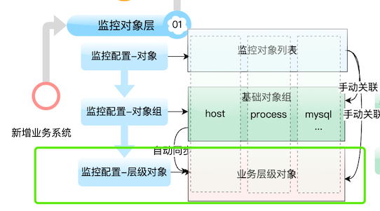

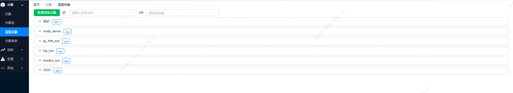

#### 功能说明

##### 1. 新增层级对象

- **功能描述**：添加新的层级对象。
- 步骤
  1. 填写层级对象的 GUID：该 GUID 必须唯一且不可重复，创建后不能修改。
  2. 填写层级对象的显示名：用于标识该层级对象的名称。
  3. 填写层级对象的类型：类型不能与现有的监控对象类型重复，但可以与其他层级对象类型相同。
- **用途**：通过新增层级对象，用户可以构建监控对象的层次结构，便于统一管理和配置。
- 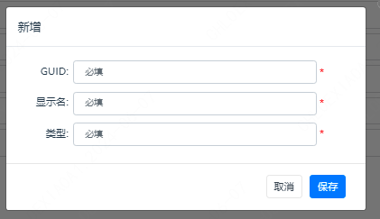

##### 2. 配置关联角色

- **功能描述**：为层级对象配置关联角色。
- 步骤
  1. 在层级对象管理界面，选择要配置的层级对象。
  2. 点击“配置关联角色”按钮，进入角色配置界面。
  3. 选择关联角色并保存。
- **用途**：通过配置关联角色，用户可以明确层级对象的管理权限，确保系统的安全和权限分配合理。
- 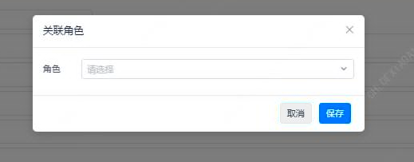

##### 3. 配置关联监控对象

- **功能描述**：在层级对象中配置关联多个监控对象。
- 步骤
  1. 在层级对象管理界面，选择要配置的层级对象。
  2. 点击“配置关联监控对象”按钮，进入关联配置界面。
  3. 选择要关联的监控对象并保存。
- **用途**：通过配置关联监控对象，用户可以将相关的监控对象统一归类到层级对象中，便于统一管理和监控。
- 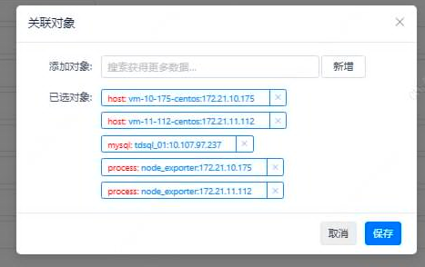

##### 4. 新增子层级对象

- **功能描述**：为当前层级对象新增一个子层级对象。
- 步骤
  1. 在层级对象管理界面，选择要新增子层级对象的层级对象。
  2. 点击“新增子层级对象”按钮，进入新增界面。
  3. 填写子层级对象的相关信息（如 GUID、显示名、类型）并保存。
- **用途**：通过新增子层级对象，用户可以进一步细化和扩展监控对象的层次结构，提升管理的层次性和清晰度。
- 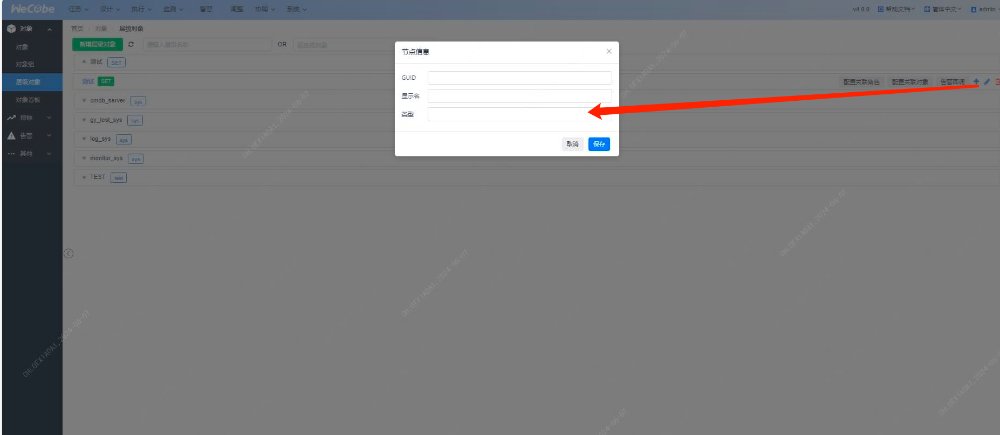

##### 5. 修改、删除层级对象信息

- **功能描述**：修改层级对象的显示名和类型等信息。
- 步骤
  1. 在层级对象管理界面，选择要修改的层级对象。
  2. 点击“修改”按钮，进入修改界面。
  3. 修改显示名和类型等信息并保存。
  4. 在层级对象管理界面，选择要删除的层级对象。
  5. 点击“删除”按钮，系统将弹出确认提示。
  6. 点击“确认”按钮，删除该层级对象及其所有子层级对象。
- **用途**：通过修改层级对象信息，用户可以随时更新层级对象的属性，确保信息的准确性和实时性。
- **注意**：删除层级对象将移除该对象及其所有子层级对象，请谨慎操作。
- 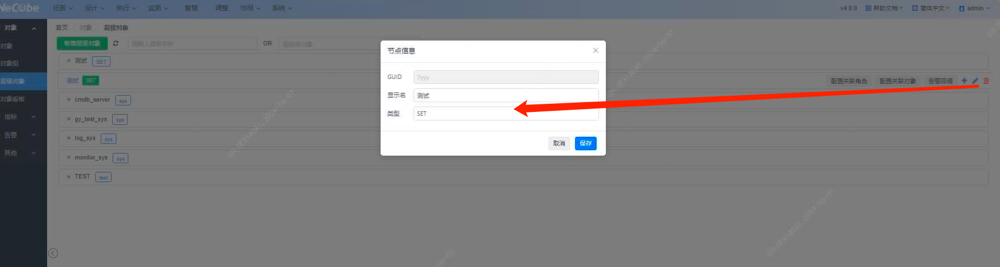

#### 常见问题

##### Q1：如何确保新增层级对象的 GUID 唯一？

- **A1**：在新增层级对象时，系统会自动检测输入的 GUID 是否重复，确保 GUID 的唯一性。

##### Q2：删除层级对象后，其关联的监控对象会怎样？

- **A2**：删除层级对象不会影响其关联的监控对象，但层级关系会被移除。监控对象仍然存在于系统中，可在其他层级对象中重新配置。

##### Q3：如何更改层级对象的关联角色？

- **A3**：在层级对象管理界面，选择要更改关联角色的层级对象，点击“配置关联角色”按钮，然后选择新的关联角色并保存即可。

### 对象看板

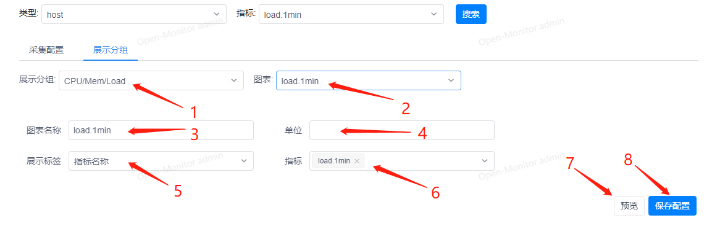

#### **功能说明:**

1. 选择图表分组：用户可以选择已有的图表分组，也可以新增或删除分组。
2. 选择图表：在选定的分组中，用户可以选择已有的图表，也可以新增或删除图表。
3. 填写图表名称：用户需填写所选图表的名称。
4. 填写显示单位：用户需填写图表上显示的指标的单位。
5. 选择信息提示格式：用户可以选择图表上展示的信息提示的格式。
6. 选择展示指标：用户可以选择要在图表上展示的指标。
7. 预览对象看板：用户可以预览监控对象的视图。
8. 保存配置：用户可以保存所做的配置。

**常见问题:**

1. 如何新增图表分组或图表？
   - 答：在相应的界面中，点击新增按钮并填写相应信息即可。
2. 如何删除图表分组或图表？
   - 答：在相应的界面中，选中要删除的分组或图表，并点击删除按钮进行删除。
3. 如何预览对象看板？
   - 答：在配置完成后，系统会自动生成对象看板，用户可以在相应位置进行预览。

**注意事项:**

1. 配置监控对象后，会生成相应的标签页，用户可在其中查看监控指标图表。
2. 在配置层级对象时，注意对象之间的关系，以确保正确汇总指标数据。
3. 如需查看各监控对象的独立数据，可通过对象看板或额外设计的指标实现。

#### 示例配置流程

1. 新增监控对象并配置业务指标
   - 配置对象后，系统会生成一个 "service" tab。
   - 在该 tab 中，可以查看所有配置在目标监控对象上的指标图表。
2. 层级对象配置示例
   - 配置层级对象 A，包含进程 P1、P2 和主机 H1、H2。
   - 进程 P1 运行在 H1 上，P2 运行在 H2 上。
   - 配置日志业务监控指标 `/tmp/test.log` 的 `cost_time` 指标在层级对象 A 上。
   - 系统生成监控指标 `cost_time`，汇总 H1 和 H2 上的 `/tmp/test.log` 数据。
   - 在配置视图和告警时，选择层级对象 A 可查看汇总的 `cost_time` 指标。
   - 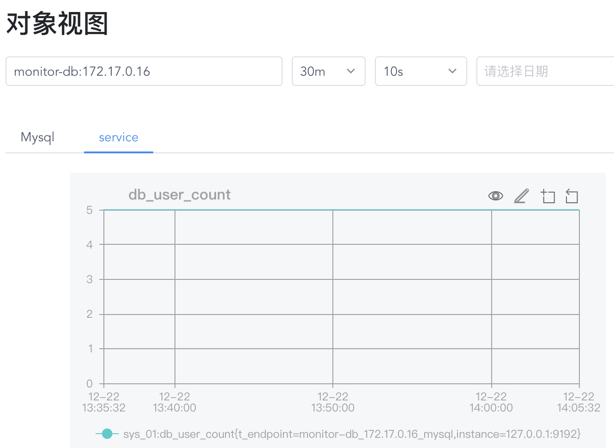

#### 特殊配置说明

如果用户希望查看各监控对象的独立数据：

- 可以在对象看板中，通过进程 P1、P2 查看各自的 `cost_time` 数据。
- 或者在指标设计中，设计一个额外的指标 `cost_time_detail`，在表达式中带上 `t_endpoint="$guid"` 标签，这样该指标会区分不同的监控对象，显示独立数据。
