# 监控配置

告警配置提供对象管理、组管理、阀值配置、日志告警配置、业务指标配置功能。

## 监控对象管理

监控对象是一个监控的最小单位，它拥有自身的监控指标、可配置自身的监控阈值等。

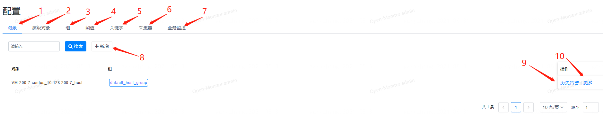

1. 监控对象管理
1. 层级对象管理
1. 监控对象组管理
1. 阈值配置管理
1. 日志关键字告警配置管理
1. 扩展类的比如k8s、snmp等监控采集配置管理
1. 业务日志监控管理
1. 新增监控对象
1. 查看该监控对象的历史告警
1. 更多功能选项，不同监控类型的选项不同，比如说主机类的有进程监控等、数据库类的有数据行监控等配置

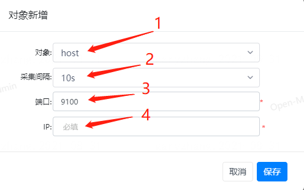

1. 选择监控对象类型
1. 选择采集间隔
1. 填写监控端口，这里的端口默认指exporter的端口，如果勾选了托管选项，这里的端口则是应用实例的端口
1. 填写监控IP，这里的IP默认指exporter的IP，如果勾选了托管选项，这里的IP则是应用实例的IP


## 层级对象管理

层级对象是一种业务层的概念，管理哪些对象属于哪些业务，有点像组一样可配置管理监控对象，但它拥有更高级的层级结构管理

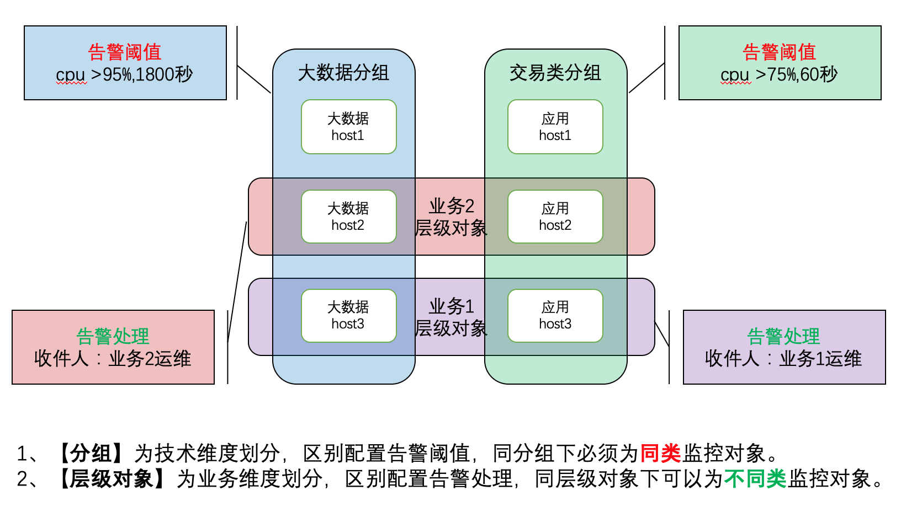

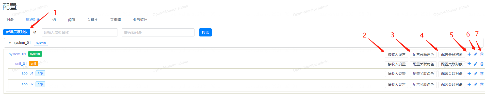
1. 新增层级对象
1. 层级对象里关联的监控对象的告警可发送到统一的接收人那
1. 配置关联角色
1. 层级对象里可配置关联多个监控对象
1. 给该层级对象新增一个子层级对象
1. 可修改该层级对象的显示名和类型等信息
1. 删除该层级对象，会附带把它下面的所有层级对象都给删除

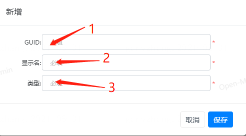
1. 填写层级对象的GUID，唯一不重复，且不能修改
2. 填写层级对象的显示名
3. 填写层级对象的类型，不能与已有的监控对象类型所重复，可与其它层级对象类型一样


## 组管理

监控对象组是一堆监控对象的集合，可方便地对其下面的所有监控对象配置告警阈值

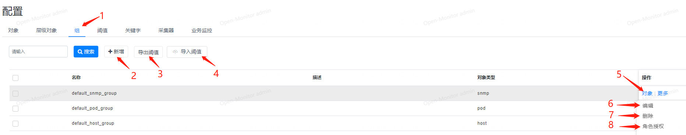

1. 点击切到组管理配置界面
1. 新增一个组
1. 可选择某一个组导出该组已配置的阈值设置
1. 可导入上面导出的配置
1. 管理该组下的对象
1. 修改该组的名称等属性
1. 删除该组
1. 授权这个组归哪类角色所有


## 阀值配置

阈值配置是对监控对象或监控对象组进行一些指标的阈值配置，可配置告警的内容与接收人等

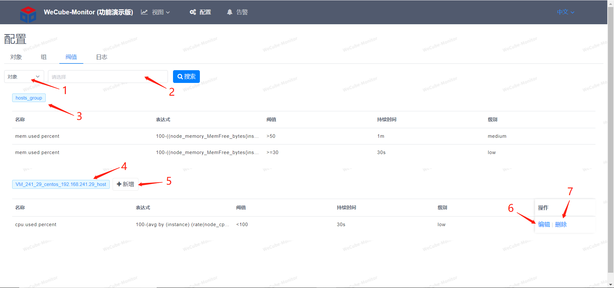

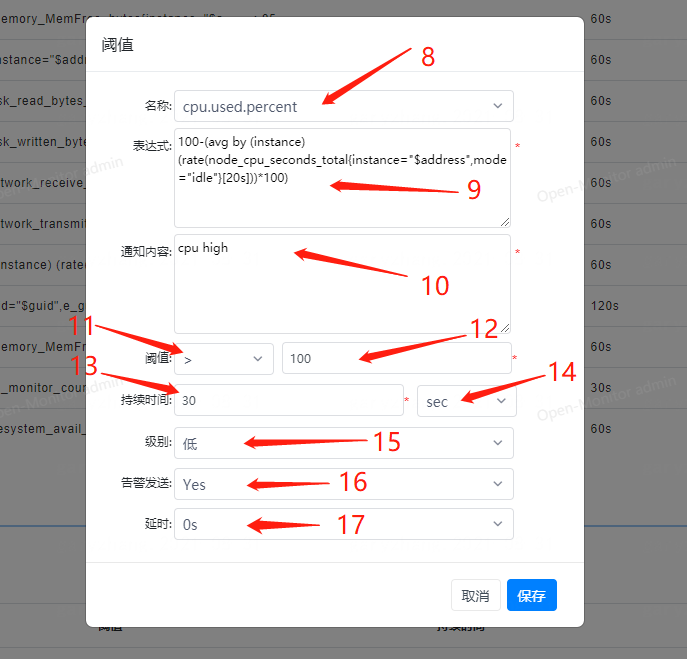

1. 可选择是对象还是组

1. 可模糊搜索对象或组

1. 组名，如果所选择是对象，会把它所属组的策略也给显示出来，但是不能修改组的策略

1. 对象名

1. 可以给对象增加阀值策略

1. 编辑阀值策略

1. 删除阀值策略

1. 可选择指标

1. 选好指标后会自动带出已在指标配置上配置好的Prometheus表达式

1. 填写通知内容

1. 选择条件

1. 填写阀值

1. 持续异常时间数值

1. 时间单位

1. 告警级别，有高中低三个级别

1. 可选择告警是否发送通知

1. 可选择告警发送通知的延迟，如果在延迟时间内该告警恢复，则不会发告警，为了避免持续异常恢复的情况

   

## 关键字告警配置

关键字告警配置是监控某个主机监控对象上的某个日志文件内容，如果识别到有匹配的关键字则产生告警

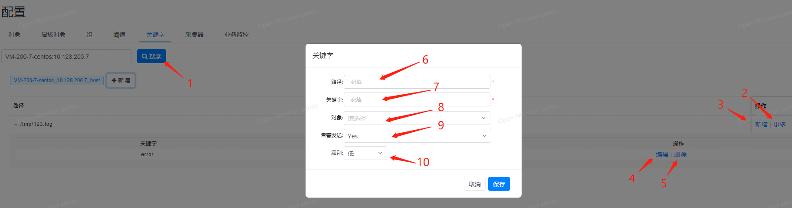

1. 搜索某个主机监控对象，展示其已保存的关键字配置，下面是新增一个关键字配置的按钮
1. 更多里面有对该配置路径的修改和删除
1. 给该路径新增一个关键字配置
1. 修改该关键字
1. 删除该关键字
1. 填写主机上的日志文件绝对路径
1. 填写日志文件里要识别的关键字
1. (可选)该项配置可关联到其它监控对象，出现在其它监控对象的视图中
1. 是否发送告警通知
1. 告警的级别，有高中低三个选项

   
## 采集器配置

采集器配置主要配置一些扩展类的比如说k8s、snmp监控的配置，这些配置是需要加到prometheus.yml配置文件里去的

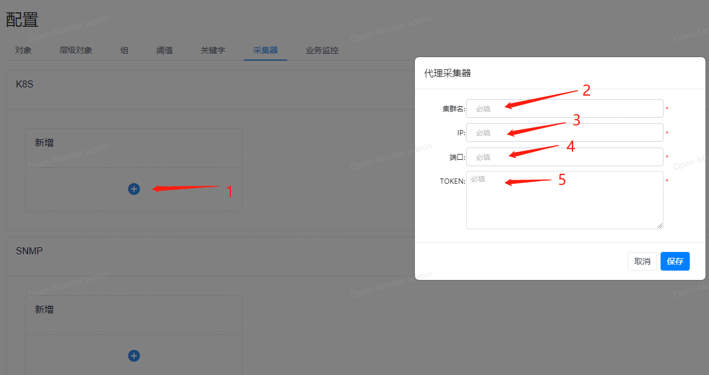

1. 新增一个k8s配置

2. 填写集群名

3. 填写k8s连接的ip

4. 填写k8s连接的端口

5. 填写k8s连接的认证token

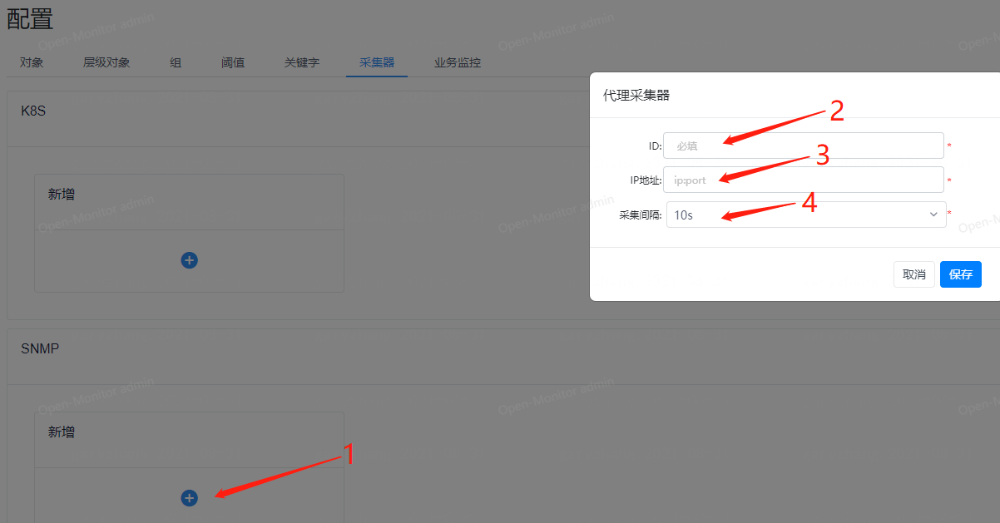

1. 新增一个snmp配置

2. 填写snmp采集的唯一标识

3. 填写snmp exporter的ip

4. 选择采集间隔

   


## 业务指标配置

### 一、	监控方式说明

#### 1、内容匹配

通过业务系统打的业务日志来采集业务指标，日志以行为单位，每一行都会去尝试匹配在Open-Monitor业务监控里配置好的正则表达式，如果匹配上了会去尝试解析匹配上的Json字符串，进而拿到里面的key、value。
比如说：
```
正则表达式：\[.*\]\[.*\]\[.*\]\[.*\]\[.*\]\[.*\]\[.*\]\[(.*)\]\[.*\]
日志行：[INFO][2020-01-01 10:00:00 169][ConsumeMessageThread_9][][20111201A][][][{"costTime":52,"method":”GET","resCode":"200"}][]
```
匹配上了正则后，会去尝试拿小括号()里面匹配上的子字符串做json解析，可以配多段json内容，只是尽量不要里面的key一样，会被覆盖。
解析后会拿到如下的内容
```
{"costTime":52,"method":”GET","resCode":"200"}
```

#### 2、指标计算

因为Prometheus的采集方式是server向client拉数据，间隔现在默认是10秒，所以需要对10秒期间内的多行日志数据指标做聚合，现在支持三种聚合方式：avg(平均)，sum(累加)，count(计数)。
比如说：
10秒内的日志每行匹配到的json如下

```
{"costTime":52,"method":”GET","resCode":"200"}
{"costTime":137,"method":”POST","resCode":"200"}
{"costTime":28,"method":”GET","resCode":"404"}
```

要配置出 请求的平均耗时、总请求数、各方式(GET/POST)的请求数、请求成功率
需要配置三组计算规则，计算规则由正则表达式、标签、指标配置、字符映射四部分组成，表达式是为了匹配内容，标签是为了区分要要不同统计规则的key，指标则是要用于最后的指标采集与数值计算，字符映射是用于把value映射成数值，因为时序数据库只能保存数值。
三组规则(正则都是一样的)：

1、
```
正则：\[.*\]\[.*\]\[.*\]\[.*\]\[.*\]\[.*\]\[.*\]\[(.*)\]\[.*\]
标签：（空）
指标配置：(由key、指标名、聚合方式组成)
costTime   app_request_time  avg
method    app_request_all_num  count
```

2、
```
正则：\[.*\]\[.*\]\[.*\]\[.*\]\[.*\]\[.*\]\[.*\]\[(.*)\]\[.*\]
标签：method
指标配置：
method   app_request_method_num  count
```

3、
```
正则：\[.*\]\[.*\]\[.*\]\[.*\]\[.*\]\[.*\]\[.*\]\[(.*)\]\[.*\]
标签：resCode
指标配置：
resCode   app_request_status_num  count
```

当聚合规则为count时，其实只是计算它的数量，此时key是什么并不重要，换其它的key也可以，因为标签的存在已经把不同标签value的指标给分隔开来了，以上三个规则会有如下6条指标：

```
app_request_time{agg=”avg”}  72
app_request_all_num{agg=”count”}  3
app_request_method_num{agg=”count”,method=”GET”}  2
app_request_method_num{agg=”count”,method=”POST”}  1
app_request_status_num{agg=”count”,resCode=”200”}   2
app_request_status_num{agg=”count”,resCode=”404”}   1
```

至此已经可以求出上面四个需求中的三个，请求的平均耗时、总请求数、各方式(GET/POST)的请求数。

第四个请求成功率则需要用 app_request_status_num/ app_request_all_num\*100% 获得，这个需要在指标设计中配置过新的指标，上面的配置已经把基础数据都给采回来了，在指标设计中通过PromQL（Prometheus的查询表达式）来查出想要的内容。

```
指标名：app_request_success_percent
表达式：(sum(node_business_monitor_value{key="app_request_status_num",tags="resCode=200"} or vector(0))/sum(node_business_monitor_value{key="app_request_all_num"} or vector(1)))*100
```


### 二、	界面配置说明

在监控配置中找到对应的主机跳转到对应的业务日志监控配置界面。

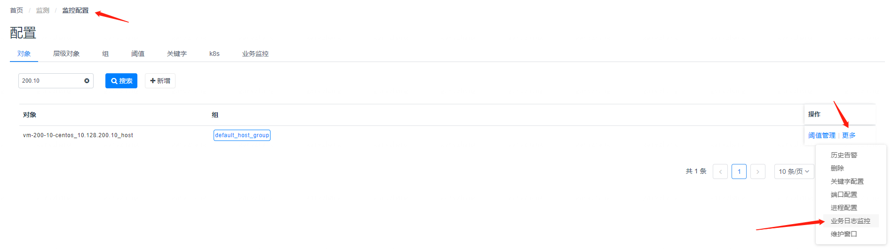

或直接在界面上的最后一个tab叫业务监控上搜索相应的主机也可以。

界面的列表结构是以日志path为主，里面套多一层规则列表的形式展现，所以新增的时候是新增一个path，然后再在这path上增加各种规则，界面如下：

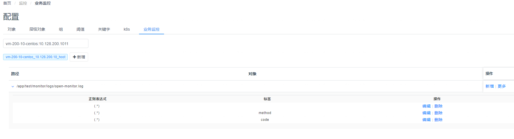

规则的表单有如下内容，对应上面第一部分所说的规则样例，有正则、标签(可空)、指标配置、字符串映射(可空)

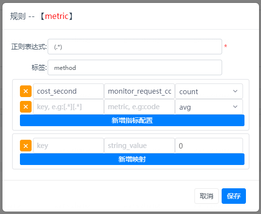

配置好后可以在对象视图界面看到所采集上来的指标，在最后的Business那一列

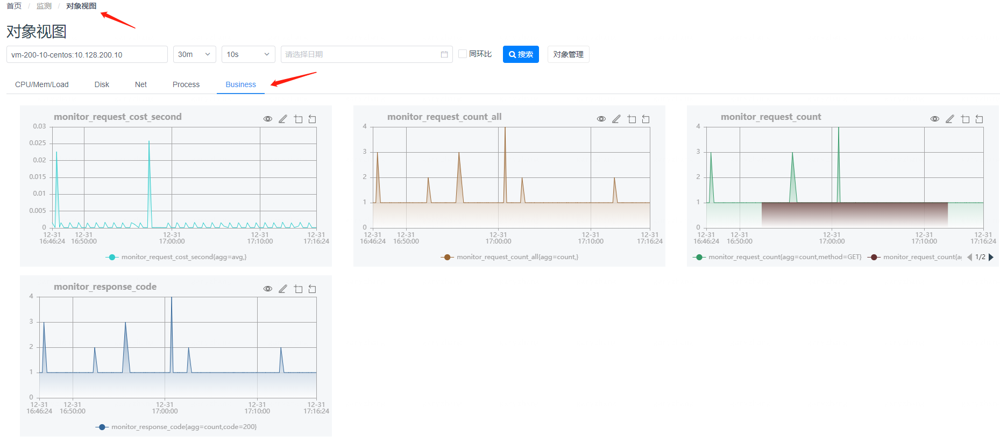
