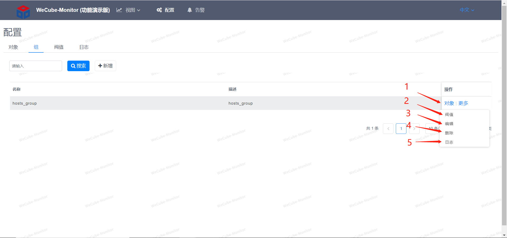
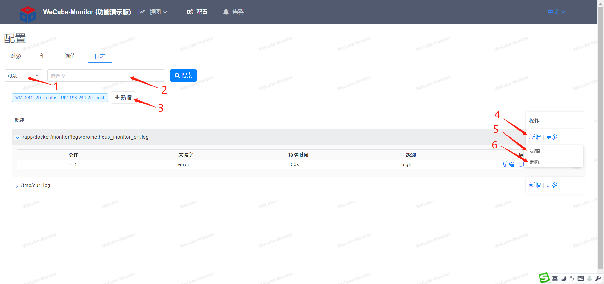

# 监控配置

告警配置提供对象管理、组管理、阀值配置、日志告警配置、业务指标配置功能。


## 监控对象管理


1. 监控对象管理
1. 对象组管理
1. 阀值配置管理
1. 日志告警配置管理
1. 可根据ip或主机名实例名来模糊搜索监控对象
1. 新增告警对象
1. 点击跳转到阀值配置页面
1. 点击查看该对象历史告警
1. 点击跳转到日志告警配置页面
1. 选择监控对象类型
1. 填入对象agent的ip
1. 填入对象agent的端口


## 对象组管理



1. 可跳转到对象管理页面，查看该组内的对象，可在那增加删除成员对象
1. 可跳转到阀值页面给组配置阀值策略，会对该组内的所有对象都生效
1. 可编辑组的名称和描述
1. 可删除该组
1. 可跳转到日志告警页面给组配置日志告警，会对该组内的所有对象都生效


## 阀值配置


1. 可选择是对象还是组
1. 可模糊搜索对象或组
1. 组名，如果所选择是对象，会把它所属组的策略也给显示出来，但是不能修改组的策略
1. 对象名
1. 可以给对象增加阀值策略
1. 编辑阀值策略
1. 删除阀值策略
1. 可选择指标
1. 选好指标后会自动带出已在指标配置上配置好的Prometheus表达式
1. 填写通知内容
1. 选择条件
1. 填写阀值
1. 持续异常时间数值
1. 时间单位
1. 告警级别，有高中低三个级别


## 日志告警配置




1. 可选择是对象还是组
1. 可模糊搜索对象或组
1. 可新增日志告警配置
1. 新增该日志路径下的关键字告警
1. 编辑该告警配置
1. 删除配置
1. 日志里的关键字
1. 关键字出现条件
1. 关键字出现次数
1. 持续异常时间数值
1. 时间单位
1. 告警级别，有高中低三个级别


## 业务指标配置

### 一、	监控方式说明

#### 1、内容匹配

通过业务系统打的业务日志来采集业务指标，日志以行为单位，每一行都会去尝试匹配在Open-Monitor业务监控里配置好的正则表达式，如果匹配上了会去尝试解析匹配上的Json字符串，进而拿到里面的key、value。
比如说：
```
正则表达式：\[.*\]\[.*\]\[.*\]\[.*\]\[.*\]\[.*\]\[.*\]\[(.*)\]\[.*\]
日志行：[INFO][2020-01-01 10:00:00 169][ConsumeMessageThread_9][][20111201A][][][{"costTime":52,"method":”GET","resCode":"200"}][]
```
匹配上了正则后，会去尝试拿小括号()里面匹配上的子字符串做json解析，可以配多段json内容，只是尽量不要里面的key一样，会被覆盖。
解析后会拿到如下的内容
```
{"costTime":52,"method":”GET","resCode":"200"}
```

#### 2、指标计算

因为Prometheus的采集方式是server向client拉数据，间隔现在默认是10秒，所以需要对10秒期间内的多行日志数据指标做聚合，现在支持三种聚合方式：avg(平均)，sum(累加)，count(计数)。
比如说：
10秒内的日志每行匹配到的json如下

```
{"costTime":52,"method":”GET","resCode":"200"}
{"costTime":137,"method":”POST","resCode":"200"}
{"costTime":28,"method":”GET","resCode":"404"}
```

要配置出 请求的平均耗时、总请求数、各方式(GET/POST)的请求数、请求成功率
需要配置三组计算规则，计算规则由正则表达式、标签、指标配置、字符映射四部分组成，表达式是为了匹配内容，标签是为了区分要要不同统计规则的key，指标则是要用于最后的指标采集与数值计算，字符映射是用于把value映射成数值，因为时序数据库只能保存数值。
三组规则(正则都是一样的)：

1、
```
正则：\[.*\]\[.*\]\[.*\]\[.*\]\[.*\]\[.*\]\[.*\]\[(.*)\]\[.*\]
标签：（空）
指标配置：(由key、指标名、聚合方式组成)
costTime   app_request_time  avg
method    app_request_all_num  count
```

2、
```
正则：\[.*\]\[.*\]\[.*\]\[.*\]\[.*\]\[.*\]\[.*\]\[(.*)\]\[.*\]
标签：method
指标配置：
method   app_request_method_num  count
```

3、
```
正则：\[.*\]\[.*\]\[.*\]\[.*\]\[.*\]\[.*\]\[.*\]\[(.*)\]\[.*\]
标签：resCode
指标配置：
resCode   app_request_status_num  count
```

当聚合规则为count时，其实只是计算它的数量，此时key是什么并不重要，换其它的key也可以，因为标签的存在已经把不同标签value的指标给分隔开来了，以上三个规则会有如下6条指标：

```
app_request_time{agg=”avg”}  72
app_request_all_num{agg=”count”}  3
app_request_method_num{agg=”count”,method=”GET”}  2
app_request_method_num{agg=”count”,method=”POST”}  1
app_request_status_num{agg=”count”,resCode=”200”}   2
app_request_status_num{agg=”count”,resCode=”404”}   1
```

至此已经可以求出上面四个需求中的三个，请求的平均耗时、总请求数、各方式(GET/POST)的请求数。

第四个请求成功率则需要用 app_request_status_num/ app_request_all_num\*100% 获得，这个需要在指标设计中配置过新的指标，上面的配置已经把基础数据都给采回来了，在指标设计中通过PromQL（Prometheus的查询表达式）来查出想要的内容。

```
指标名：app_request_success_percent
表达式：(sum(node_business_monitor_value{key="app_request_status_num",tags="resCode=200"} or vector(0))/sum(node_business_monitor_value{key="app_request_all_num"} or vector(1)))*100
```


### 二、	界面配置说明

在监控配置中找到对应的主机跳转到对应的业务日志监控配置界面。


或直接在界面上的最后一个tab叫业务监控上搜索相应的主机也可以。

界面的列表结构是以日志path为主，里面套多一层规则列表的形式展现，所以新增的时候是新增一个path，然后再在这path上增加各种规则，界面如下：


规则的表单有如下内容，对应上面第一部分所说的规则样例，有正则、标签(可空)、指标配置、字符串映射(可空)


配置好后可以在对象视图界面看到所采集上来的指标，在最后的Business那一列


