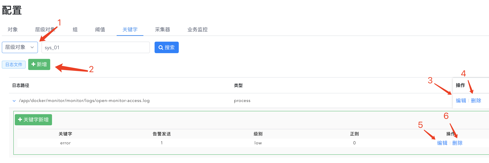
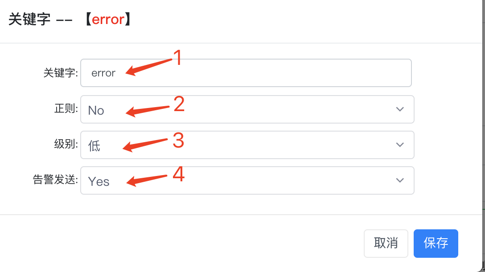

# 监控配置

告警配置提供对象管理、层级对象管理、组管理、阀值配置、日志关键字告警配置、采集器配置、业务指标配置功能。

对象管理 : 监控对象的注册修改删除。

层级对象 : 是业务监控的主体，它所对应的概念是一种业务组，可包含各种不同类型的监控对象，并且层级对象之间有树状结构关系。

组管理 : 是一组同一类型监控对象的集合，用来给一组监控对象配置同一阈值。

阀值配置 : 配置需要触发告警的阈值与告警通知管理。

日志关键字 : 业务监控的日志关键字告警，它不需要阈值配置，会持续监测日志出现的内容，遇到匹配上的关键字就会产生告警。

采集器配置 : 对一些额外监控类型的采集配置。

业务指标配置 : 可配置监控日志指标和数据库指标采集。

## 监控对象管理

监控对象是一个监控的最小单位，它属于某一监控类型，告警与视图的配置都是以监控对象为基础。

1. 新增监控对象，监控对象的guid由对象名+ip+监控类型组成，主机的对象名会使用主机名

1. 修改监控对象的一些属性，但上述组成guid的三要素不能改，因为其它的配置都是关联监控对象的guid

1. 查看该监控对象的历史告警

1. 删除该监控对象

1. 如果想暂时屏蔽该监控对象的告警，可在维护窗口上配置维护时间，在该时间内该对象的告警将会无效

   

1. 选择监控对象类型
1. 选择采集间隔
1. 填写监控端口，这里的端口默认指exporter的端口，如果勾选了托管选项，这里的端口则是应用实例的端口
1. 填写监控IP，这里的IP默认指exporter的IP，如果勾选了托管选项，这里的IP则是应用实例的IP

## 层级对象管理

层级对象是一种业务层的概念，管理哪些对象属于哪些业务，有点像组一样可配置管理监控对象，但它拥有更高级的层级结构管理

1. 新增层级对象
1. 配置关联角色
1. 层级对象里可配置关联多个监控对象
1. 给该层级对象新增一个子层级对象
1. 可修改该层级对象的显示名和类型等信息
1. 删除该层级对象，会附带把它下面的所有层级对象都给删除

1. 填写层级对象的GUID，唯一不重复，且不能修改
2. 填写层级对象的显示名
3. 填写层级对象的类型，不能与已有的监控对象类型所重复，可与其它层级对象类型一样

## 组管理

监控对象组是一堆监控对象的集合，可方便地对其下面的所有监控对象配置告警阈值

1. 点击切到组管理配置界面
1. 新增一个组
1. 可选择某一个组导出该组已配置的阈值设置
1. 可导入上面导出的配置
1. 管理该组下的对象
1. 修改该组的名称等属性
1. 删除该组
1. 授权这个组归哪类角色所有

## 阀值配置

阈值配置是对监控对象组或层级对象进行一些指标的阈值配置，可配置告警的内容与接收人等，不可对单独对象配置阈值，但可查看该对象所应用的阈值

1. 可选择对象组、层级对象、监控对象
1. 新增一个阈值配置
1. 编辑阈值配置
1. 删除阈值配置
1. 新增一个通知配置，这里的通知配置针对的是上面整组阈值，其中每个阈值里面是还可以设单独的通知配置，当阈值中有配置通知时，这里的通知对那个阈值不生效
1. 保存通知配置
1. 可选择是在告警发生时通知还是告警恢复时
1. 可选择所需要触发的流程编排
1. 通知的角色，如果配置了邮箱发送人，那么会对这些角色上的邮箱发送邮件

1. 选择指标

1. 填写通知内容

1. 选择条件

1. 填写阀值

1. 持续异常时间数值

1. 告警级别，有高中低三个级别

1. 可选择告警是否发送通知

1. 可选择告警发送通知的延迟，如果在延迟时间内该告警恢复，则不会发告警，为了避免持续异常恢复的情况

   

## 关键字告警配置

关键字告警配置是监控主机上的某个日志文件内容，如果识别到有匹配的关键字则产生告警

关键字告警属于业务指标告警，所以它归属于层级对象当中，它的配置会对该层级对象及其全部子对象所关联的与相应路径绑定的主机上生效，比如它配置到层级对象A中，A的子层级对象B中关联了主机H1,H2，那么在此处配置的路径上可选择出H1、H2，如果只绑定了H1到该日志路径上，那么关键字监控只会作用于H1中。

1. 选择层级对象或监控对象，监控对象的情况下不能配置，只能查看
1. 新增一个日志路径
1. 编辑该路径的绑定信息
1. 删除该配置
1. 编辑关键字
1. 删除某个关键字

1. 选择该日志所属的业务监控类型，比如说进程、java等
1. 配置日志路径，新增时可一次填多个，批量新增
1. 上面所选的监控类型会带出属于该类型的监控对象出来，配置监控对象所对应的主机监控对象，比如说一个应用A部署在主机H上，打了日志/tmp/test.log，那么在此处的配置就是填上日志路径，然后选择进程监控类型，把应用A的进程监控对象与主机H的主机监控对象绑定上，这个绑定关系并不需要手动维护，当上面的类型选择了进程后此处会自动带出绑定关系，通过应用A的进程监控的IP信息与主机监控的IP信息对应来自动生成

1. 填写要识别的关键字字符串，大小写敏感
1. 可选择是否使用正则去匹配，如果选择yes，那么上面的关键字应该填写正则表达式
1. 关键字告警的级别
1. 关键字告警是否发送

   

   
## 采集器配置

采集器配置主要配置一些扩展类的比如说k8s、snmp监控的配置，这些配置是需要加到prometheus.yml配置文件里去的

1. 新增一个k8s配置

2. 填写集群名

3. 填写k8s连接的ip

4. 填写k8s连接的端口

5. 填写k8s连接的认证token

1. 新增一个snmp配置

2. 填写snmp采集的唯一标识

3. 填写snmp exporter的ip

4. 选择采集间隔

   

## 业务指标配置

### 一、	日志业务指标监控方式说明

#### 1、监控方式

通过业务系统打的业务日志来采集业务指标，基本工作方式就是从日志行中提取出有意义的指标数值，根据日志的格式有两种方式给用户选择，如果日志中有标准的json格式，那么可以直接配置从日志中提取json的正则表达式，然后指标就从json中的key/value里取。另一种就是日志格式不固定的，可以通过一个指标一个正则表达式的方式，用正则表达式从日志行中提取出业务数据出来。最终的结果都是一个指标对应日志中的某一个数值，因为日志打印肯定是时间不固定的，采集器会用默认10秒为一个间隔地汇总期间所捕获的所有日志行上的指标数据，汇总方式有sum、count、max、min、avg，比如说日志在10秒内打了一千行，指标配置的汇总方式是sum，那么采集器就会把这一千行内匹配到该指标的值给全加起来生成一个10秒的汇总值。

#### 2、作用对象

业务指标日志只能配置在层级对象上，它的作用域是该层级对象及其所有子对象所关联的对象集合，每个日志可选择这些对象集合中的某些监控对象来做绑定，只有绑定了的才会生效该日志的配置，比如进程P1的日志/tmp/test.log配置到层级对象A中，A的子层级对象B中关联了主机H1,H2，进程P1,P2，那么在此处配置的路径上可通过选择类型是process进程来自动带出P1->H1,P2->H2，它们之间的自动关联是通过这些监控对象的ip是否是同一个来取的，因为业务日志监控的采集器就是主机监控agent，所以需要最终关联到主机监控上，此时可以通过只选择P1->H1来让/tmp/test.log的配置只在H1上生效。当新的process类型的监控对象再加进层级对象A或其子对象中时，系统会自动地尝试去匹配它有没有对应的主机监控对象，如果有则会自动加进层级对象A配置的业务日志监控中，这样的好处在于这个日志配置与主机分离，可参考下图的设计：

#### 3、业务指标

上述的业务日志监控配置是以指标为单位，它上面所配置的指标与其它普通的监控指标并无两样，只是它是动态生成的表达式，用户可以在指标设计页面对这些指标进行改动或加工出其它指标出来，这些指标的告警配置与视图展示会以层级对象为作为对象来出现，如果是普通的监控对象，那么在配置视图与告警时，这些指标不可见。

### 二、	日志业务指标界面配置说明

1. 可选择层级对象或普通监控对象，普通监控对象只能查看配置

2. 新增一个业务日志配置(下图一详细说明)

3. 修改业务日志配置的绑定关系

4. 删除业务日志监控与其所自动生成的指标等

5. 新增一个日志json正则配置，里面可以配置正则表达式查找json字符串尝试去解析，并配置指标与json key之间的对应关系(下图二详细说明)

6. 新增一个正则表达式指标(下图三详细说明)

   

   图一：业务日志配置新增

   

1. 选择该日志所属的业务监控类型，比如说进程、java等

2. 配置日志路径，新增时可一次填多个，批量新增

3. 上面所选的监控类型的监控对象，并且这些监控对象属于前面所选的层级对象及其所有子对象的关联监控对象中

4. 主机监控对象，同样属于前面所选的层级对象及其所有子对象的关联监控对象中，并且与第3点的对象之间的关联关系会默认用ip来关联，可以手动修改绑定映射。

   

   图二：json正则配置

1. 指标标签，非必填，填写json中的某个key，如果填写了后指标会根据json中这个key的值动态生成指标，比如说请求日志中的http method，如果指标是count统计请求数量，那么配了method后count会根据method是get或post给区分成两个指标数据。
2. 配置正则表达式，用小括号()来匹配子字符串，该子字符串得是json格式，程序会尝试去格式化该子字符串成json
3. 点第8点的新增指标可以出来一行这种指标配置，这里填写是json中的key
4. 指标名
5. 统计类型
6. 指标别名，这个别名会显示于对象视图的动态service视图title中
7. 可以对该指标配置字符串映射，因为业务指标统计的是数字，如果是匹配到非数字的字符串等(如果字符串里是纯数字程序会自动转化，不用配此处)，用这个映射可以把相应字符串转化成数字，比如说aaa转成1，bbb转成2

​       图三：正则表达式指标配置

1. 指标名
2. 指标显示别名
3. 要获取指标值的正则表达式，用小括号()来提取数值
4. 指标值在10秒内的汇总类型
5. 可以对该指标配置字符串映射，因为业务指标统计的是数字，如果是匹配到非数字的字符串等(如果字符串里是纯数字程序会自动转化，不用配此处)，用这个映射可以把相应字符串转化成数字，比如说aaa转成1，bbb转成2

### 三、	数据库业务指标监控方式说明

#### 1、监控方式

通过数据库实例监控可以连接到相应的数据库上，数据库业务指标当前可做到配置一个SQL查询去查询出一个数值出来，比如说select count(1) from mysql.user这种，采集器会默认拿返回结构的第一行第一列去尝试转成数字。数据库业务指标与上面的日志业务指标的管理方式相同，只是采集方式不同。

#### 2、界面配置

1. 指标显示别名
2. 指标名
3. 要获取指标值的SQL
4. 要把该指标关联到某个监控类型上去，方便配置告警的时候去作用于某一类的监控对象
5. 配置上面所选类型与数据库监控对象间的绑定关系，可以简单的用数据库监控对象自己绑定自己

#### 3、数据查看

在配置好上面的业务指标监控后，可在对象视图上查询所绑定的目标监控对象，可以看到会多出一个tab叫service，这个service是个动态的tab，不能在指标配置中进行设置，它只会在配置了业务指标的目标监控对象上出现，它里面的图表是所有配置在该目标监控对象上的指标的图表集合，如下图

如果一个层级对象A上配置了两个进程P1,P2，两个主机H1,H2，进程P1在H1上，P2在H2上，并且层级对象A上配置了日志业务监控指标/tmp/test.log的cost_time指标，那么系统会根据指标的汇总类型生成一个监控指标cost_time，这个指标专属于层级对象A，在配置视力和告警的时候只有选了层级对象A才会带出cost_time的指标来，并且该指标的表达式是把两台主机上H1,H2上/tmp/test.log的数据汇总起来的，比如说cost_time的汇总类型是sum，那么cost_time的值会是这两个主机上日志采集的最后总和，这样在配置视图和告警的时候就不会出来各自分开的数据，如果用户就是想要查看它们各自的数据，请在对象视图中用P1,P2查看各自的cost_time数据，或者在指标设计中设计一个额外的指标cost_time_detail之类的，在表达式中带上 t_endpoint="$guid" 标签，这样这个指标就会区分不同的监控对象。
