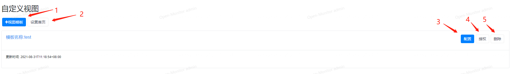
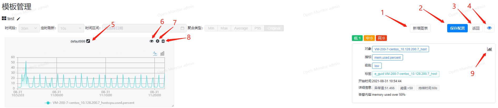
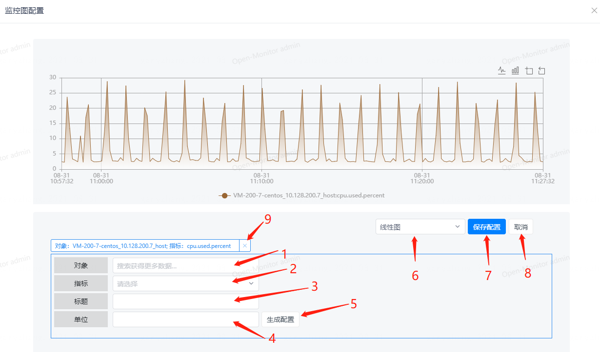

# 自定义视图

自定义视图提供可让用户自行配置图表主页的编辑界面，可拖拽图表大小，可配置各个图表内容。

1. 新增一个视图模板
1. 可设置某个自定义视图为首页
1. 查看自定义视图，进入编辑页面
1. 可给自定义视图进行授权，授权给某个角色
1. 删除该自定义视图

1. 新增一个图表
1. 保存当前自定义视图配置
1. 返回自定义视图的上一级页面
1. 控制右边告警列表栏的缩放
1. 修改图表的名称
1. 放大查看该图表
1. 配置该图表的内容
1. 删除该图表
1. 跳转到告警对象的对象视图上

1. 选择一个监控对象或层级对象，如果是层级对象则会把其关联的对象给动态显示到视图上
1. 选择要显示的指标
1. 填写图表的标题
1. 填写图表显示的单位
1. 生成图表显示配置
1. 可切换曲线图或柱状图
1. 保存配置
1. 取消配置
1. 删除某个显示配置
