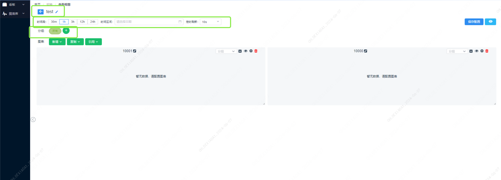

提供可让用户自行配置图表主页的编辑界面，可拖拽图表大小，可配置各个图表内容。

### 功能说明

#### 新增自定义看板

##### 1. 新增一个视图模板

- 点击“新建”按钮。
- 输入看板名称，选择管理角色(可编辑)和使用角色(可查看)。
- 点击“保存”完成新增。
- 

##### 2. 进入看板编辑页面

- 选择要查看的自定义看板。
- 点击“编辑”按钮进入编辑页面。
- 编辑看板分组、采集时间段、自定义时间区间、刷新周期
- 

##### 3. 新增一个图表

- 点击“新增”按钮,选择图表类型并填写图表名称。

- 

- 选择图表配置,支持一键切换常规模版,

- 选择对象/层级对象->对象类型->指标->标签->点击新增

- 配置对应线条的颜色

- ##### 

  #####

##### 4. 保存图表进入图表库

- 将图表存入图表库,配置管理角色(支持编辑)和使用角色(支持引用、复制),方便下次引用
- 
- 也支持在看板页一键保存
- 

##### 5. 调整看板布局、图表大小,分组,保存配置

- 拖拽调整布局、缩放调整图表大小
- 
- 创建分组
- 
- 切换分组
- 
- 统一保存配置
  

##### 6. 删除该图表

- 选择要删除的图表。
- 点击“删除”按钮，并确认删除操作。

#### 查看自定义看板

##### 1. 查看自定义看板

- 搜索看板,点击查看进入

- 支持放大查看

- 点击告警列表,查看当前看板关联对象的所有告警,支持筛选级别
- 

##### 2. 设置某个自定义看板为首页

- 点击“设置为首页”按钮。
- 选择角色,要设置为首页的自定义看板。
- 

#### 查看、编辑图表库列表

##### 1. 查看自定义看板

- 搜索图表,点击查看进入查看,点击编辑修改图表

#### 常见问题

##### Q1：无法编辑自定义看板配置

- **A1**：确认是否有图表的管理角色权限.

##### Q2：无法编辑图表

- **A2**：确认是否有图表的管理角色权限.
