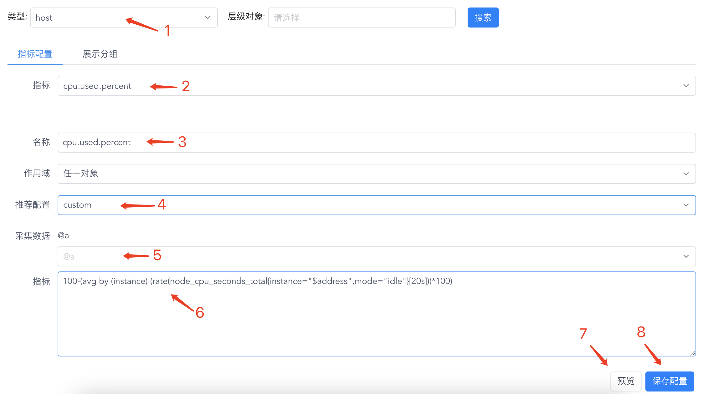

# 指标配置

指标配置可以配置监控指标名与 Prometheus 表达式的映射关系，也可以配置对象看板的图表展示。

#### 1.普通监控指标

1. 选择监控类型
1. 可以选择已有指标进行修改，或新增监控指标
1. 监控指标名称
1. 内置了一些表达式模版，比如说百分数除法等，如果不需要则选择 custom
1. 可以选择一些采集上来的原生 prometheus 指标，选择后会根据上面的模版自动填充生成到下面的表达式编辑框中
1. 可以写 prometheus 查询表达式
1. 点击预览可以选择这个监控类型的某个监控对象来查看表达式查询的值，以此来验证表达式是否正确
1. 保存指标配置

1. 选择监控类型

1. 选择层级对象

1. 可以选择已有指标进行修改，或新增监控指标

1. 监控指标名称

1. 作用域可选全部对象或任一对象，它们的区别是如果选择了全部对象，那么下面第 7 的数据里会把标识某个监控对象的标签去掉，如果是任一对象，那么会加上 t_endpoint="$guid" 这种去区分监控对象

1. 内置了一些表达式模版，比如说百分数除法等，如果不需要则选择 custom

1. 可以选择一些采集上来的原生 prometheus 指标，选择后会根据上面的模版自动填充生成到下面的表达式编辑框中

1. 可以写 prometheus 查询表达式
