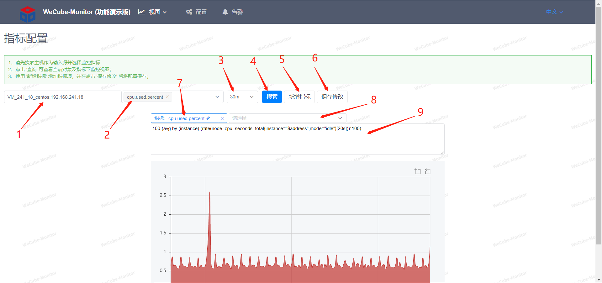

# 指标配置

指标配置可以配置监控指标名与Prometheus表达式的映射关系。

1. 可根据ip或主机名实例名来模糊搜索监控对象
1. 可选择该监控对象上已配置好的指标名
1. 可选择视图展示的时间区间
1. 点击搜索可展示下面显示的表达式的查询图表，会把多个表达式的值放一个图表里
1. 新增一个指标名
1. 保存所做的修改
1. 可直接改指标名
1. 可选择该监控对象采集上来的基础Prometheus指标
1. 可编辑表达式
