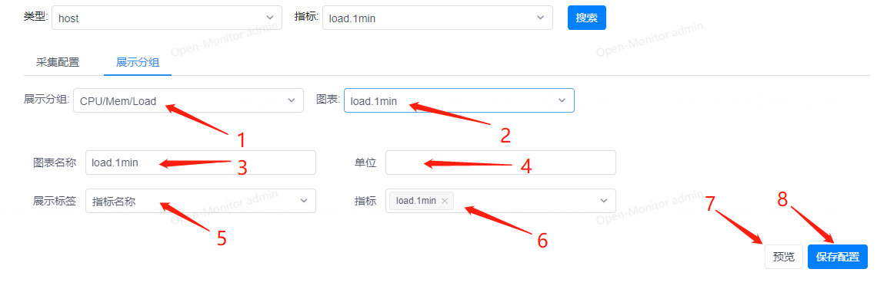

# 指标配置

指标配置可以配置监控指标名与Prometheus表达式的映射关系，也可以配置对象视图的图表展示。

1. 选择监控对象类型
1. 新增监控指标
1. 选择已保存的监控指标进行更改
1. 删除监控指标

1. 填写监控指标名称
1. (可选)可选择某个监控对象去查看该监控对象所采集上来的原生prometheus指标
1. (可选)可快速选择原生prometheus指标
1. 配置PormQL表达式
1. 可通过选择某个监控对象来预览第4项配置的表达式采集内容
1. 保存配置
1. 可配置该监控类型在对象视图查询中的图表展示

1. 选择一个图表分组，也可以在这里新增和删除
1. 选择分组中的某个图表，也可以在这里新增和删除
1. 填写图表名称
1. 填写显示的单位
1. 选择图表展示的信息提示格式
1. 选择图表上要展示的指标
1. 预览对象视图
1. 保存配置