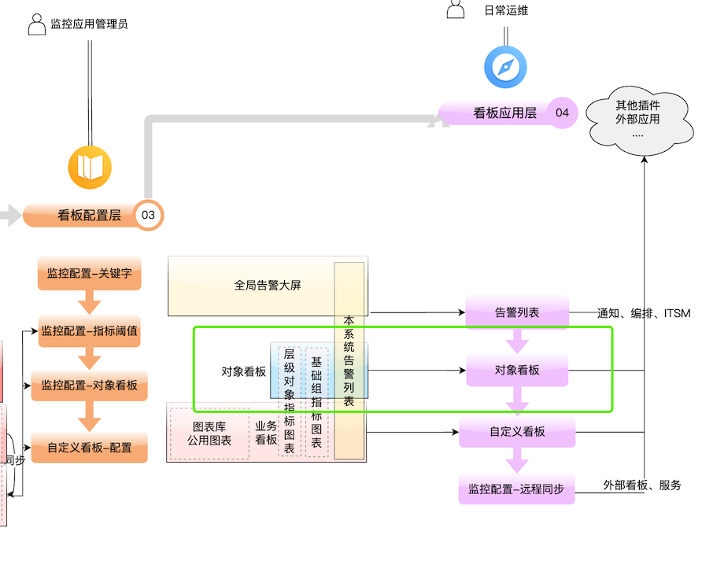
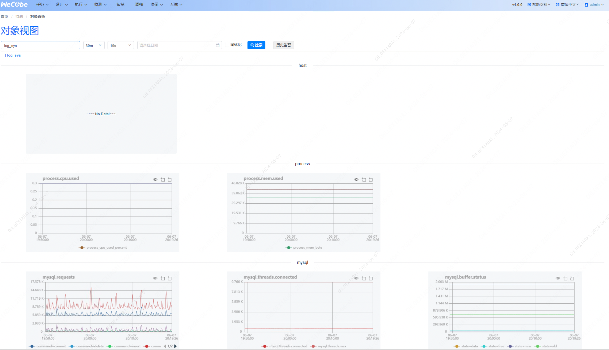
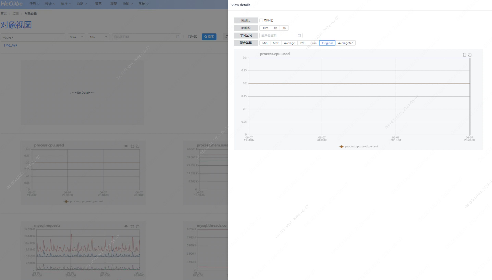

#### 功能说明

##### 1. 对象看板功能

- **功能描述**：对象看板可以快速地展示各类型监控对象的基础监控指标，包括主机、MySQL、Redis、Tomcat 等。
- 
- 步骤
  1. 选择对象看板菜单。
  2. 根据需要进行搜索、切换视图和配置。
  3. 查看和分析各类监控指标。

##### 具体步骤说明

###### 1. 根据 IP 或主机名、实例名进行模糊搜索监控对象

- 在搜索框中输入 IP、主机名或实例名。
- 点击搜索按钮，查看匹配的监控对象列表。

###### 2. 选择视图展示的时间区间

- 点击时间区间选择器。
- 选择所需的时间范围，例如过去 1 小时、过去 24 小时等。

###### 3. 选择定时刷新的时间间隔

- 点击刷新间隔选择器。
- 选择刷新间隔时间，例如 30 秒、1 分钟等。

###### 4. 放大图表

- 点击图表上的放大按钮。
- 查看放大的图表详情。
- 

###### 5. 选择看板聚合的方式

- 点击聚合方式选择器。
- 选择聚合方式，例如 max、min、avg、sum、p95。

##### 常见问题

###### Q1：无法搜索到监控对象

- **A1**：确认输入的 IP、主机名或实例名是否正确；检查监控对象是否已经配置。

###### Q2：视图展示的时间区间无法选择

- **A2**：确保浏览器没有禁用时间选择控件；尝试刷新页面或重新登录系统。

###### Q3：定时刷新没有生效

- **A3**：检查网络连接是否正常；确保选择的刷新间隔时间没有超出系统限制。
