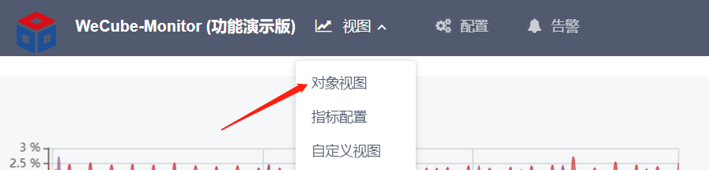
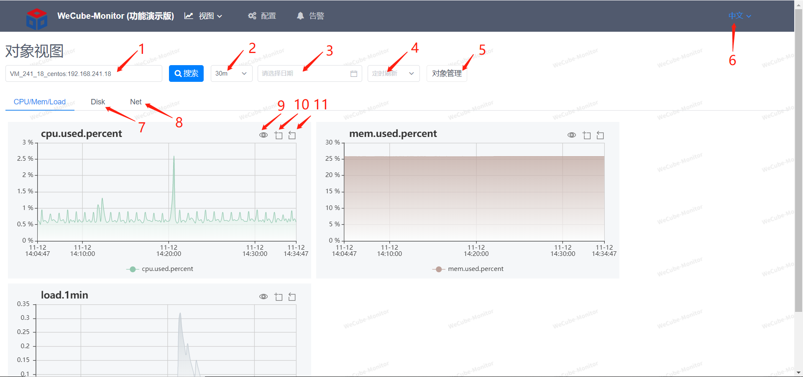
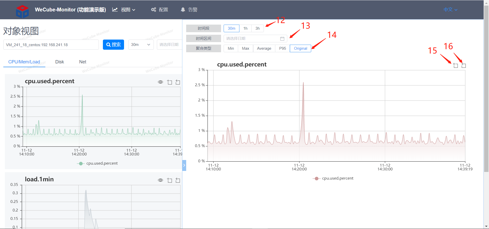

# 对象视图

对象视图可以快速地展示各类型监控对象的基础监控指标，包括主机、Mysql、Redis、Tomcat等。

1. 可根据ip或主机名实例名来模糊搜索监控对象
1. 可选择视图展示的时间区间
1. 可选择视图展示的日期区间
1. 可选择定时刷新的时间间隔
1. 可快速跳转到该对象告警配置页面
1. 可切换中英文显示
1. 可切换视图页查看主机磁盘指标视图
1. 可切换视图页查看主机网络指标视图
1. 可放大图表
1. 点击后可在图表上拖拉图表区间
1. 点击后可恢复图表区间
1. 可选择视图展示的时间区间
1. 可选择视图展示的日期区间
1. 可选择视图聚合的方式，聚合是指把多个点合成一个点来减少显示点数，加快图表显示
1. 点击后可在图表上拖拉图表区间
1. 点击后可恢复图表区间
