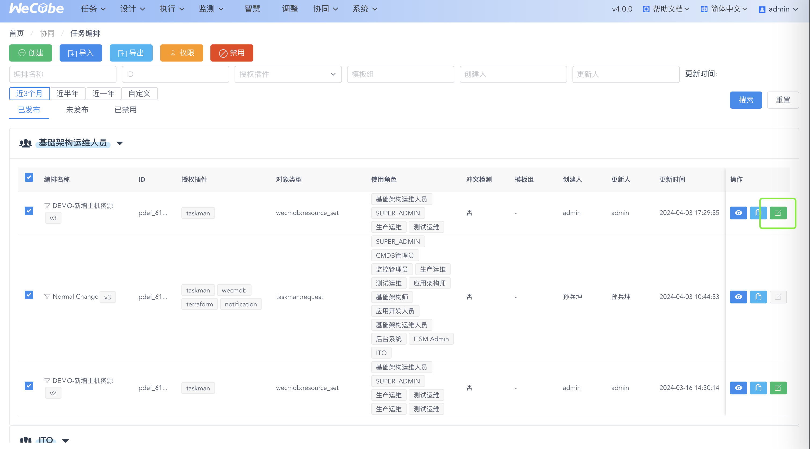

# 协同-编排设计

## 功能菜单

WeCube 界面导航包含任务、设计、执行、监测、智慧、调整、协同、系统共八个主菜单。

访问 “协同 > 任务编排” 菜单,进入 “任务编排管理” 页面

编排包含三种状态:

1. 已发布:正式发布的编排,

   1. 支持单条编辑(生成一条新草稿)、复制、查看(无法保存),
   2. 支持批量修改权限、禁用、导出

2. 未发布:新建草稿、复制生成的草稿,

   1. 支持查看、编辑单条,
   2. 支持批量修改权限、删除

3. 已禁用:需要下线的编排,
   1. 支持查看单条,
   2. 支持批量启用

点击列表页 “编排-右侧编辑按钮” ，进入“编排详情页”, 可以修改已经配置好的的编排列表,

顶部是编排标题、编排编辑入口

## 编排节点组件

节点说明如下

| 节点名   | 类型     | 中文说明                                                                                                                                                                                                                                                   |
| -------- | -------- | ---------------------------------------------------------------------------------------------------------------------------------------------------------------------------------------------------------------------------------------------------------- |
| 开始     | 起止节点 | 功能:事件节点 1,标志编排开始  使用规范: 1.一个编排有且只有一个开始节点 2.只有一条出线.                                                                                                                                                                |
| 结束     | 起止节点 | 功能:事件节点 2,标志编排结束  使用规范: 1.一个编排有且只有一个结束节点 2.只有一条入线                                                                                                                                                                 |
| 异常结束 | 起止节点 | 功能:事件节点 3,标志编退出  使用规范: 1.一个编排可以有多个退出节点 2.只有一条入线                                                                                                                                                                     |
| 人工节点 | 功能节点 | 功能:任务节点 1,在[任务-工作台]自动创建一个人工任务  使用规范:  1.发布编排之后,可以在[任务-模版管理-筛选本编排-编辑-任务表单设置]中,配置同名的任务表单   2.如需要支持审批,请在后面接一个判断节点,任务表单会根据判断条件自动生成一个判断表单 |
| 自动节点 | 功能节点 | 功能:任务节点 2,将自动执行插件服务 API   使用规范:  1.操作目标对象: 设置[数据绑定-对象定位规则]   2..操作使用 API:选择[操作[协同-插件注册-某插件-服务注册-插件服务 API],设置对应的入参,才能执行程序.                                        |
| 数据节点 | 功能节点 | 功能:任务节点 3,执行 WECMDB 的数据写入  使用规范:  1.配置数据写入的目标对象和操作类型,WECMDB 将自动写入数据,支持设置多个目标对象                                                                                                                 |
| 子编排   | 功能节点 | 功能:任务节点 4,执行一个子编排  使用规范:  1.配置子编排的目标对象,选择一个子编排引入(需要有使用权限),执行时会根据数据列表每条发起一个子编排                                                                                                      |
| 固定时间 | 时间节点 | 功能:时间节点 1,控制流程进行下一步的具体时间  使用规范: 1.支持设置未来的一个时刻,格式为年月日时分秒,支持跳过                                                                                                                                          |
| 时间间隔 | 时间节点 | 功能:时间节点 2,控制流程进行下一步的间隔  使用规范: 1.支持选择一个时间段,支持跳过                                                                                                                                                                     |
| 并行开始 | 分支节点 | 功能:并行线路的终点,并行线路都完成才能走到汇聚节点  使用规范: 1.分支节点和汇聚节点配套使用 2.多进单出                                                                                                                                                 |
| 并行结束 | 分支节点 | 功能:并行线路的起点,并行线路都完成才能走到汇聚节点  使用规范: 1.分支节点和汇聚节点配套使用 2.单进多出                                                                                                                                                 |
| 判断开始 | 分支节点 | 功能:判断人工节点的填表结果,根据结果走到不同路线  使用规范: 1.判断节点只能接在人工任务节点后面 2.支持一条入线 n 条出线                                                                                                                                |
| 判断结束 | 分支节点 | 功能:汇聚判断节点  使用规范: 如果需要汇聚判断分支,则加上判断结束节点,如果不需要汇聚判断分支,则不需要本节点                                                                                                                                            |

## 新增主编排+子编排

编排包含 2 种类型:

| 类型   | 调用子编排 | 父编排 | 人工节点 | 定时执行 | 使用权限                                                   | 管理权限                      |
| ------ | ---------- | ------ | -------- | -------- | ---------------------------------------------------------- | ----------------------------- |
| 主编排 | 0~n        | -      | Y        | Y        | 发起人需要有使用权限                                       | 可切换子编排版本              |
| 子编排 | -          | 1 个   | N        | N        | 主编排中关联子编排的时候,关联人需要有使用权限,执行时不校验 | 可升级子编排版本,不影响主编排 |

主子编排的配置流程

首页可以查看已有的子编排,请把需要重复调用的流程抽成通用的子编排

点击主编排-查看,可以看到使用中的主编排

点击新增,创建一个主编排,默认为编排类型:主编排

引用主编排组件,配置数据绑定和调用子编排,**关联人需要有使用权限,执行时不校验**

点击查看子编排,可以看到编排类型:子编排,不支持人工节点(请把 ITSM 流程合并到主编排统一处理)、子编排节点(不支持嵌套),确认主编排正确之后,返回发布主编排、可以在编排执行中使用

##

## 新增普通主编排

下面以 “删除 MYSQL” 为例， 演示如何新增一个编排。

### 新建编排

点击列表页 ”添加“按钮， 开始新建编排，弹出新建编排的权限配置页面，如下图所示：

页面上半部分的 “属主角色”[单选], 决定哪些角色的用户可以编辑、查看和使用该编排。角色清单是当前用户所拥有的角色。

页面下半部分的 “使用角色” .决定哪些角色的用户可以查看和使用该编排， 但是无编排的编辑权限。

### 配置编排信息

权限配置页面确认后， 进入编排编辑页面,

- 在 “编排对象类型” 下拉框中选择编排关联的对象类型， 对象类型来源于各插件提供的数据模型,——本示例属于 wecmdb 的 “taskman:request 资源实例类型。
- 选择授权插件,影响每个节点的插件服务。

1. | 字段名                 | 字段功能                                                      | 类型         | 特殊说明                                               | 输入              | 默认值                                                     | 编辑场景       | 展示/使用场景                                         |
   | ---------------------- | ------------------------------------------------------------- | ------------ | ------------------------------------------------------ | ----------------- | ---------------------------------------------------------- | -------------- | ----------------------------------------------------- |
   | 编排 ID                | 唯一标志                                                      | 基础字段     | -                                                      | 自动生成          | 自动                                                       | 新建、修改编排 | 请求-请求相关页,编排编辑页                            |
   | 编排名称、             | 唯一标志                                                      | 基础字段     | 支持自动生成：「base」+时间戳/编排-「对象类型」+时间戳 | 自动生成,手动输入 | 编排名(操作对象简称 xx-时间戳)不超过 15 个字符(数字算半个) | 新建、修改编排 | 请求-模版编辑页,请求-请求相关页,编排选择页,编排编辑页 |
   | 编排版本               | 编排变更标志                                                  | 基础字段     | 前端输入,控制只能输入数字,初始为 1 后台生成+1          | 自动生成          | 1                                                          | -              | 请求-模版编辑页,请求-请求相关页,编排选择页,编排编辑页 |
   | 授权插件               | 选择编排可以被调用的插件                                      | 基础字段     | 如选了 taskman，插件服务列表应该做筛选                 | 手动输入          | -                                                          | 新建、修改编排 | 请求-模版编辑页,请求-请求相关页,编排选择页,编排编辑页 |
   | 模版组                 | 场景分类标签                                                  | 基础字段     | -                                                      | 手动输入          | 请求                                                       | 新建、修改编排 | 请求-模版编辑页,编排选择页,编排编辑页                 |
   | 编排发布状态           | 已发布、草稿                                                  | 基础字段     | tab 展示字段                                           | 自动生成          | 草稿                                                       | -              | 请求-模版编辑页,编排选择页                            |
   | 编排发布、草稿编辑时间 | 默认倒序                                                      | 基础字段     | 列表默认倒序                                           | 自动生成          | -                                                          | -              | 请求-模版编辑页,编排选择页                            |
   | 编排收藏状态           | 已收藏、未收藏                                                | 基础字段     | 列表展示                                               | 自动生成          | -                                                          | -              | 请求-模版编辑页,编排选择页                            |
   | 标签                   | 打标签                                                        | 基础字段     | 区分老标签                                             | 手动输入          | -                                                          |                | 请求-模版编辑页                                       |
   | 属主角色               | 控制编排的编辑权限                                            | 权限字段     | -                                                      | 手动输入          | -                                                          | 新建、修改编排 | 请求-模版编辑页,编排编辑页                            |
   | 使用角色               | 控制编排的使用权限：如模版的流程列表会根据使用角色筛选        | 权限字段     | -                                                      | 手动输入          | -                                                          | 新建、修改编排 | 请求-模版编辑页,编排选择页,编排编辑页                 |
   | 操作对象类型           | 编排数据信息、影响 1、节点数据绑定、 2、请求操作对象类型 | 编排功能字段 | -                                                      | 手动输入          | -                                                          | 新建、修改编排 | 请求-模版编辑页,请求-请求相关页,编排选择页,编排编辑页 |
   | 冲突检测               | 编排执行的冲突检测开关                                        | 编排功能字段 | -                                                      | 手动输入          | 开                                                         | 新建、修改编排 | 编排编辑页,编排选择页                                 |

### 配置编排流程节点

在编排元素面板中，点击选中 “创建开始节点”， 拖到画布空白处，如下图， 之后绘制主流程

左侧是组件库,支持拖入编排节点

中间是编排画布,点击节点,展开节点信息

- 配置节点基础信息
- 配置执行控制
- 配置数据绑定关系

- 配置调用的插件服务
- 设置服务参数

点击保存修改当前节点配置

| 字段名                    | 字段类型     | 字段功能                                                                                                                                                                                                                                                      | 说明点                   | 必选填 | 输入              | 过滤条件+可选枚举                                                                        | 默认值     | 生效的流程           |
| ------------------------- | ------------ | ------------------------------------------------------------------------------------------------------------------------------------------------------------------------------------------------------------------------------------------------------------- | ------------------------ | ------ | ----------------- | ---------------------------------------------------------------------------------------- | ---------- | -------------------- |
| 节点 ID                   | 基础字段     | 唯一标识                                                                                                                                                                                                                                                      | -                        | 必填   | 自动生成          | -                                                                                        | -          | 设计                 |
| 节点名                    | 基础字段     | 唯一标识                                                                                                                                                                                                                                                      | -                        | 必填   | 手动输入,自动生成 | -                                                                                        | -          | 设计                 |
| 节点类型 \*（原名插件类型 | 基础字段     | (1) 自动节点-该节点能够自动执行完成； (2) 人工节点-该节点需人工介入处理环节； (3) 数据写入节点-该节点会将数据写入定义的数据模型                                                                                                                     | -                        | 必填   | 手动筛选          | 自动节点  人工节点  数据写入节点                                               | 自动节点   | 设计                 |
| 描述说明                  | 基础字段     | -                                                                                                                                                                                                                                                             | -                        | 选填   | 手动输入          | -                                                                                        | -          | -                    |
| 高危检测                  | 执行控制字段 | 针对要执行的插件参数及模型实例，进行目标对象范围界定，若符合则使用其规则进行脚本内容的检测 当选择 "Y" 时，若"绑定节点"为空，执行到该任务节点时，则重新计算该节点需要绑定的数据；若"绑定节点"不为空，执行到该任务节点时，则使用选择的绑定节点所绑定的数据 | 增加提示说明节点类型影响 | 必填   | 手动筛选          | 开关                                                                                     | N          | 编排试算数据依赖查询 |
| 超时时间 \*               | 执行控制字段 | 编排超时时间                                                                                                                                                                                                                                                  | -                        | 必填   | 手动筛选          | 5min-3d                                                                                  | 30min      | 执行                 |
| 定位规则 \*               | 数据字段     | 筛选节点插件服务列表                                                                                                                                                                                                                                          | -                        | 必填   | 手动筛选          | 对象类型为跟节点往下找的路径 枚举为历史路径                                              | 根对象类型 | 编排试算数据依赖查询 |
| 动态绑定 \*               | 数据字段     | 动态绑定节点可以直接使用其他节点的数据                                                                                                                                                                                                                        | -                        | 必填   | 手动筛选          | 开关                                                                                     | N          | 数据绑定条目         |
| 绑定节点                  | 数据字段     | 同上                                                                                                                                                                                                                                                          | 同上                     | 选填   | 手动筛选,关联生成 | 包含路径的前置节点                                                                       | -          | 数据绑定条目         |
| 插件                      | API 接口字段 | 调用的插件服务 ——先选定位规则                                                                                                                                                                                                                                 | 增加插件服务说明         | 必填   | 手动筛选          | 根据定位规则对象过滤 插件服务列表                                                        | -          | 执行                 |
| 上下文参数                | API 接口字段 | 从该节点的上游节点中，选择此节点的根任务节点，并选择根任务节点的入参或出参，作为当前节点插件接口的入参 ——依赖插件                                                                                                                                        | todo                     | 选填   | 手动输入,关联生成 | 根据插件服务的 context 入参类型过滤 选了跟节点之后，可以选择跟节点-插件服务-所有参数字段 | -          | 执行                 |
| 静态参数                  | API 接口字段 | 配置当前节点插件接口入参中的静态参数 ——依赖插件                                                                                                                                                                                                          | todo                     | 选填   | 手动输入,关联生成 | 根据插件服务的 constant 入参类型过滤                                                     | -          | 执行                 |

### 修改权限

右上角权限,配置属主角色、使用角色,编排会自动给使用角色授权

### 校验规则(保存、发布阶段)

**开始结束、退出:**

1. 结束、异常后不能加连线。
2. 开始只能连出一条线。
3. 结束、异常结束只能连入一条线。
4. 开始、结束各只能有一个节点,异常结束可以多个

**判断、分流、汇聚节点:**

1. 判断后的线必须有不同的名字。
2. 开始后面不能是判断。
3. 判断前只能是任务节点。
4. 分流和判断节点必须单进多出。
5. 汇聚节点必须多进单出。
6. 线的两边不能都是分流和汇聚。
7. 不能有环路。

**功能节点:**

1. 任务（三类）、定时（两类）都只能有且只有一个连入和一个连出线。

### 执行发布

点击发布,执行编排发布,版本自动+1

至此，已经新建了一个完整的编排。能在 “已发布” 列表中看到刚刚创建的编排。

## 修改/删除编排

1. 删除编排

   在 “未发布” 列表中，点击删除按钮， 确认后可以删除编排。

   

1. 修改编排权限信息

   在 “已发布”、“未发布” 列表中，点击删除按钮， 确认后可以删除编排。

   

   可以修改属主和使用权限。

1. 修改编排的内容

   在 “已发布” 、“未发布"列表中， 选择编排，点击编辑

   

   进入编排详情页，可以进行编辑。

   

## 编排导出

选择一个编排， 点击 “导出” 按钮，即可完成编排导出。

## 编排导入

在任务编排主页面，点击 “导入” 按钮， 在弹出框中选择要导入的编排文件， 点击 “打开”,即可完成编排导入，导入流程如下

