# 编排执行

“编排执行”功能是为了使IT运维人员在WeCube平台上能够进行日常工作中的标准作业程序（SOP）而设计的。

通常来讲，运维部门对各应用系统和IT资源的常见操作流程都应进行标准化及自动化，这些形成的流程规范SOP在WeCube中是以任务编排的形式来进行管理和实施的。所以，当相关人员完成了SOP的梳理并把它们纳入到WeCube的任务编排之后，操作人员便可以根据需要触发执行这些流程中定义好的自动化运维操作以及审批步骤。

用户在WeCube中可以通过“执行” – “编排执行”菜单项进入功能页面，在页面上可以新执行一次编排或者查看之前的执行历史。

## 普通执行

### 新建

进入编排执行-普通执行-新建页面后，用户可以通过指定一个任务编排并选择目标对象范围来触发一次编排的执行，如下图所示：

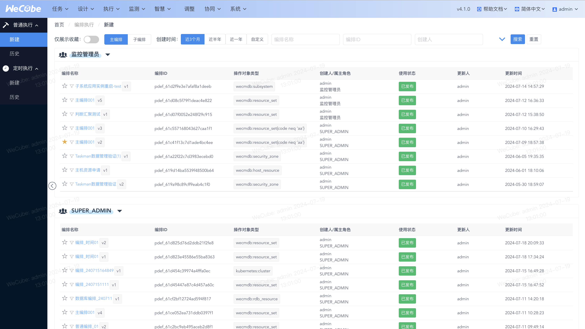

其中，可供选择的主编排/子编排,任务编排列表中将显示当前登录用户对应角色可以执行(使用权限)的所有任务编排，包括任务编排的名称、版本及更新时间。
支持收藏.

### 执行预览

当用户选择了一个任务编排后，进入执行预览页面
用户可以在目标对象列表中选择流程执行时将要操作的数据对象，(可供选择的数据对象列表由 任务编排设计时确定的根数据类型 以及 登录用户对应角色具有的数据权限 这两个因素共同决定。).
页面左侧区域中将会显示已选择任务编排的流程缩略图，供用户进行确认。
页面右侧区域中将显示以目标对象为根的关联数据图，以便用户了解和确认任务编排执行的影响范围。

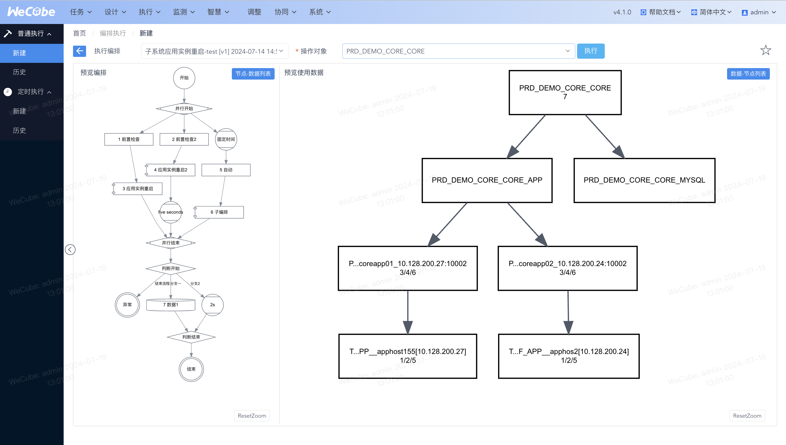

用户通过点击左侧区域的编排流程缩略图中的每个任务节点/顶部按钮，在弹出的对话框中为它们进一步配置具体的操作数据对象。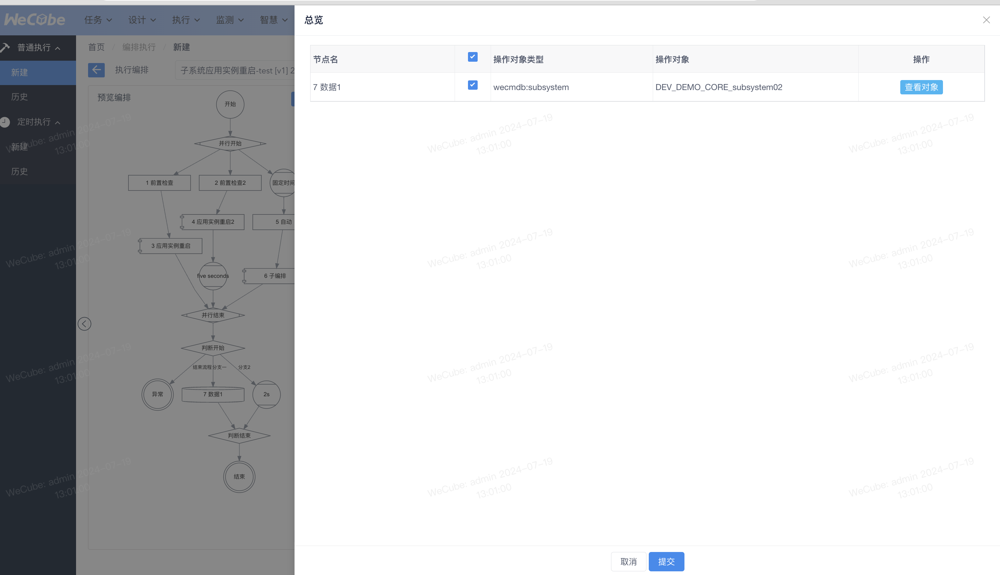
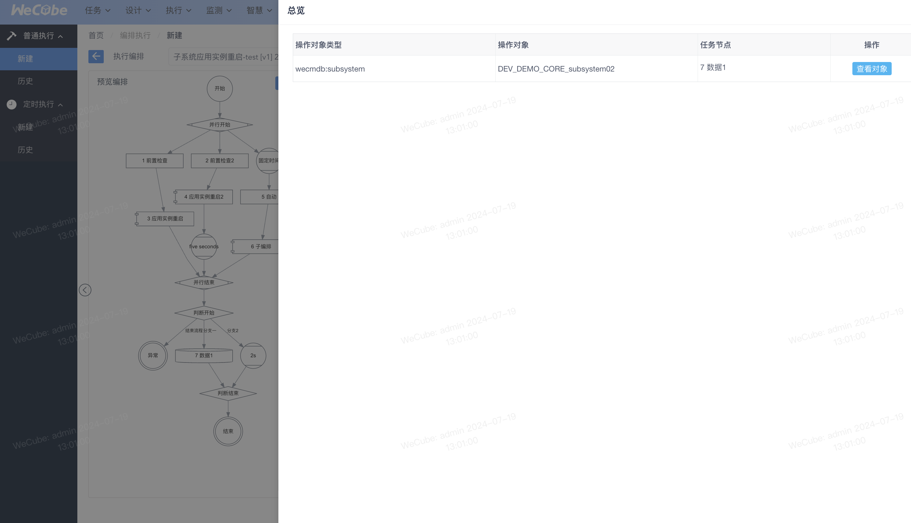

用户选择确定了目标对象后，配置完毕后，点击页面右上方的 执行,进入“历史-历史详情页面”，即可触发编排任务在已选择数据对象上的执行过程。此时，WeCube将自动跳转至此次任务编排执行的历史页面，以供用户追踪编排的执行状态与结果,详见“历史-历史详情页面”。

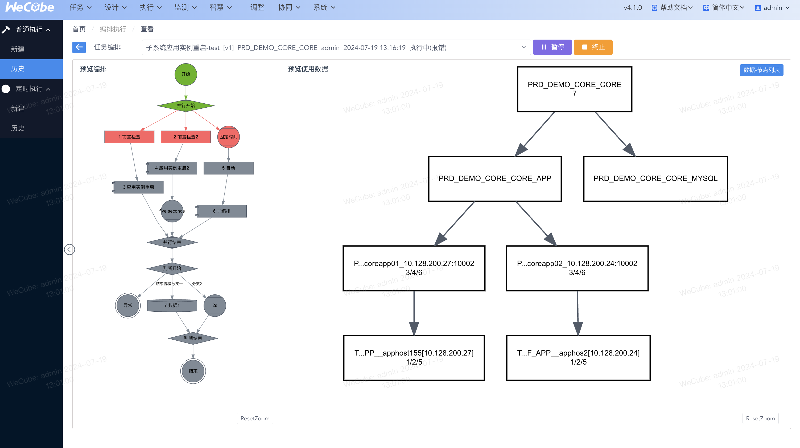

### 历史

进入历史页面,可以看到普通执行发起的执行记录,“执行中”的编排支持暂停、终止
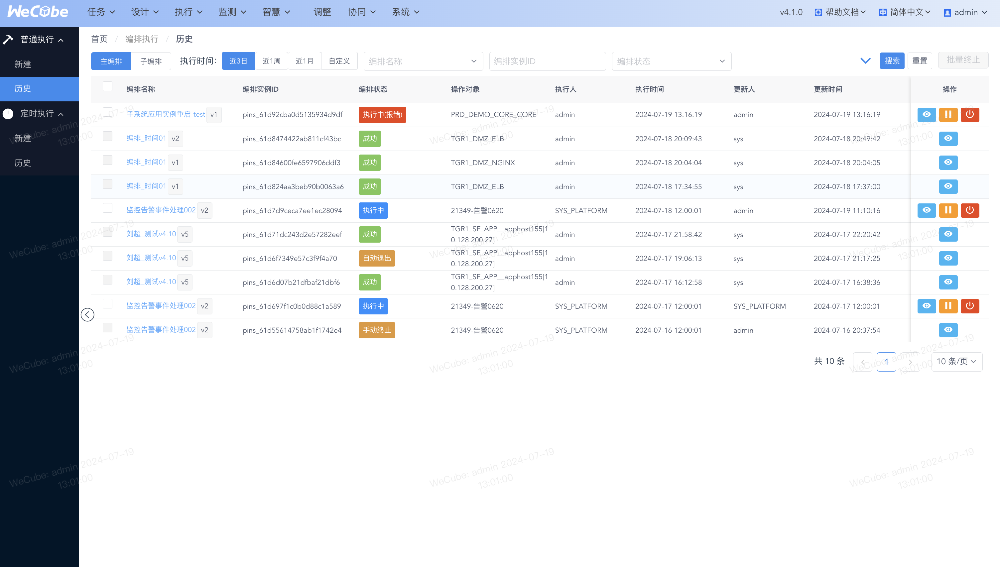

### 历史详情

执行记录点击详情进入单个编排的详情页，用户可以看到左侧区域中的流程缩略图以及右侧区域中的关联数据图。流程缩略图中将使用不同的颜色标识个流程任务节点的执行状态，如下所示：

- 绿色：已成功执行完成
- 红色：已结束执行但有错误发生
- 蓝色：正在执行自动化任务或者审批流程中
- 灰色：尚未开始执行

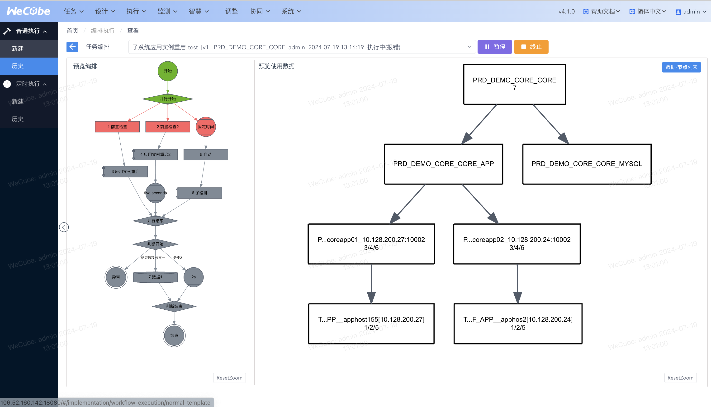

编排支持暂停、继续

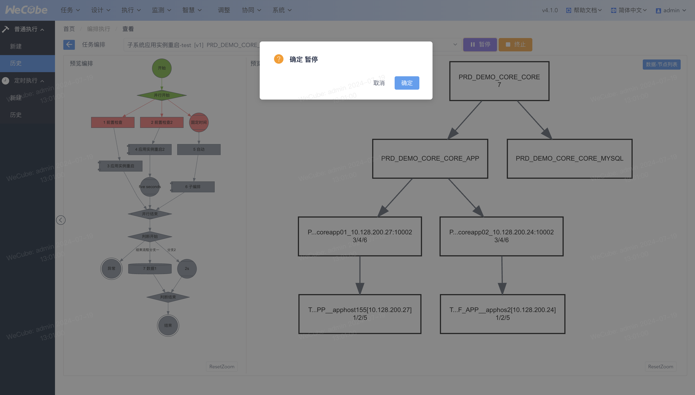

点击节点展开节点面板,报错超时节点支持跳过、重试
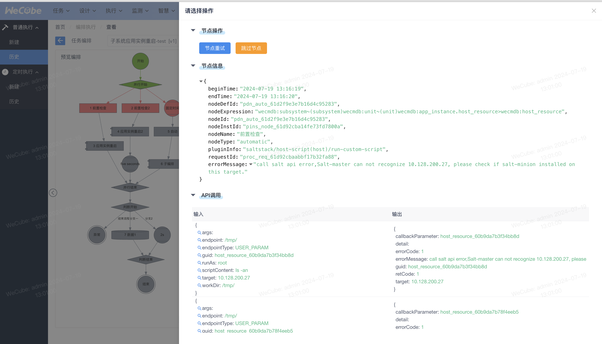

判断手动选择判断分支

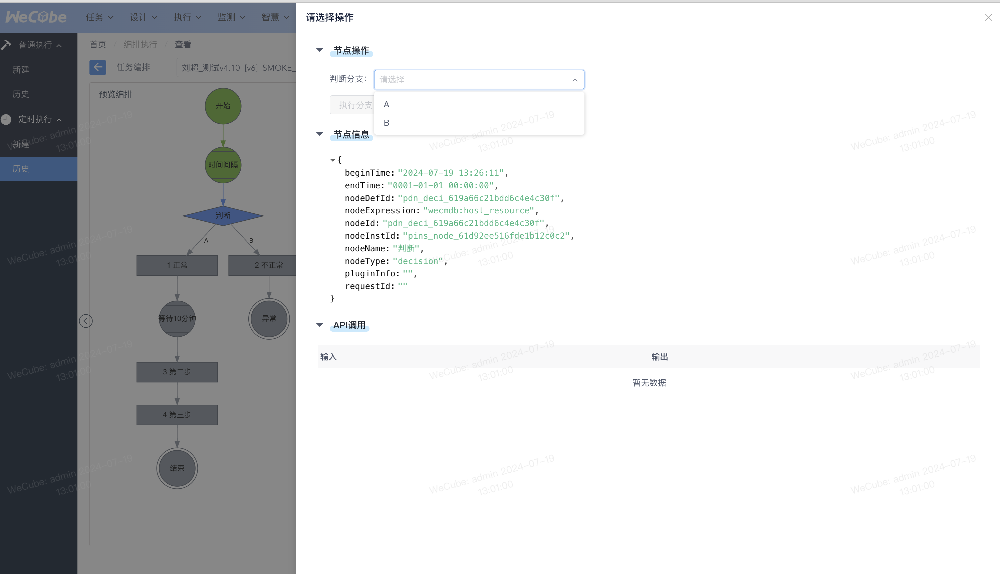

时间节点支持手动跳过时间节点(可关闭配置)

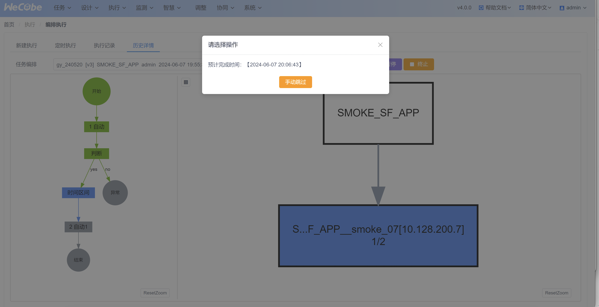

## 定时执行

### 新建

用户进入定时执行-新建,可以看到已有任务

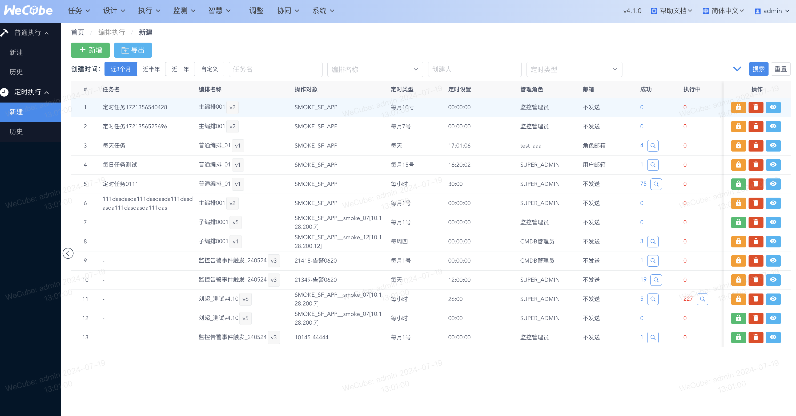

此时用户可以看到当前设置的定时任务信息，并且可以对定时任务进行如下操作：

- 启动：启动定时执行
- 暂停：暂停定时执行
- 删除：删除定时任务
- 列表：查看当前定时任务的历史执行结果

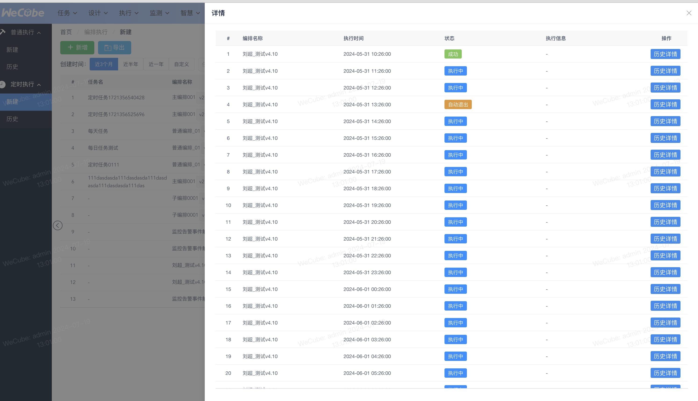

点击新增按钮可以增加定时任务，注意：只有被执行且执行成功的编排才可以添加为定时任务

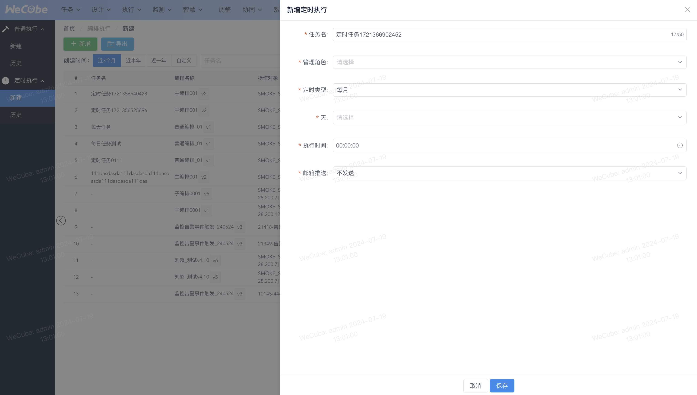

### 历史

进入历史可以查看定时执行任务发起的执行记录,支持暂停、终止

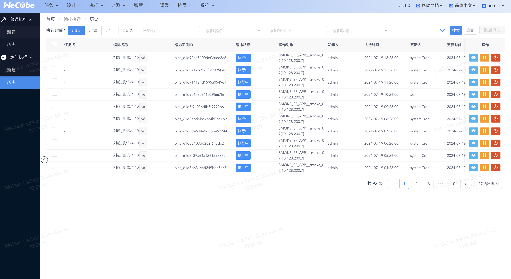

### 历史详情

点击查看进入详情页,功能同普通执行
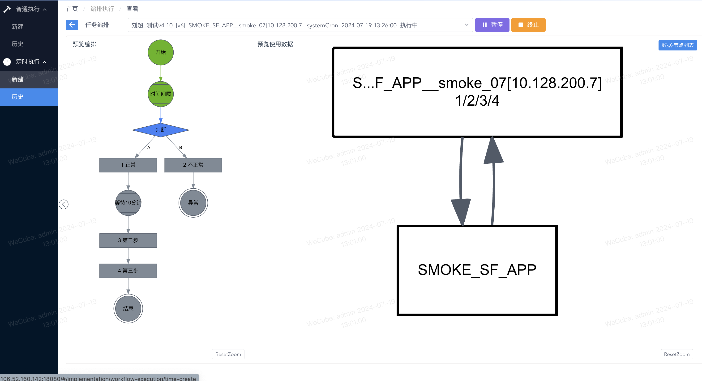