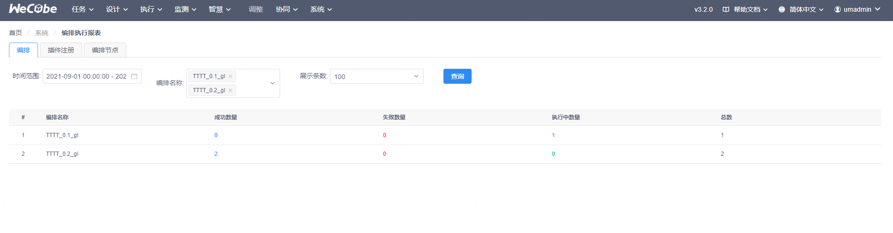
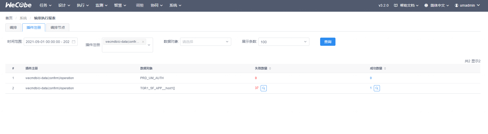
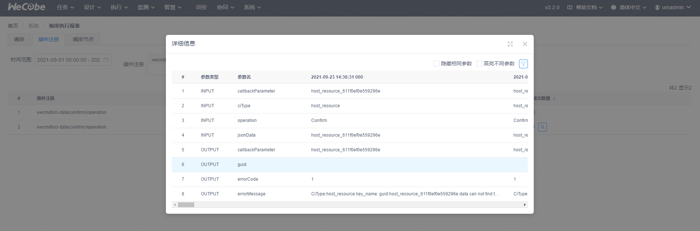
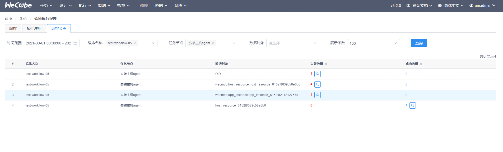
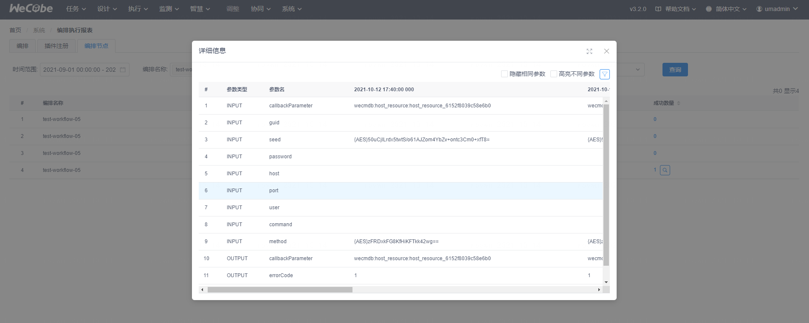

# 编排报表

用户在 WeCube 中可以通过“系统” – “编排报表”菜单项进入功能页面。

使用编排报表可以快速了解平台中任务编排功能的使用统计概览，比如哪些编排经常使用，而哪些从未被使用，哪些插件的失败率最高，从统计中可以分析出未来编排或插件甚至数据管理的优化方向，提高用户使用体验。

编排报表提供了 3 个维度的统计分析

## 按编排统计

根据时间 + 编排 进行统计编排执行状态（成功，失败，执行中）的数量

## 按插件统计

根据时间 + 插件 + 数据对象(可选) 进行统计编排执行状态（成功，失败）的数量，并且可以对比插件的出入参数，快速分析可能导致失败的原因

## 按节点统计

根据时间 + 编排 + 任务节点 + 数据对象(可选) 进行统计编排执行状态（成功，失败）的数量，并且可以对比节点的出入参数，快速分析可能导致失败的原因

