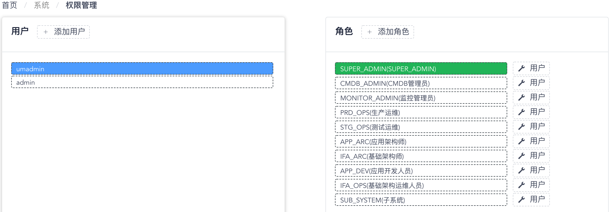
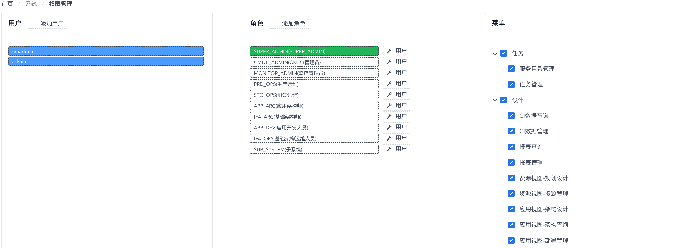

# 用户、角色与菜单权限管理

您可以通过 “**系统**菜单” - “**权限管理**菜单项” 来访问权限管理功能页面。在权限管理功能页面中，您可以对WeCube平台上的用户、角色、用户与角色间的所属关系进行管理和维护；此外，还可以基于角色为系统菜单的访问控制进行授权管理。

页面左侧部分会显示WeCube平台上所有的用户列表，当您在列表中选中一个用户时，页面中间的角色列表将为您自动高亮显示此用户拥有的所有用户角色，如下图所示：

{: target=\_image}

您可以点击用户列表上方的 “**添加用户**” 按钮来创建新的用户。

同样地，页面中间的角色列表会显示WeCube平台上所有的角色，当您在列表中选中一个角色时，页面左侧的用户列表也将为您自动高亮显示拥有该角色的所有用户，同时页面右侧的菜单列表也会高亮显示该角色具有的菜单访问权限，如下图所示：

{: target=\_image}

您可以点击角色列表上方的 “**添加角色**” 按钮来创建新的角色；点击列表中角色右侧的 “**用户**” 按钮，则可以配置该角色与所有用户的关联关系；选中了一个角色后，可以在页面右侧的菜单列表中为该角色能够访问的菜单进行授权。
