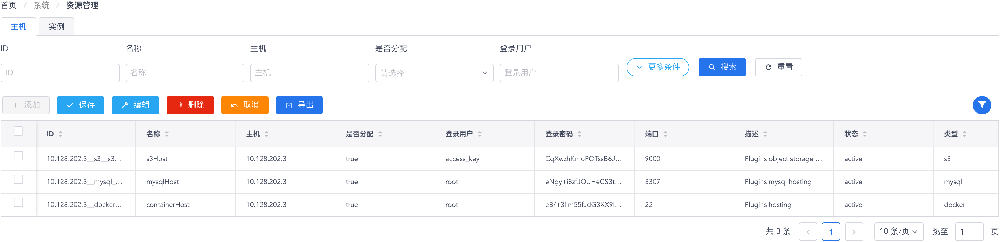
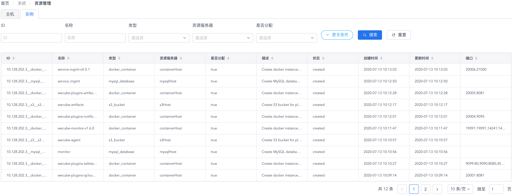

# 插件运行环境资源管理

您可以通过 “**系统**菜单” - “**资源管理**菜单项” 来访问资源管理功能页面。在资源管理功能页面中，您可以查看WeCube平台上现有配置好的用于支持插件运行所需的各类资源，可以根据需要添加新的资源到资源池之中；另外，也能看到目前已经分配给插件运行环境的所有资源列表。

## 可分配给插件运行环境的资源主机

在主机标签页，会以表格形式显示当前可以分配给插件运行环境使用的资源主机，如下图所示：

{: target=\_image}

您可以使用表格组件上方的过滤搜索进行有针对性的查询，也可以使用动作按钮对资源主机行查看、编辑、删除和导出等操作。关于资源主机的属性说明，请参见下表：

属性 | 说明
- | -
ID | 资源主机的唯一标识，由“主机”、“类型”和“名称”共同构成。
名称 | 简短而有意义的资源主机名称。
主机 | 资源主机的主机名或IP地址。
是否分配 | true - 可分配给插件运行环境使用；false - 不可分配给插件运行环境使用。
登录用户 | WeCube平台登录到此资源主机使用的用户名。
登录密码 | WeCube平台登录到此资源主机使用的密码（已做加密处理）。
端口 | WeCube平台连接此资源主机的端口。
描述 | 详尽的文字描述。
状态 | active - 资源主机生效，可以正常使用；inactive - 资源主机未生效，不能被使用。
类型 | 资源主机提供的资源类型：s3 - 插件运行所需的对象存储资源；mysql - 插件运行所需的关系型数据库资源；docker - 插件运行所需的容器主机资源。

## 已分配给插件运行环境的资源实例

在实例标签页，会以表格形式显示当前已经分配给插件运行环境使用的资源实例，如下图所示：

{: target=\_image}

您可以使用表格组件上方的过滤搜索进行有针对性的查询，由于资源实例已经分配给插件运行环境，所以您在此不能进行任何操作。关于资源实例的属性说明，请参见下表：

属性 | 说明
- | -
ID | 资源实例的唯一标识，由多种属性共同构成。
名称 | 由插件声明的资源实例名称。
类型 | 资源实例类型：containerHost - 插件运行使用的容器；mysql_database - 插件运行使用的逻辑数据库；s3_bucket - 插件运行使用的对象存储桶。
资源服务器 | 此资源实例所在的资源服务器（资源主机）。
描述 | 详尽的文字描述。
状态 | active - 资源主机生效，可以正常使用；inactive - 资源主机未生效，不能被使用。
端口 | 此资源实例对外暴露以供连接的端口。
