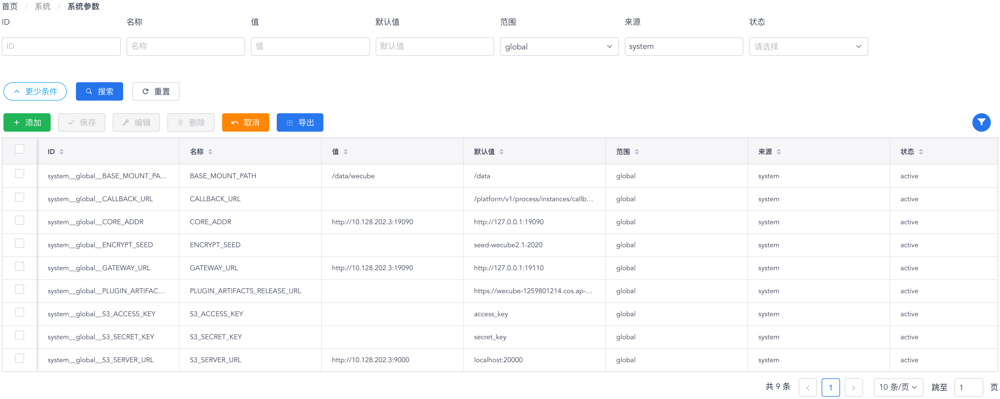

# 系统参数

您可以通过 “**系统**菜单” - “**系统参数**菜单项” 来访问系统参数功能页面。在系统参数功能页面中，您可以检视当前所有由WeCube平台及插件定义和使用中的参数。

系统参数以表格形式显示，如下图所示：

{: target="\_image"}

您可以使用表格组件上方的过滤搜索进行有针对性的查询，也可以使用动作按钮对系统参数进行查看、编辑、删除和导出等操作。关于系统参数的属性说明，请参见下表：

属性 | 说明
- | -
ID | 系统参数的唯一标识，由“来源”、“范围”和“名称”共同构成。
名称 | 简短而有意义的参数名称
值 | 由用户配置的参数值，配置后将覆盖默认值生效。
默认值 | WeCube平台或插件在定义参数时提供的默认值，可以被用户配置的值覆盖。
范围 | global - 参数可以被所有插件读取使用；插件私有 - 参数仅能被定义的插件读取使用。
来源 | 参数定义的来源，可能是由WeCube平台定义（system），或是由某个插件定义。
状态 | active - 参数生效，可以被插件读取使用；inactive - 参数未生效，不能被任何插件读取使用。
