### 简介
Taskman 是一个服务管理插件，简化版的ITSM，提供服务请求和任务管理功能。

### 1. 关联信息

#### 1.1 目标数据

   进入“设计->数据管理(CI)”，在“资源规划”层，依次选择“资源集合”和“主机资源”，查看对应的属性字段。
   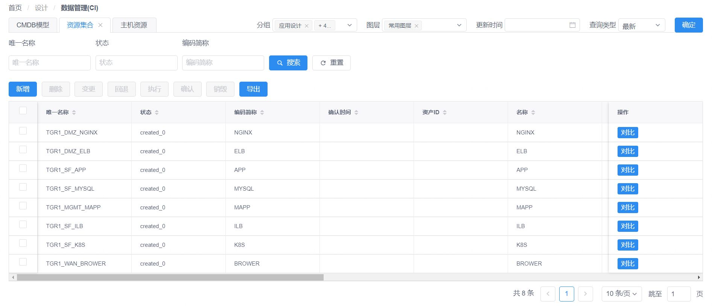
   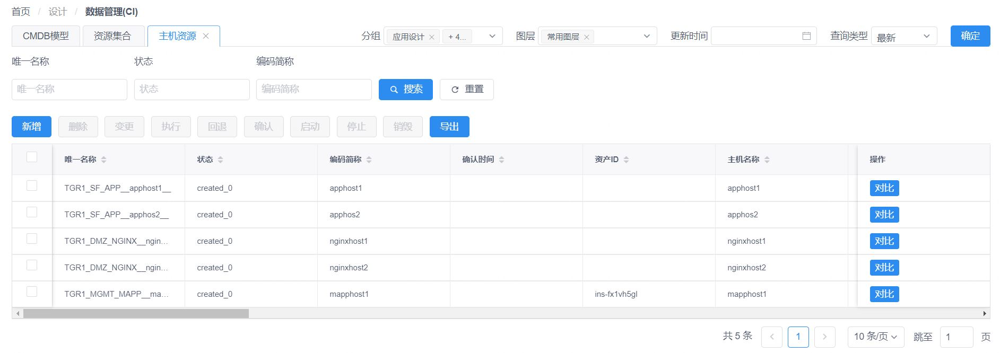

#### 1.2 流程内容

   进入“协同->任务编排”，选择“主机资源集合扩容主机资源”。
   
   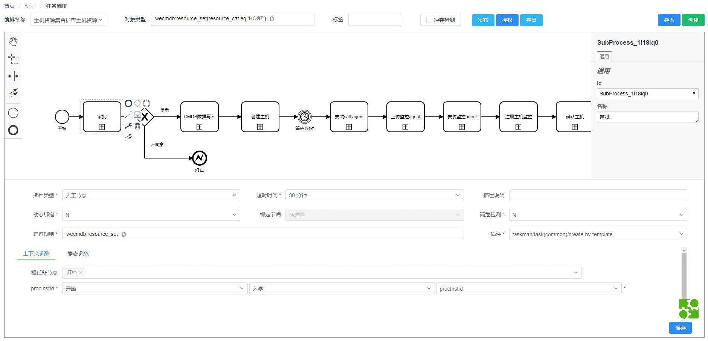

   其中“审批”是人工节点，对应create-by-template插件，是动态参数插件服务，根据关联的taskman任务表单产生调用参数。流程执行过程中需要进入“首页->任务管理”，领取和处理相关任务。

   而且“CMDB数据写入”节点，是taskman关联编排的流程中必备的节点，用于将taskman中用户填写的表单信息写入CMDB，以供后续的自动化流程使用。

   通览整个流程的所有任务节点，熟悉相关内容，便于理解后继流程执行过程。

### 2. 任务配置

#### 2.1 模板组管理

   进入“任务->模板组管理”，点击“添加”，配置模板组的名称和角色信息。

   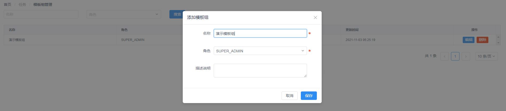

#### 2.2 模板管理

   （1）进入“任务->模板管理”，点击“添加”，配置模板的基础信息。

   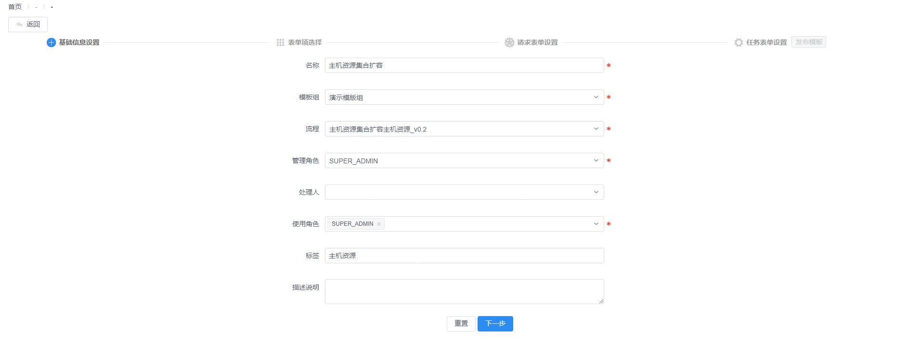

   流程：对应“协同->任务编排” 中配置的流程名称“主机资源集合扩容主机资源”。

   管理角色：指管理此模版并审核用户提交请求合法性、管理编排任务绑定数据的角色。

   处理人：非必填，是管理角色中的成员，若填写，则将该请求指定给该成员处理。

   标签：对模板的标记，利于在请求发起时选模板。

   使用角色：指可以使用该模板发起请求的角色。

   （2）点击“下一步”，选择模板的表单项。

   表单项来源于编排任务节点的定位规则对应的对象属性，用于表单配置时，筛选出上报人和处理人关注的信息项，过滤不必要的数据项，在此处可筛选后续表单所需的数据项。

   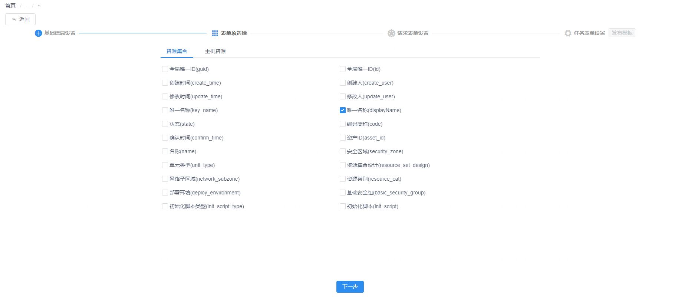

   （3）点击“下一步”，设置模板的请求表单。

   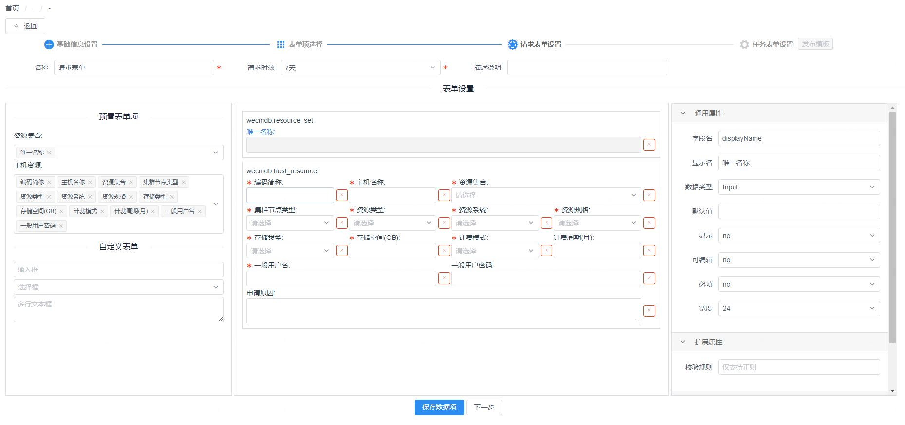

   预置表单项：表单项的来源可为预置的（即上一步所选），也可以是自定义的表单项。

   表单设置中间列：当选中预置表单项时，表单设置中间列会出现相应的表单元素，也可以直接将自定义表单拖到表单设置中。点击已选择的具体表单项，在页面最右侧，可设置其对应的通用属性、扩展属性和数据项。而且选择的表单项可自由拖曳，自定义布局。

   数据项的约束：当选择“yes”时，通用属性中，下拉框的枚举范围只在该请求表单数据内；当选择“no”时，则无此限制。

   （4）点击“保存数据项”，点击“下一步”，进行设置模板的任务表单。

   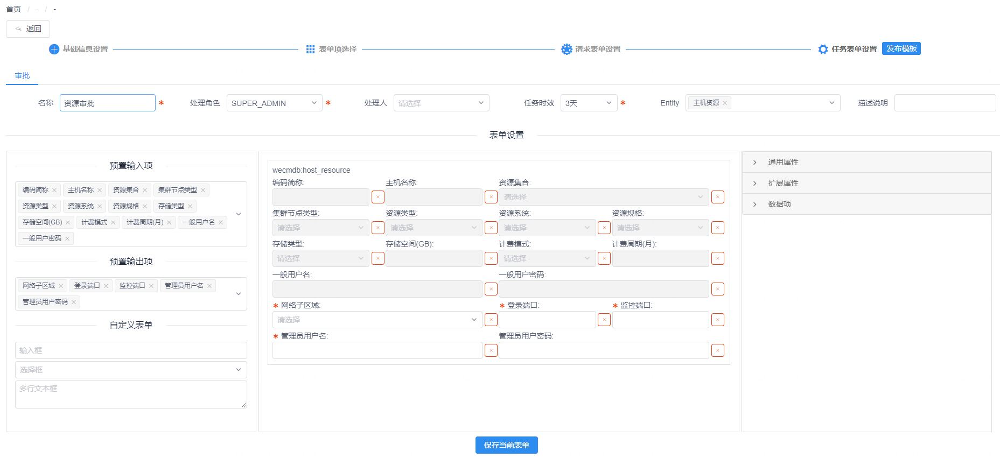

   Entity：用于筛选“预置输入项”和“预置输出项”中的可选项。

   预置输入项：来源于上一步“请求表单设置”中配置的表单项，表单项默认不可编辑。

   预置输出项：用于配置任务表单的输出项，表单项默认可编辑。

   表单设置中间列：当选中预置表单项时，表单设置中间列会出现相应的表单元素，也可以直接将自定义表单拖到表单设置中。点击已选择的具体表单项，在页面最右侧，可设置其对应的通用属性、扩展属性和数据项。而且选择的表单项可自由拖曳，自定义布局。

   数据项的约束：当选择“yes”，通用属性中，下拉框的枚举范围只在该任务表单数据内；当选择“no”时，则无此限制。

#### 2.3 请求管理

   （1）进入“任务->请求管理”，点击“发起请求上报”，配置请求的基础信息。

   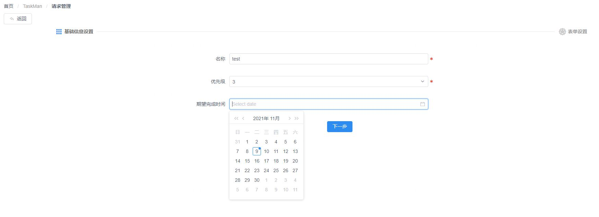

   （2）点击“下一步”，设置请求的表单信息，“目标对象”为可选，当选择指定项后，点击“搜索”，即可填充“resource_set”和“host_resource”的表单项数据。应从左到右依次配置每一个表单，预置数据可自行配置，点击“保存”后，再配置下一个表单。配置完成后点击“提交”。

   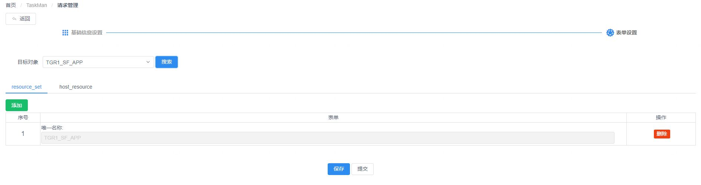

   （3）进入“任务->请求管理”，选择“本组处理”，处理提交的请求。

   

   （4）选择发起的请求，点击“处理”，审核“基础信息设置”。

   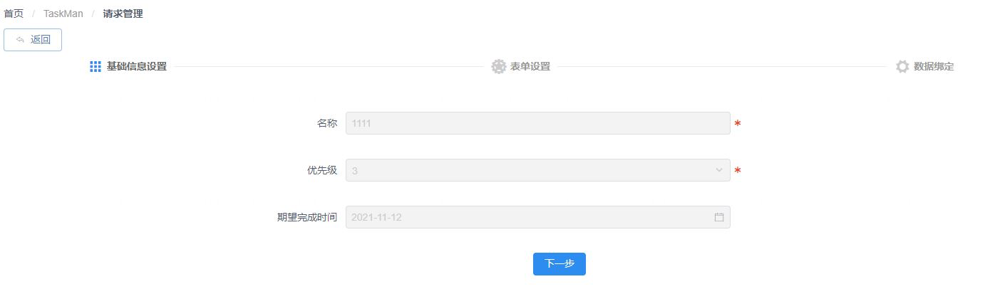

   （5）点击“下一步”，审核“表单设置”。

   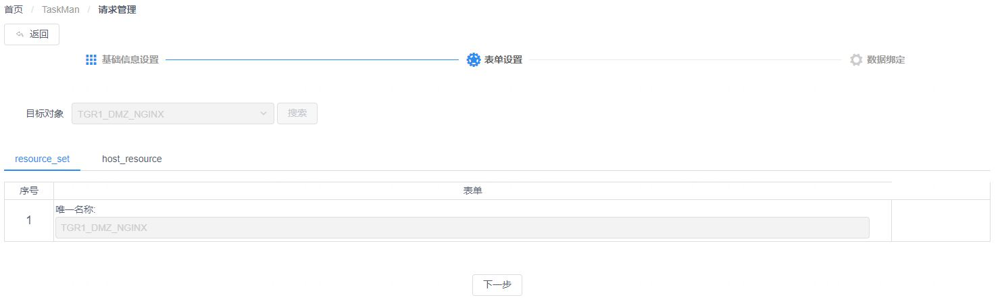

   （6）点击“下一步”，进行“数据绑定”，点击“确认定版”。

   

#### 2.4 任务管理

   进入“任务->任务管理”，选择任务，点击“认领”。

   

   选择认领的任务，点击“处理”，进入任务处理页面。   

   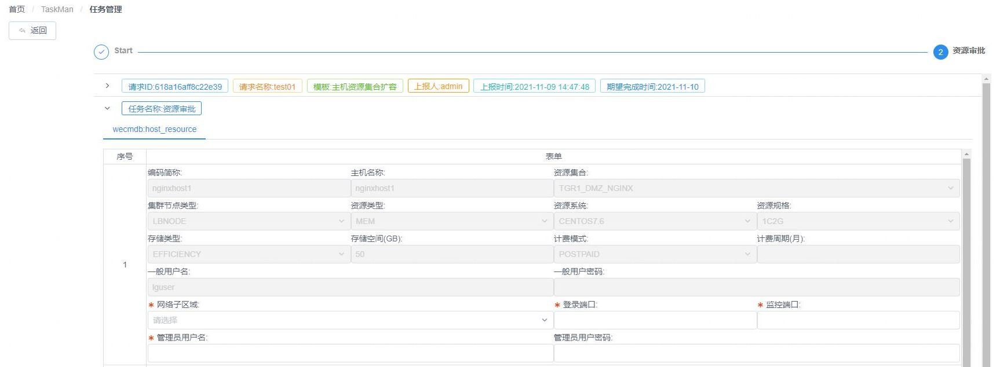

### 3. 流程执行

#### 3.1 执行预览

   发起任务请求后，进入“执行->编排执行”，点击“查询历史编排”，选择“主机资源集合扩容主机资源”，查看正在处理的流程内容。

   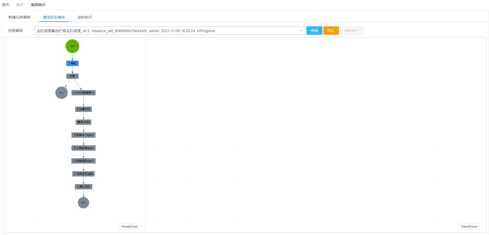

#### 3.2 执行处理

   进入“首页->本组处理”，看到有一条待领取的审批任务，点击【认领】、然后点击【处理】，处理结果选择“同意”，点击【提交】，提交后会编排会继续执行。

   

   
