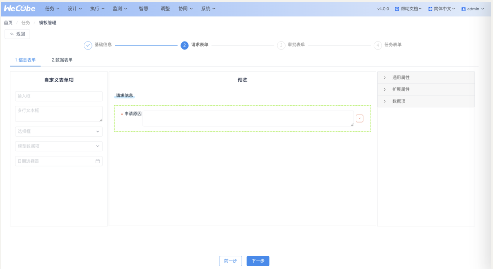

### 简介

Wecube 的任务模块由插件 Taskman 提供,涵盖 ITSM 五⼤场景:请求、发布、变更、事件、问题,提供服务请求和任务管理功能。

### 1. 整体流程

#### 1.1 流程图

###### a.整体关键流程

数据层-编排层-请求模版设计层-请求层

###### b.请求流程

#### 1.2 关键用户角色

需要提前在对应“系统->权限管理”中配置对应的⾓⾊,参考[用户角色及画像](manual-user-roles-and-profiles.md)

- CMDB 管理员
- 编排管理员
- ITSM 管理员
- 申请⼈
- 定版⼈
- 审批⼈
- 任务处理⼈

#### 1.3 ⼯单模版类型对比

| 2 种模版类型 | 模版              | 数据层                                                       | 执⾏层                                                  | ⼯单处理层                                                   |
| ------------ | ----------------- | ------------------------------------------------------------ | ------------------------------------------------------- | ------------------------------------------------------------ |
| ⾃动化模版   | DEMO-主机资源申请 | 1.⽀持 CMDB 数据的读写 2.请求、审批、任务表单的填写数据将传⼊编排,影响执⾏结果 ⾏任务 | 1.关联编排  2.平台⾃动执行                         | 1.⽤户须选择操作根对象 2.⽀持⾃动试算编排 3.⽀持操作对象影响范围分析 |
| 非自动化模版 | DEMO-主机扩容变更 | 1.仅⽀持读 CMDB 数据 2.请求、审批、任务表单仅作为处理记录 | 1.不关联编排  2.线下完成任务,⼿动扭转任务状态 | 1.⽤户须⼿动选择操作对象                                     |

### 2. 页面功能

#### 2.1 模板组管理

进入“任务->模板组管理”，点击“添加”，配置模板组的名称和角色信息。

####

#### 2.2 模版管理

##### （1）查看模版列表

进⼊“任务->模板管理”，模版列表四个 Tab 对应模版的四种状态

模版状态扭转图:

##### （2）配置“1.基础信息”

###### a.模版信息

左侧为模版的信息、权限配置:

1. 场景类型:ITSM 五⼤类型
2. 属主⾓⾊/属主:模版的管理员
3. 使⽤⾓⾊:模版的使⽤者⾓⾊列表
   - 若关联编排,将⾃动为使⽤者添加对应编排的使⽤权限求
4. 时效:超过时间认为请求超时,会有邮件提醒

###### b.模版配置

右侧为模版的流程配置:

1. 定版节点:控制定版流程的开关、处理⼈、超时时效
2. 关联编排:控制关联编排的开关、及选择具体编排
   - 仅可选择您拥有管理权限,且授权插件为 taskman 的编排
   - ⽀持切换编排版本
3. 确认节点:控制确认节点的开关、超时时效

##### （3）配置“2.请求表单”

请求表单由两部分组成:

###### a.步骤 1-信息表单

常规的“单⾏表单”,⽤于记载请求的关键信息,⽐如申请原因、截⽌时间

###### b.步骤 2-数据表单

特殊的“多⾏表单”,⽤于填写请求操作的关键数据列表,⽀持三种数据表单

点击预览区“加号”创建⼀个表单

点击编辑图标,配置表单名、预置表单项、分析表单项、新增⼀⾏规则

###### **c.表单类型**

表单⽤颜⾊区分:

|                              | 场景                                                         | CMDB 模型                                    | 预置表单项                 | 分析表单项                                  | 自定义表单项 | 新增一行                       | 填充规则                                                     |
| ---------------------------- | ------------------------------------------------------------ | -------------------------------------------- | -------------------------- | ------------------------------------------- | ------------ | ------------------------------ | ------------------------------------------------------------ |
| 编排 entity 表单(金色)       | 编排自动计算相关模型 引入 CMDB 模型快速建表 填写值作为编排自动节点的输入 | 编排-定位规则配置的模型, 属于 CMDB 模型 | 勾选 CMDB 表字段生产表单项 | 配置分析规则,计算相关的 CMDB 表字段分析结果 | 拖入组件     | 1.新增数据 2.选择已有数据 | 1.新建时,选择目标对象之后优先编排试算结果填充 2.支持默认值 |
| 自选 entity 表单(绿色)  | 自选模型的数据表单表单  引入 CMDB 模型快速建表 不会修改 CMDB 数值 | CMDB 所有模型                                | 勾选 CMDB 表字段生产表单项 | 配置分析规则,计算相关的 CMDB 表字段分析结果 | 拖入组件     | 1.新增数据 2.选择已有数据 | 1.支持默认值                                                 |
| 自定义表单(紫色)             | 自定义表单结构                                               | 勾选 CMDB 表字段生产表单项                   | 配置 CMDB 表字段分析表单项 | -                                           | 拖入组件     | 1.新增数据                | 1.支持默认值                                                 |

###### **d.表单项控件类型**:

1. 输⼊框:可配置默认值
2. ⽂本框:可配置默认值
3. 下拉框:须配置可选项
4. 模型数据项:配置 CMDB 模型类型,使⽤时可直接选择 CMDB 数据
5. 时间选择器:⽀持年⽉⽇时分秒

###### **e.表单项配置**:

1. 通⽤属性
   - 表单名、
   - 编码(唯⼀标识)
   - 数据源(可选项)、默认值、可编辑、必填、清空、宽度等
2. 扩展属性:
   - 正则校验规则
3. 数据项:
   - 数据项的约束：当选择“yes”时，通⽤属性中，下拉框的枚 举范围只在该请求表单数据内；当选择“no”时，则⽆此限 制。

##### （4）配置“3.审批表单”

配置审批流程、处理⼈、表单。
审批配置分成三块:

###### a.顶部——审批节点流

1. ⽀持增删

2. 串⾏审批

3. ⾄少有⼀个审批节点

###### b.中部——节点配置

1. 时效:每个节点有超时控制,超时会有催办邮件

2. 分配:5 种模式,上级审批选择了提交⼈管理员,

3. 处理⼈列表:每个处理⼈有两个关键配置:处理⾓⾊配置和处理⼈配置

| 5 种分配     | 处理人配置 | 通过条件                       |
| ------------ | ---------- | ------------------------------ |
| 单人         | 单人       | 单人同意                       |
| 协同         | 多人       | 任意人同意                     |
| 并行         | 多人       | 所有人同意                     |
| 提交人管理员 | -          | 提交人-使用角色-角色管理员同意 |
| 自动跳过     | -          | 直接通过                       |

| 2 种处理角色配置形式 | 角色配置者 | 通过条件                                          |
| -------------------- | ---------- | ------------------------------------------------- |
| 模版指定             | 模版属主   | 由模版发起的请求,当前审批的处理角色固定           |
| 提交人指定           | 提交人     | 由模版发起的请求,当前审批的处理人由提交人自由指定 |

| 6 种处理人配置形式 | 人配置者 | 场景           | 转单人                        |
| ------------------ | -------- | -------------- | ----------------------------- |
| 模版指定           | 模版属主 | 指定处理人     | 不希望同组人转单,仅角色管理员 |
| 模版建议           | 模版属主 | 建议处理人     | 允许同组人转单                |
| 提交人指定         | 提交人   | 指定处理人     | 不希望同组人转单,仅角色管理员 |
| 提交人建议         | 提交人   | 建议处理人     | 允许同组人转单                |
| 系统分配           | 系统     | 不明确处理人   | 允许同组人转单                |
| 主动认领           | -        | 仅分配到角色组 | 角色成员主动认领              |

###### c.底部——表单配置

⽀持引⽤请求表单来创建审批表单(仅⽀持修改表单项的编辑属性)

⽀持勾选请求表单中已有的预置字段、分析字段、拖⼊新的⾃定义表单

##### （5）配置“4.任务表单”

如关联了编排,任务列表依据编排的人工任务自动生成,如未关联,任务列表可以自定义配置

###### a.顶部——任务节点流

功能参考审批配置

###### b.中部——节点配置

功能参考审批配置

###### c.底部——表单配置

功能参考审批配置

##### （6）配置请求信息表单作为分配条件

请求表单-信息表单,可以开启控制审批任务开关,开启之后将作为审批/任务的节点分配条件

审批/任务中默认出现分配条件配置,配置条件

提交请求的时候如果信息表单输入满足条件,才会执行这个节点,否则会直接跳过

##### （7）配置数据表单作为过滤条件

请求表单-数据表单,可以开启控制审批任务开关,开启之后将作为审批/任务的节点分配条件

审批/任务中默认出现过滤条件配置,给每个处理人配置条件

处理任务的时候,如果有多行数据,则该处理人只会处理按照条件过滤的表单行

##### （8）表单组件库配置

勾选表单,直接创建组件,已有组件一键拖入表单

修改名称,保存,全局可用

##### （9）表单隐藏条件配置

选中表单-拓展属性,新增隐藏条件
支持选择条件、符号、计算值,用户在使用表单的时候,将根据表单填写值动态计算当前表单的隐藏状态

#### 2.3 工作台

##### (1)首页

页面分成五大区块

- 本人处理
- 本组处理
- 我暂存的
- 我提交的
- 已处理的

菜单分成五大场景

##### (2)新建请求

##### (3)请求详情

### 3.ITSM 请求⽰例 [申请主机资源]

#### 3.1 关键⽤户⾓⾊

对应“系统->权限管理”中的⾓⾊,请根据您在日常中的角色查看

1. CMDB 管理员:

   1. CMDB_ADMIN(CMDB 管理员)/CMDB 管理员

2. 编排管理员:
   1. IFA_OPS(基础架构运维⼈员)/admin
3. ITSM 管理员:

   1. IFA_OPS(基础架构运维⼈员)/admin

4. 申请⼈:

   1. PRD_OPS(⽣产运维)/⽣产运维 1

5. 定版⼈:

   1. IFA_OPS(基础架构运维⼈员)/admin

6. 审批⼈:
   1. 上级审批:PRD_OPS(⽣产运维)/admin
   2. 基础架构审 批
      1. :IFA_OPS(基础架构运维⼈员)/基础架构运维 2
      2. IFA_OPS(基础架构运维⼈员)/基础架构运维 1
7. 任务处理⼈
   1. 分配 IP 地址:CMDB_ADMIN(CMDB 管理员)/CMDB 管理员 1

#### 3.2 CMDB 管理员-配置模型数据

进⼊“设计->数据管理(CI)”，在“资源规划”层，依次选择“资源集合”和“主机资源”，查看对应的属性字段。

#### 3.3 编排管理员-设计[申请主机资源]编排

进⼊“协同->任务编排”，选择“DEMO-新增主机资源”。

#### 3.4 ITSM 管理员-配置[申请主机资源]请求模版

进⼊“任务->模板管理”，选择“DEMO-主机资源申请”,点击变更,从[草稿]列表中找到新建的草稿记录进入编辑

配置模板的基础信息。

配置信息表单

配置数据表单

配置说明:

1. 场景:本模版关联了申请主机的编排,因此只需要⾃动⽣成的编排 entity 表单(⾦⾊)
2. CMDB 模型:⾃动根据编排中每个节点的定位规则⽣成了 wecmdb:resource_set、wecmdb:host_resource 两个编排表单
3. 预置表单项:勾选了唯⼀名称、主机名称、资源集合等关注的预置表单 项⽣成表单
4. 新增⼀⾏:其中主机资源是申请的,配置了新增数据,资源集合是已有的, 配置了选择已有数据
5. 填充规则:提交请求的时候,需要先选择⽬标对象(哪个资源集合)->编排 试算->填充表单

配置“3.审批表单”

配置“4.任务表单”,提交审核
管理员确认发布,模版发布成功

#### 3.5 申请人-新建请求

选择请求模版

新建请求,填写表单

#### 3.6 定版人-处理定版

本人处理查看定版任务

提交定版处理

#### 3.7 审批人-处理审批

本人处理查看审批任务

提交审批

另一位审批人也同样完成审批,查看请求进度

#### 3.8 任务处理人-处理任务

CMDB 管理员 1,进入本人处理,查看任务

填写任务表单,处理任务

#### 3.9 申请人-处理确认

进入设计-数据管理查看主机资源,发现主机已经写入 CMDB

本人处理-确认

提交
请求执行成功

### 4.ITSM-变更-⽰例 [主机扩容变更]

变更模版选择[DEMO-主机扩容变更],操作步骤参考 3.请求流程
